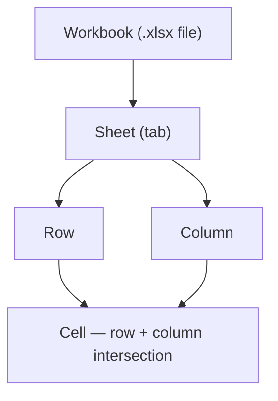
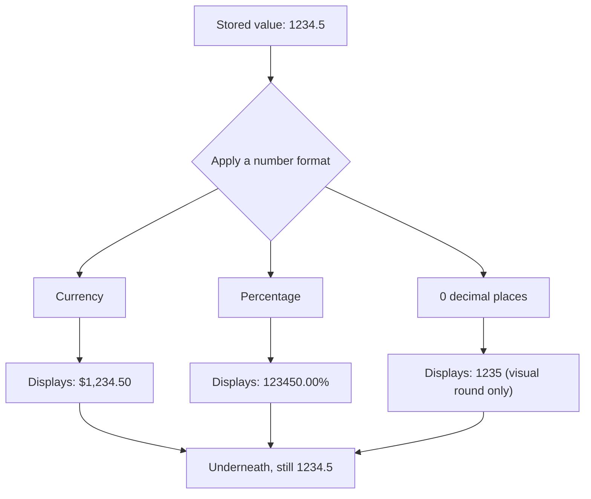

# Lecture 1 — The Grid: Cells, Rows, Columns & Sheets

> **Duration:** ~2 hours. **Outcome:** You can describe a workbook's structure precisely, address any cell or range with A1 notation, enter each of the four core data types correctly, and explain the difference between a cell's *stored value* and its *displayed format* — the single idea that prevents the most common spreadsheet bugs.

Every spreadsheet skill you'll build over the next 12 weeks sits on top of one structure. Get the vocabulary and the mental model exactly right now, and formulas, lookups, pivot tables, and dashboards will all make immediate sense later, because they're all just operations on this same grid.

## 1. The hierarchy: workbook → sheet → row/column → cell

A **workbook** is the file itself — `crunch-week1.xlsx` in Excel, or a Google Sheets document in Drive. A workbook contains one or more **sheets** (also called worksheets or tabs), shown as tabs along the bottom of the window.

Each sheet is a grid:

- **Columns** run vertically, labeled with letters: `A`, `B`, `C`, … `Z`, then `AA`, `AB`, … A sheet has 16,384 columns (through `XFD`) in modern Excel and Google Sheets.
- **Rows** run horizontally, labeled with numbers: `1`, `2`, `3`, … A sheet has 1,048,576 rows in Excel; Google Sheets caps a whole *workbook* at 10 million cells total, spread across all sheets.
- A **cell** is the intersection of one column and one row — the atomic unit of a spreadsheet. It holds exactly one piece of data (or one formula, which resolves to one piece of data).


*The four levels of a spreadsheet, from the file down to its atomic unit.*

```
        A          B          C
   ┌──────────┬──────────┬──────────┐
 1 │  A1      │  B1      │  C1      │
   ├──────────┼──────────┼──────────┤
 2 │  A2      │  B2      │  C2      │
   ├──────────┼──────────┼──────────┤
 3 │  A3      │  B3      │  C3      │
   └──────────┴──────────┴──────────┘
```

At any moment, exactly one cell is the **active cell** — the one with the bold outline, where your keystrokes land. You always know where you are by looking at the **Name Box** (top-left, above column `A`) — it always shows the active cell's address.

## 2. A1 addressing

Every cell has a unique address: **column letter, then row number, no space** — `A1`, `B7`, `AZ204`. This is called **A1 notation**, and it's universal across Excel, Google Sheets, and virtually every spreadsheet tool. You will type and read thousands of these addresses; they need to become as automatic as reading a clock.

A **range** is a rectangular block of cells, written as its top-left corner, a colon, and its bottom-right corner:

```
A1:C3     → the 3×3 block from A1 to C3 (9 cells)
B2:B10    → a single column, rows 2 through 10 (9 cells)
A5:F5     → a single row, columns A through F (6 cells)
```

**Absolute vs. relative addresses** get their own deep dive in Week 2 (this is where the `$` sign comes in — `$A$1` vs. `A1`). For now, just know that plain `A1`-style addresses are called **relative** references, and they're what you'll use all week.

**Sheet-qualified addresses.** To refer to a cell on a *different* sheet, prefix it with the sheet name and an exclamation mark: `Budget!A1` means cell `A1` on the sheet named "Budget." You'll use this constantly once you have multiple sheets (Lecture 2, Exercise 3).

## 3. The four data types you'll enter this week

A cell's content falls into one of a few fundamental types. Excel and Google Sheets both try to **guess** the type from what you type — which is convenient until it guesses wrong, which happens constantly with dates. Knowing the rules lets you predict and control the guess.

### Text (a "string")

Anything the app can't parse as a number, date, or boolean becomes text — left-aligned by default. `Crunch`, `Q1 Budget`, `SKU-4471` are all text.

**Forcing a number to be text:** if you type `007` it becomes `7` (leading zero dropped — it was parsed as a number). To keep a value like a zip code or SKU as literal text, either:
- Format the cell as **Text** first (Excel: `Ctrl+1` → Number tab → Text; Sheets: **Format → Number → Plain text**), or
- Prefix the entry with an apostrophe: `'007` — the apostrophe itself isn't stored, but it forces text interpretation. You'll see the classic green corner-triangle warning in Excel on numbers-stored-as-text; that's this in reverse.

### Numbers

Digits, with an optional decimal point, minus sign, or thousands separator — right-aligned by default. `1200`, `-45.5`, `1,200` (the comma is just a formatting choice; the *stored* value is `1200` either way — more on this in section 4).

Typing `1/4` looks like a fraction but **will be auto-converted to a date** (January 4th) unless you format the cell as a fraction first or prefix with `0 ` (`0 1/4`). This is one of the most common "why did my number turn into a date" bugs — flag it now so it never surprises you.

### Dates and times

Both Excel and Google Sheets store a date internally as a **serial number** — an integer counting days since a fixed epoch (Excel: December 31, 1899 is day 0, so January 1, 1900 is day 1; Google Sheets uses December 30, 1899 as day 0 for compatibility). Typing `1/15/2026` or `Jan 15 2026` gets recognized as a date and stored as that serial number, then **displayed** according to a date format.

Time works the same way, as a *fractional* day: `12:00 PM` is stored as `0.5` (halfway through a day). A date+time like `1/15/2026 6:00 AM` is stored as a single number: the date's serial number plus `0.25`.

Why this matters: because dates are just numbers underneath, you can do real math on them — `hire_date + 30` gives a date 30 days later, and `end_date - start_date` gives a count of days. You'll use this constantly starting Week 4. It also means a date **can be sorted, filtered, and compared numerically**, which text-that-merely-looks-like-a-date cannot.

### Booleans

`TRUE` and `FALSE` — you'll type these directly sometimes, but mostly they show up as the *result* of a logical formula (`=A1>100`) starting Week 3. Worth knowing now: `TRUE` behaves as `1` and `FALSE` as `0` in arithmetic, which is a trick you'll use for counting conditions later in the course.

## 4. The value vs. the display format — the single most important idea this week

This is the concept that separates people who fight their spreadsheet from people who control it.

**Every cell stores exactly one underlying value. Separately, every cell has a number format that controls how that value is *displayed*.** Changing the format never changes the stored value — it only changes what you *see*.

Concretely: type `1234.5` into a cell.

| What you did | Stored value | Displayed as |
|---|---|---|
| Type `1234.5`, no formatting | `1234.5` | `1234.5` |
| Apply **Currency** format | `1234.5` (unchanged) | `$1,234.50` |
| Apply **Percentage** format | `1234.5` (unchanged) | `123450.00%` |
| Apply **0 decimal places** | `1234.5` (unchanged) | `1235` (rounds *visually* only) |

That last row is the trap: a cell displaying `1235` might still be storing `1234.5`. If you `SUM` a column of numbers that *look* rounded to whole dollars, the total can come out "wrong" by a few cents — it isn't wrong, it's summing the true stored values, not the rounded display. This single fact explains a huge share of "why doesn't my total match" questions you'll field for the rest of your career. (There's a real function for *actually* rounding the stored value — `ROUND()` — coming in Week 2.)


*One stored value, three different displays — formatting never touches the number underneath.*

The percentage row above is its own trap in the other direction: if you type `50` and then apply Percentage format, you get `5000.00%`, not `50%` — because the formatter multiplies the *stored* value by 100 and appends `%`. To display `50%` you need to type `0.5` and *then* format as percentage, or type `50%` directly (Excel and Sheets both parse a trailing `%` on entry and store `0.5` for you).

## 5. Excel vs. Google Sheets — same grid, different world

Both tools implement the same cell/row/column/sheet model and the same A1 addressing — a skill transfers almost completely. Where they differ:

| | Excel | Google Sheets |
|---|---|---|
| **Where the file lives** | A file on disk (`.xlsx`) or synced via OneDrive | Lives natively in Google Drive; there is no "save" — it's continuous |
| **Saving** | `Ctrl/Cmd+S` (or AutoSave if in OneDrive) | Automatic, every keystroke; no save button needed |
| **Interface** | **Ribbon** — tabs (Home, Insert, Formulas…) with grouped icon buttons | **Menu bar** — File, Edit, View… plus a slimmer toolbar |
| **Offline use** | Fully native offline (desktop app) | Needs Sheets offline mode enabled per-file; browser-based otherwise |
| **Collaboration** | Real-time co-authoring via OneDrive/SharePoint | Real-time co-authoring is the default, built in from day one |
| **Version history** | File → Info → Version History (if in OneDrive) | File → Version history → every edit auto-tracked, name any version |
| **Extensibility** | VBA macros (Week 12) | Apps Script (Week 12) — both covered at the capstone |
| **File format** | `.xlsx` (or legacy `.xls`) | Native Sheets format; exports to `.xlsx`, `.csv`, `.pdf`, etc. |

**A practical rule for this course:** whichever one you pick as primary, keep the other open in a tab at least once this week and try the same three or four actions in both. The muscle memory of "this exists, it's just in a different menu" is worth more than memorizing every menu path.

## 6. Naming and organizing sheets — a preview

You'll do this properly in Lecture 2, but know now: a sheet's tab name defaults to `Sheet1`, `Sheet2`, etc. — rename it (double-click the tab) to something meaningful (`Budget`, `Raw Data`, `Summary`) as soon as you create it. A workbook with five tabs all still named `Sheet1`–`Sheet5` six months from now is a workbook nobody, including you, can navigate.

## 7. Check yourself

- What are the four levels of the workbook hierarchy, from largest to smallest?
- Write the A1 address of the cell at the intersection of column `D` and row 12.
- What does `B2:B10` select — a row, a column, or a rectangle? How many cells?
- If a cell displays `$1,235` but you suspect the underlying value isn't a round number, how would you check?
- Why does typing `1/4` into a fresh cell risk becoming a date instead of a fraction?
- What is a date actually stored as, underneath its display format?
- Name one thing that's fundamentally different about *where* your file lives in Excel vs. Google Sheets.

If those all came quickly, move to Lecture 2 — you'll put this model into your hands with keyboard navigation.

## Further reading

- **Microsoft — Overview of formulas and cell references:** <https://support.microsoft.com/en-us/office/overview-of-formulas-in-excel-ecfdc708-9162-49e8-b993-c311f47ca173>
- **Microsoft — Excel specifications and limits (rows/columns/sheets):** <https://support.microsoft.com/en-us/office/excel-specifications-and-limits-1672b34d-7043-467e-8e27-269d656771c3>
- **Google — Sheets editing limits:** <https://support.google.com/drive/answer/37603>
- **Microsoft — Number formats in Excel:** <https://support.microsoft.com/en-us/office/number-format-codes-5026bbd6-04bc-48cd-bf33-80f18b4eae68>
