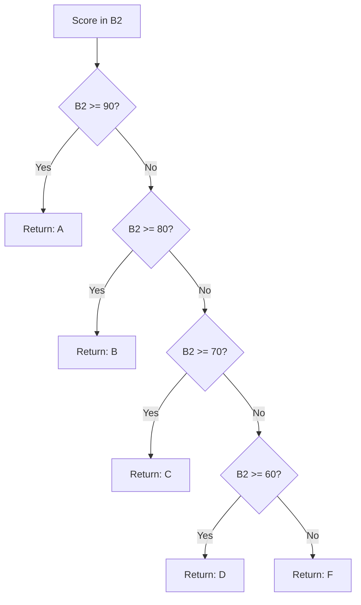

# Lecture 1 — Logical Branching: IF, IFS & Booleans

> **Duration:** ~2 hours. **Outcome:** You can write an `IF` that returns different results depending on a condition, chain multiple conditions with `IFS`, and combine conditions with `AND`/`OR`/`NOT` to express a real business rule in one cell.

## 1. A formula that decides, not just calculates

Every formula through Week 2 always did the same math on the same inputs. A logical formula does **different** things depending on what's true. That single idea — "compute this if a condition holds, otherwise compute that" — is the foundation of every "smart" spreadsheet you've ever used: a gradebook that assigns letter grades, an inventory sheet that flags low stock in red, a payroll sheet that pays a different rate to managers.

Build the `Grades` sheet now — type this into it:

```
      A          B        C
1   Student    Score    Result
2   Amara      92
3   Devon      67
4   Priya      81
5   Malik      58
6   Sofia      74
```

## 2. `IF` — the single branch

```
=IF(logical_test, value_if_true, value_if_false)
```

Three arguments: a condition that evaluates to `TRUE` or `FALSE`, what to return if it's `TRUE`, and what to return if it's `FALSE`. In `C2`:

```
=IF(B2>=60, "Pass", "Fail")
```

`B2` is `92`, `92>=60` is `TRUE`, so `C2` shows `Pass`. Fill down through `C6`. Malik's `58` gives `Fail`; everyone else gives `Pass`.

**The condition (`logical_test`) is just any formula that returns `TRUE` or `FALSE`.** You already know how to build these from Week 2's comparison operators: `=`, `<>` (not equal), `>`, `<`, `>=`, `<=`. `B2>=60` is a Boolean expression the same way `B2+B3` is an arithmetic one — it just returns a truth value instead of a number.

**Text arguments need quotes; cell references and numbers don't.** `"Pass"` needs the double quotes because it's a literal string. `IF(B2>=60, B2*2, 0)` needs no quotes on `B2*2` or `0` because those are a formula and a number, not text.

## 3. Nesting `IF` for more than two outcomes

A single `IF` only branches two ways. For a letter grade — five outcomes (A/B/C/D/F) — nest one `IF` inside the `value_if_false` of the previous one:

```
=IF(B2>=90, "A", IF(B2>=80, "B", IF(B2>=70, "C", IF(B2>=60, "D", "F"))))
```

Read it as a staircase: "if 90+, A; **otherwise**, if 80+, B; **otherwise**, if 70+, C…" and so on down to the final, unconditional `"F"`. This works — try it in `D2`, fill down — but notice two things that make nested `IF` dangerous as it grows:

**Order matters, and it's easy to get backwards.** The test must go from the *most restrictive* condition to the *least restrictive*. If you'd written `IF(B2>=60,"D",IF(B2>=90,"A",...))`, then a 92 would hit `B2>=60` first, return `"D"`, and the `>=90` test would never even run — a genuinely correct-90 student gets marked `D`. Nested `IF` doesn't warn you about this; it just silently gives the wrong answer at the *first* condition that happens to be true, not the *right* one.


*The nested IF/IFS staircase must test most-restrictive first, or a high score gets caught by a lower threshold.*

**Every level of nesting adds a parenthesis you must close correctly.** At four or five levels, counting closing `)`s by eye becomes real work, and one missing or extra paren gives a cryptic error instead of a clear one. Excel's formula bar color-codes matching parens as you type — use it — but this is exactly the fragility `IFS` was built to remove.

## 4. `IFS` — multiple conditions, no nesting

`IFS` takes any number of *condition, result* pairs and returns the result for the **first** condition that's `TRUE`, evaluated in the order you list them — no nesting, no stacked parentheses:

```
=IFS(B2>=90, "A", B2>=80, "B", B2>=70, "C", B2>=60, "D", TRUE, "F")
```

Same logic as the nested `IF` above, same "most restrictive first" ordering rule — `IFS` doesn't fix *that* trap, only the readability and parenthesis-counting one. The final `TRUE, "F"` pair is the standard "catch-all" idiom: `TRUE` is always true, so it's the fallback that fires only if every earlier condition failed. Without it, a score that matches none of the listed conditions returns the error `#N/A` instead of a value — always include a `TRUE, ...` catch-all as the last pair unless you're certain every possible input is covered.

Replace `D2`'s nested `IF` with the `IFS` version in `E2`, fill down, and compare — same results, meaningfully easier to read and to extend (adding an `A+` tier is one more pair, not one more nesting level).

**When to use which:** `IF` for a genuine two-way branch (pass/fail, in-stock/out-of-stock). `IFS` for three or more mutually exclusive tiers evaluated in order (grade bands, shipping-cost tiers, commission brackets). Reach for nested `IF` only when you're on an Excel version without `IFS` (pre-2019) — otherwise `IFS` is strictly more readable for the same job.

**Excel vs. Google Sheets:** `IFS` works identically in both, and both require the `TRUE` catch-all idiom the same way. `IFS` was introduced in Excel 2019/365, so if you're on Excel 2016 or earlier, nested `IF` is your only option there.

## 5. `AND`, `OR`, `NOT` — combining conditions

Real rules are rarely a single comparison. "Approve if the score is 90+ **and** attendance is 100%." "Flag if stock is below 10 **or** the item is discontinued." These need Boolean combination, and Excel/Sheets give you three functions, not `&&`/`||` symbols:

```
=AND(condition1, condition2, ...)   → TRUE only if every condition is TRUE
=OR(condition1, condition2, ...)    → TRUE if at least one condition is TRUE
=NOT(condition)                     → flips TRUE to FALSE and vice versa
```

Add an `Attendance` column to `Grades`:

```
      D            E
1   Attendance   HonorRoll
2   1.0
3   0.85
4   0.95
5   0.70
6   1.0
```

(Attendance is stored as a decimal fraction — `1.0` = 100%, formatted as a percentage. Format `D2:D6` as Percentage now if it isn't already, from Week 1.)

**Honor roll rule: score 90+ AND attendance 90%+.**

```
=IF(AND(B2>=90, D2>=0.9), "Honor Roll", "")
```

Both conditions must hold. Amara (`92`, `100%`) qualifies; Priya (`81`, `95%`) fails on score alone even though her attendance is fine — `AND` requires *every* argument `TRUE`, so one failing condition sinks the whole thing.

**"Needs review" rule: score under 60 OR attendance under 80%.**

```
=IF(OR(B2<60, D2<0.8), "Needs Review", "OK")
```

Malik (`58`) triggers on score; if anyone had `65` but `70%` attendance, they'd still trigger — `OR` only needs *one* condition true. This is the opposite failure mode from `AND`: use `AND` when a case must clear every bar, `OR` when clearing any one bar is enough. Confusing the two is a very common logic bug — read the English rule out loud and listen for "and" vs. "or" before you write the formula.

**`NOT` — inverting a condition.** `=NOT(B2>=60)` is identical to `B2<60`, and for a simple comparison like this you'd just flip the operator. `NOT` earns its keep when the condition itself is already complex and rewriting it inverted would be error-prone:

```
=IF(NOT(AND(B2>=60, D2>=0.75)), "At Risk", "On Track")
```

This reads as "if it's **not** the case that (score is passing AND attendance is adequate), flag At Risk" — inverting the whole compound condition at once rather than manually flipping both `>=` to `<` and swapping `AND` for `OR` (which is what you'd have to do by hand, and is easy to get backwards — this is exactly De Morgan's law, and `NOT(AND(...))` lets the spreadsheet do that inversion for you instead of you doing it in your head).

## 6. Nesting `AND`/`OR` together for compound rules

Conditions combine further: "Honor roll if (score 90+ AND attendance 90%+) OR (score 95+ regardless of attendance, for a documented exception)":

```
=IF(OR(AND(B2>=90, D2>=0.9), B2>=95), "Honor Roll", "")
```

Read from the innermost parentheses out, exactly like arithmetic order of operations from Week 2: the `AND(...)` resolves to a single `TRUE`/`FALSE` first, then that result is one of two arguments to `OR`. Build compound rules incrementally — test the inner `AND`/`OR` alone in a scratch cell first, confirm it returns the `TRUE`/`FALSE` you expect on a few sample rows, *then* wrap it in the outer function. Debugging a five-level-deep logical formula all at once is much harder than debugging it one layer at a time.

## 7. Booleans are values, not just conditions

`TRUE` and `FALSE` aren't only formula outputs — they're a real data type you can store, compare, and even do arithmetic with. `=TRUE+TRUE` returns `2` (Excel/Sheets treat `TRUE` as `1` and `FALSE` as `0` in numeric contexts). This is genuinely useful: `=SUM(B2:B6>=60)` as an **array formula** counts how many scores are passing, because the comparison produces an array of `TRUE`/`FALSE` values that `SUM` then adds as `1`/`0`. You'll use this pattern more deliberately with `SUMPRODUCT` and dynamic arrays later in the course — for now, just know that a condition's result is a first-class value, not a special "only inside `IF`" thing.

## 8. Check yourself

- Why must a chain of nested `IF`s (or `IFS` pairs) for grade bands go from the highest threshold to the lowest, not the other way around?
- What does `IFS` return if none of its conditions are `TRUE` and there's no `TRUE, ...` catch-all pair — and how do you prevent that?
- Write, in words, the difference between `AND(A, B)` and `OR(A, B)` when exactly one of `A`/`B` is true.
- Rewrite `=IF(NOT(B2>=60), "Fail", "Pass")` without using `NOT`.
- A rule reads: "flag as urgent if the order is overdue and either high-value or from a VIP customer." Which combination of `AND`/`OR` (and how nested) expresses that correctly?

If those came quickly, move to Lecture 2 — `XLOOKUP`, where you stop hard-coding values and start pulling them from another table.

## Further reading

- **Microsoft — IF function:** <https://support.microsoft.com/en-us/office/if-function-69aed7c9-4e8a-4755-a9bc-aa8bbff73be2>
- **Microsoft — IFS function:** <https://support.microsoft.com/en-us/office/ifs-function-36329a26-37b2-467c-972b-4a39bd951d45>
- **Microsoft — AND, OR, NOT functions:** <https://support.microsoft.com/en-us/office/and-function-5f19b2e8-e1df-4408-897a-ce285a19e9d9>
- **Google — Logical functions (IF, IFS, AND, OR, NOT):** <https://support.google.com/docs/table/25273>
