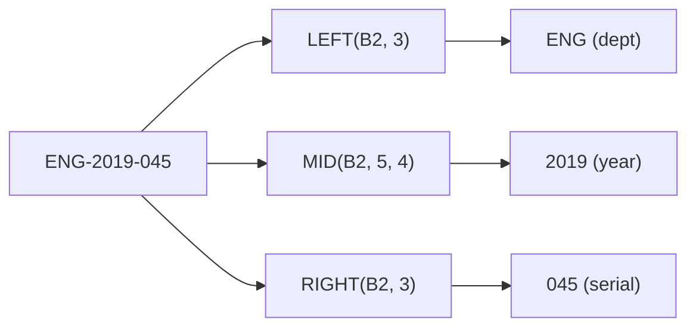
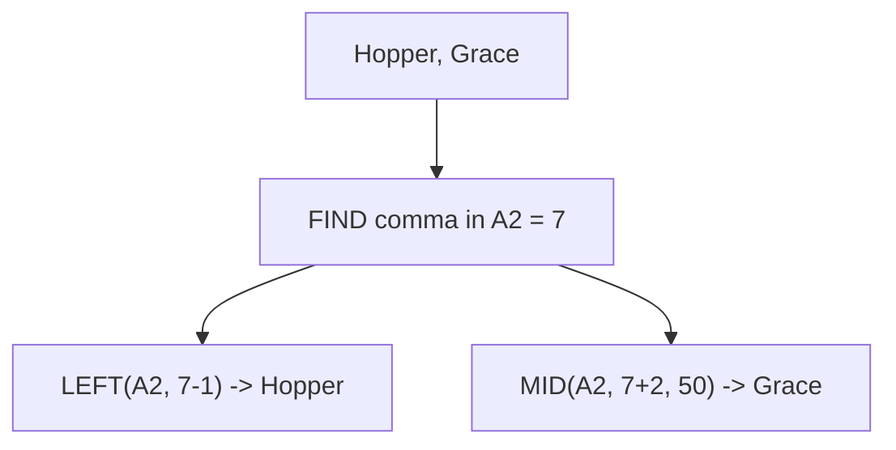

# Lecture 1 — Parsing Text: Extract, Find & Split

> **Duration:** ~2 hours. **Outcome:** You can pull a fixed-position substring out of a cell with `LEFT`/`RIGHT`/`MID`, locate *where* a character sits with `FIND`/`SEARCH` so `MID` can use that position dynamically, and split a whole field into columns with `TEXTSPLIT` or Text to Columns.

## 1. Why parsing is the first skill, not an edge case

Real data almost never arrives in the shape you need. A CRM export gives you `"Hopper, Grace"` in one cell when you need `Last` and `First` as two separate columns for a mail merge. An inventory system gives you `"ENG-2019-045"` as one product code when you actually need the department, the year, and the serial number as three separate, sortable, filterable fields. Parsing is the skill of reaching *into* a text value and pulling out just the piece you need — and once you can do it with a formula, it applies to every row in a 50,000-row column at once, correctly, forever.

Build the `Contacts` sheet:

```
      A                    B
1   FullName             EmployeeCode
2   Hopper, Grace        ENG-2019-045
3   Lovelace, Ada         ENG-2020-112
4   Turing, Alan          ENG-2018-003
5   Torvalds, Linus       ENG-2021-077
6   Hamilton, Margaret    ENG-2019-091
7   Johnson, Katherine    ENG-2022-014
```

Two problems live in this tiny table: `FullName` needs splitting on the comma, and `EmployeeCode` needs its three parts (department, year, serial) pulled out separately. You'll solve both.

## 2. `LEFT`, `RIGHT`, `LEN` — fixed positions from either end

The three simplest text functions grab characters counting from one end of a string:

```
=LEFT(text, [num_chars])    → the first num_chars characters
=RIGHT(text, [num_chars])   → the last num_chars characters
=LEN(text)                  → the total number of characters
```

`EmployeeCode` has a predictable shape: 3 letters, a dash, 4 digits, a dash, 3 digits — always the same lengths. That predictability is exactly what makes `LEFT`/`RIGHT` the right tool here (Section 4 covers what to do when the shape *isn't* predictable).

In `C2`, pull the department code — the first 3 characters:

```
=LEFT(B2, 3)
```

Returns `ENG`. In `D2`, pull the serial number — the last 3 characters:

```
=RIGHT(B2, 3)
```

Returns `045`. Fill both down through row 7. Notice `LEN` isn't needed for either of these because the position is fixed from a known end — that's the whole point of `LEFT`/`RIGHT`: they don't care how long the *rest* of the string is.

Add a `LEN` check in `E2` just to see it work:

```
=LEN(B2)
```

Returns `12` for `ENG-2019-045` — useful any time you need to confirm every row in a column has the length you expect (a fast way to spot rows that don't match the pattern, before they break a `LEFT`/`RIGHT` formula that assumes a fixed shape).

## 3. `MID` — a slice from the middle

`EmployeeCode`'s year (`2019`) sits in the middle — 4 characters starting at position 5. `MID` grabs a slice from any starting position:

```
=MID(text, start_num, num_chars)
```

In `F2`:

```
=MID(B2, 5, 4)
```

Returns `2019` — starting at character 5 (`2`), grab 4 characters. Fill down through row 7. `MID`'s three arguments read naturally once you count: `E`(1)`N`(2)`G`(3)`-`(4)`2`(5)`0`(6)`1`(7)`9`(8)`-`(9)`0`(10)`4`(11)`5`(12) — position 5 is exactly where the year starts, and it's always 4 characters, because every code in this column follows the identical shape.


*Three fixed-position slices carve one code into department, year, and serial.*

**This only works because the shape is fixed.** If some codes were `ENG-19-045` (2-digit year) and others `ENG-2019-045` (4-digit year), a hard-coded `MID(B2, 5, 4)` would silently return the wrong slice on the short ones — no error, just wrong data. Section 4 is exactly the fix for that fragility.

## 4. `FIND` and `SEARCH` — locate a character instead of hard-coding its position

Now split `FullName` — `"Hopper, Grace"` — into `Last` and `First`. Unlike `EmployeeCode`, the comma isn't always at the same position (`"Hopper, Grace"` vs. `"Lovelace, Ada"` — the comma lands in a different spot each row). You need to *find* the comma's position first, then slice relative to it.

```
=FIND(find_text, within_text, [start_num])     → case-sensitive, no wildcards
=SEARCH(find_text, within_text, [start_num])   → case-insensitive, allows wildcards (* and ?)
```

Both return the character position of the first match, or an error if not found. In `C2`, find the comma's position:

```
=FIND(",", A2)
```

Row 2 (`"Hopper, Grace"`) returns `7` — the comma is the 7th character. Now use that position to drive `LEFT` for the last name, in `D2`:

```
=LEFT(A2, FIND(",", A2) - 1)
```

The `- 1` drops the comma itself, leaving just `Hopper`. For the first name, in `E2`, skip past the comma **and** the space after it:

```
=TRIM(MID(A2, FIND(",", A2) + 2, 50))
```

`FIND(",", A2) + 2` skips the comma (1 character) and the space after it (1 character), landing on `G`. The `50` is a deliberately oversized `num_chars` — `MID` simply returns however many characters actually exist if you ask for more than remain, so padding the count is a common, safe habit when you just want "everything to the end." (`TRIM` here is a preview of Lecture 2 — it mops up if a name has extra trailing spaces; harmless if there aren't any.) Fill both formulas down through row 7. Every row now splits correctly *regardless of where the comma sits*, because the position was found, not assumed.


*Find the comma's position once, then reuse it to slice both the last and first name.*

**`FIND` vs. `SEARCH` — when the difference matters:** if you needed to locate `"grace"` (lowercase) inside `"Hopper, Grace"`, `FIND("grace", A2)` returns an error (case mismatch — `FIND` is case-sensitive), while `SEARCH("grace", A2)` succeeds. `SEARCH` also accepts `?` (any single character) and `*` (any run of characters) as wildcards — useful for "find something matching a pattern" rather than an exact string. Default to `SEARCH` unless you specifically need case-sensitivity (e.g., distinguishing a part code `AB-100` from `ab-100` as genuinely different values).

## 5. `TEXTSPLIT` — the modern, one-formula split

Excel 365/Sheets can skip the `FIND`+`LEFT`+`MID` combination entirely for simple delimiter splits, using `TEXTSPLIT`:

```
=TEXTSPLIT(text, col_delimiter, [row_delimiter], [ignore_empty], [match_mode], [pad_with])
```

In `G2`, split `FullName` on the comma in one shot:

```
=TEXTSPLIT(A2, ", ")
```

This **spills** into `G2:H2` automatically — `Hopper` in `G2`, `Grace` in `H2` — no `FIND`, no `-1`, no `+2` arithmetic. Notice the delimiter here is `", "` (comma-space together) rather than just `","` — `TEXTSPLIT` doesn't auto-trim surrounding spaces the way the `FIND`-based approach did with `TRIM`, so building the space into the delimiter itself is the cleanest fix. Only put this formula in `G2` — don't also type something in `H2`, or you'll block the spill with a `#SPILL!` error.

You can split on **multiple delimiters at once** by passing an array: `=TEXTSPLIT(B2, {"-"})` splits `EmployeeCode` into `ENG`, `2019`, `045` across three spilled cells in one formula — a one-line replacement for the three separate `LEFT`/`MID`/`RIGHT` formulas from Sections 2–3, when all you want is every piece with no extra logic.

**When to still use `LEFT`/`RIGHT`/`MID`/`FIND` instead of `TEXTSPLIT`:** when you need only *one* piece of the split (not all of them), when you need to keep working in an Excel version without `TEXTSPLIT` (2019 and earlier), or when the extraction logic isn't a clean delimiter split (like `EmployeeCode`'s fixed-width year in Section 3 — pulling one specific chunk by position, not splitting the whole string).

## 6. Text to Columns — the one-time, non-formula split

Both apps also offer a menu-driven split that runs **once** and replaces the original cells with the split result — no formula, no spill, no live recalculation if the source data changes later:

- **Excel:** select the column → **Data → Text to Columns** → choose **Delimited** → pick the delimiter (comma, in this case) → **Finish**.
- **Google Sheets:** select the column → **Data → Split text to columns** → the delimiter is often auto-detected, or choose **Custom** and type `,`.

**Use Text to Columns when:** you're doing a one-time cleanup of a column you'll never re-import, and you don't need the split to update automatically. **Use `TEXTSPLIT` (or `FIND`/`MID`) when:** the source data will be refreshed, pasted over, or appended to later — a formula re-splits automatically on every new row; Text to Columns has to be re-run by hand every time. For this course, default to formulas unless a challenge or exercise explicitly says otherwise — formulas are the reproducible, auditable choice.

## 7. Check yourself

- Why does `LEFT(B2, 3)` work reliably on `EmployeeCode` but would be a bad choice for splitting `FullName`?
- Walk through `=LEFT(A2, FIND(",", A2) - 1)` for a name where the comma sits at position 10 — what does each part evaluate to?
- What's the one concrete situation where `SEARCH` succeeds and `FIND` fails on the identical two arguments?
- Split `"ENG-2019-045"` with `TEXTSPLIT` on `"-"` — how many cells does the result spill into, and what's in each?
- Name one situation where Text to Columns is the *better* choice than a `TEXTSPLIT` formula, and one where it's the *worse* choice.

If those came quickly, move to Lecture 2 — cleaning the junk that usually surrounds the text you just learned to slice.

## Further reading

- **Microsoft — LEFT, LEFTB functions:** <https://support.microsoft.com/en-us/office/left-leftb-functions-9203d2d2-7960-479b-84c6-1ea52b99640c>
- **Microsoft — MID, MIDB functions:** <https://support.microsoft.com/en-us/office/mid-midb-functions-d5f9e25c-d7d6-472e-b568-4ecb12433028>
- **Microsoft — FIND, FINDB functions:** <https://support.microsoft.com/en-us/office/find-findb-functions-c7912941-af2a-4bdf-a553-d0d89b0a0628>
- **Microsoft — TEXTSPLIT function:** <https://support.microsoft.com/en-us/office/textsplit-function-b1ca414e-4c21-4ca0-b1b7-bdecace8a6e7>
- **Google — SPLIT function:** <https://support.google.com/docs/answer/3094136>
- **Google — Split text into columns:** <https://support.google.com/docs/answer/6033206>
