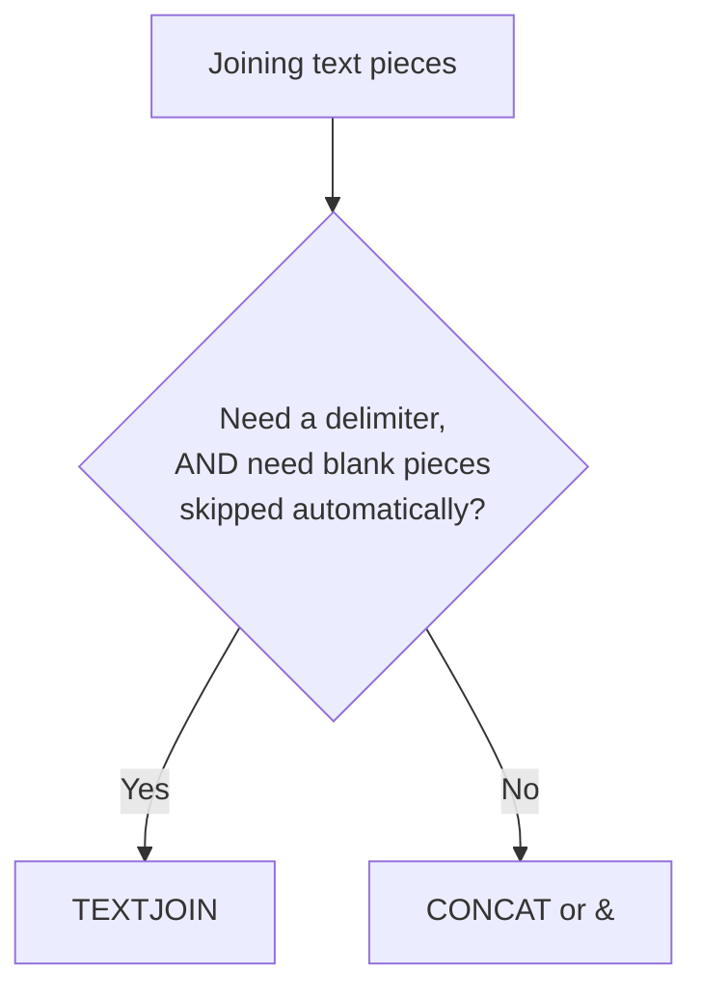

# Lecture 2 — Cleaning & Joining Text

> **Duration:** ~2 hours. **Outcome:** You can strip stray spaces and invisible characters with `TRIM`/`CLEAN`, do targeted find-and-replace inside a formula with `SUBSTITUTE`, normalize casing with `UPPER`/`LOWER`/`PROPER`, and reassemble cleaned pieces into one value with `TEXTJOIN` and `CONCAT`.

## 1. Why "looks fine" isn't "is fine"

A cell can display `Grace Hopper` and still be broken. It might actually contain `"  Grace  Hopper "` (extra spaces you can't see), or `"Grace Hopper "` (a non-breaking space pasted from a webpage, invisible and indistinguishable from a regular space to your eyes), or `"GRACE HOPPER"` in a column where every other row is properly cased. None of these show up by looking at the cell. All of them break things downstream: a `VLOOKUP`/`XLOOKUP` against `"Grace Hopper"` silently fails to match `"  Grace Hopper "` because they are, character for character, different strings. This lecture is the fix.

Extend the `Contacts` sheet with a deliberately messy import — real-world exports look exactly like this:

```
      A                        B                           C
1   RawName                  RawEmail                    RawPhone
2    Grace  Hopper           GRACE.HOPPER@Crunch.io      (512) 555-0110
3   ada lovelace              Ada.Lovelace@CRUNCH.io      512.555.0111
4   ALAN TURING               alan.turing@crunch.io        5125550112
5   Linus  Torvalds           linus.torvalds@Crunch.IO    512-555-0113
6   margaret hamilton         MARGARET.HAMILTON@crunch.io  (512)555-0114
```

Notice: leading/trailing/double spaces in `RawName`, wildly inconsistent casing in every column, and four different phone formats. All believable, all common in a real export.

## 2. `TRIM` — collapse extra whitespace

```
=TRIM(text)
```

`TRIM` removes leading and trailing spaces **and** collapses any run of multiple internal spaces down to one. In `D2`:

```
=TRIM(A2)
```

`"  Grace  Hopper"` → `"Grace Hopper"` — outer spaces gone, the double space between the names collapsed to one. Fill down through row 6. **`TRIM` does not touch single internal spaces** — `"Grace Hopper"` stays `"Grace Hopper"`, exactly as it should.

## 3. `CLEAN` — strip non-printing characters

`TRIM` only handles regular spaces. Data pasted from PDFs, old mainframe exports, or some web pages can carry genuinely non-printing control characters (like a line-feed pasted mid-string) that `TRIM` doesn't touch because they aren't spaces at all.

```
=CLEAN(text)
```

`CLEAN` strips the first 32 ASCII control characters (tab, line feed, carriage return, etc.) that don't print visibly but do affect string comparisons and can even wrap a cell's display oddly. The safe habit for any freshly imported text column: wrap it in both, `CLEAN` first, then `TRIM`:

```
=TRIM(CLEAN(A2))
```

This is a genuinely common production pattern — `TRIM(CLEAN(...))` around every freshly imported text column, every time, whether or not you can currently see a problem. It costs nothing when the data's already fine and saves you the mystery of a lookup that "should" match but doesn't.

## 4. `SUBSTITUTE` — targeted find-and-replace inside a formula

`RawPhone` has four different formats for the same 10 digits. `SUBSTITUTE` removes or replaces a specific substring, wherever it occurs:

```
=SUBSTITUTE(text, old_text, new_text, [instance_num])
```

To strip every non-digit character from a phone number, chain several `SUBSTITUTE` calls, each removing one kind of punctuation:

```
=SUBSTITUTE(SUBSTITUTE(SUBSTITUTE(SUBSTITUTE(C2, "(", ""), ")", ""), "-", ""), ".", "")
```

Working from the inside out: strip `(`, then strip `)` from that result, then strip `-`, then strip `.`. Whatever's left is trimmed of the space that separated area code from the rest — wrap the whole thing in one more `TRIM`:

```
=TRIM(SUBSTITUTE(SUBSTITUTE(SUBSTITUTE(SUBSTITUTE(C2, "(", ""), ")", ""), "-", ""), ".", ""))
```

Put this in `F2` and fill down through row 6 — every row, regardless of its original punctuation style, becomes a clean 10-digit string like `5125550110`. This "chain of `SUBSTITUTE`s" pattern is extremely common for phone numbers, product codes, and any field where several people typed the same underlying value in several different styles.


*Each SUBSTITUTE strips one punctuation style, working from the inside out.*

**The optional 4th argument, `instance_num`, replaces only the *Nth* occurrence.** `=SUBSTITUTE("2024-01-15-Q1", "-", "/", 1)` replaces only the first dash, giving `"2024/01-15-Q1"` — useful when a string has the same delimiter meaning different things in different positions and you only want one of them changed.

## 5. `UPPER`, `LOWER`, `PROPER` — normalize casing

```
=UPPER(text)    → ALL CAPS
=LOWER(text)    → all lowercase
=PROPER(text)   → Title Case (First Letter Of Each Word Capitalized)
```

In `G2`, produce a clean, consistently-cased name:

```
=PROPER(TRIM(A2))
```

Fill down through row 6 — `"ALAN TURING"` and `"ada lovelace"` both become `"Alan Turing"`, matching the already-correct `"Grace Hopper"` row. In `H2`, normalize the email to lowercase (the conventional casing for emails, and critical if you'll later compare or deduplicate them):

```
=LOWER(TRIM(B2))
```

Fill down through row 6. `"GRACE.HOPPER@Crunch.io"` becomes `"grace.hopper@crunch.io"`.

**`PROPER`'s one real weakness:** it capitalizes the letter after *every* space or non-letter boundary, which mangles names like `"McDonald"` (becomes `"Mcdonald"`) or `"O'Brien"` (becomes `"O'brien"`). There's no built-in function that fixes this perfectly — for a handful of known exceptions, layer a `SUBSTITUTE` fix on top (`=SUBSTITUTE(PROPER(A2), "Mcdonald", "McDonald")`); for a large list of exceptions, this is exactly the kind of judgment call worth flagging for manual review rather than trusting blindly. Know the limitation; don't assume `PROPER` output is always correct without a spot-check.

## 6. `TEXTJOIN` — glue pieces back together with a delimiter

Now that `RawName` is split (from Lecture 1) and cleaned, you'll often need to *reassemble* pieces into a new combined value — a full name from first + last, a mailing label from several fields, a formatted ID.

```
=TEXTJOIN(delimiter, ignore_empty, text1, [text2], ...)
```

Given cleaned `First` (`I2`) and `Last` (`J2`) columns (build these with `PROPER`+`TRIM`+`MID`/`LEFT` from Lecture 1's techniques), rebuild a standard `"Last, First"` label in `K2`:

```
=TEXTJOIN(", ", TRUE, J2, I2)
```

The second argument, `ignore_empty`, is the reason `TEXTJOIN` usually beats plain `&` concatenation: set it `TRUE` and any blank piece in the list is silently skipped **along with its delimiter** — so joining `First`, `Middle`, `Last` where `Middle` is blank for most people doesn't leave you with `"Grace  Hopper"` (double space) or `"Grace, , Hopper"` (stray comma). Try it directly:

```
=TEXTJOIN(" ", TRUE, "Grace", "", "Hopper")
```

Returns `"Grace Hopper"` — one space, not two — because the empty middle name and its delimiter were both dropped.

**`TEXTJOIN` can also join an entire range at once**, not just individual cells — `=TEXTJOIN(", ", TRUE, A2:A6)` joins every value in `A2:A6` into one comma-separated string, which plain `&` simply cannot do without typing out `A2&", "&A3&", "&A4...` by hand.

## 7. `CONCAT` and `&` — simple concatenation without a delimiter

When you don't need a delimiter or the empty-skip behavior, `CONCAT` (or the older `&` operator) is simpler:

```
=CONCAT(text1, [text2], ...)
=A2 & B2
```

Build a normalized email in `L2` from a cleaned first initial and last name:

```
=LOWER(LEFT(I2, 1) & J2) & "@crunch.io"
```

For `Grace`/`Hopper`, this returns `"ghopper@crunch.io"`. `&` and `CONCAT` are functionally interchangeable for simple joins — `&` is slightly faster to type inline; `CONCAT` reads a bit more clearly when chaining many pieces or joining a whole range. Either is fine; **`TEXTJOIN` is the one to reach for specifically when a delimiter and empty-skipping both matter.**


*Which joining tool to reach for, based on what the join needs to do.*

## 8. Check yourself

- Why wrap an imported text column in `TRIM(CLEAN(...))` even when it looks fine on screen?
- Walk through the four chained `SUBSTITUTE` calls on `"(512) 555-0110"` one substitution at a time — what does the string look like after each step?
- What specific bug does `TEXTJOIN`'s `ignore_empty = TRUE` prevent that plain `&` concatenation doesn't?
- Name a real name where `PROPER` produces the wrong result, and explain why.
- When would you choose `CONCAT`/`&` over `TEXTJOIN`?

If those came quickly, move to Lecture 3 — dates, which look like text but are secretly numbers, and the specific ways that trips people up.

## Further reading

- **Microsoft — TRIM function:** <https://support.microsoft.com/en-us/office/trim-function-410388fa-c5df-49c6-b16c-9e5630b479f9>
- **Microsoft — CLEAN function:** <https://support.microsoft.com/en-us/office/clean-function-26f3d7c5-475f-4a9c-90e5-4b8ba987ba41>
- **Microsoft — SUBSTITUTE function:** <https://support.microsoft.com/en-us/office/substitute-function-6434944e-a904-4c7a-a3a4-a2966fabcf1a>
- **Microsoft — TEXTJOIN function:** <https://support.microsoft.com/en-us/office/textjoin-function-357b449a-ec91-49d0-80c3-0e8fc845691c>
- **Google — TRIM, CLEAN, SUBSTITUTE, TEXTJOIN (text function list):** <https://support.google.com/docs/table/25273>
