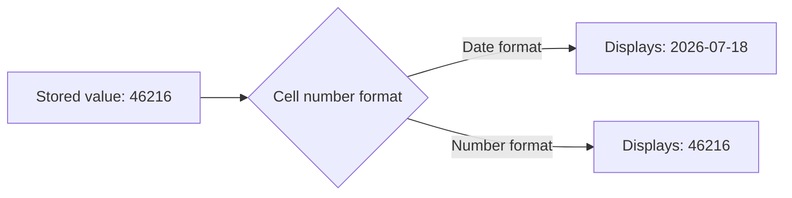
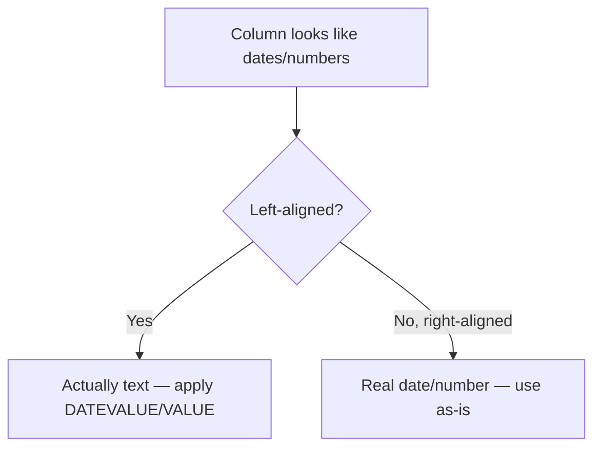

# Lecture 3 — Dates & Time Math

> **Duration:** ~2 hours. **Outcome:** You can explain why a date is secretly a number, build and decompose dates with `DATE`/`YEAR`/`MONTH`/`DAY`, find month-ends and weekdays with `EOMONTH`/`WEEKDAY`, compute real business date math with `DATEDIF`/`NETWORKDAYS`, and convert reliably between text and real dates with `DATEVALUE`/`TEXT`.

## 1. The single most important fact about dates

Every date in Excel and Google Sheets is stored as a **serial number** — an integer counting days since a fixed epoch (Excel: December 31, 1899, so January 1, 1900 = `1`; Google Sheets: December 30, 1899, same practical effect for any date you'll use). A "date" is never actually a date underneath — it's a number that's been given a **date number format** so it *displays* as one.

Prove it. In a blank cell, type a real date and check the raw value:

```
A1: 2026-07-18
```

Now in `A2`:

```
=A1
```

`A2` shows the same date — because it inherited the same underlying number and Excel/Sheets applies date formatting by default when it sees another date. Now change `A2`'s format to plain **Number** (Excel: Home → Number format dropdown → Number; Sheets: Format → Number → Number). `A2` now shows something like `46216` — that's the actual serial number sitting underneath every date you've ever typed. Set it back to Date format and it displays as a date again. **Nothing about the value changed — only the display.**


*Same underlying serial number, two different displays — only the format changed.*

This single fact is why date arithmetic works at all: `EndDate - StartDate` is just subtracting two integers, and the result is a count of days. Try it:

```
B1: 2026-08-01
=B1 - A1
```

Returns `14` (as a plain number — format the cell as Number if it defaults to a date format, which sometimes happens since the operands were dates). Two dates two weeks apart, subtracted, gives you 14 — exactly the "number of days between them" you'd expect, because under the hood you subtracted `46230` from `46216`.

## 2. `DATE` — build a date from parts

```
=DATE(year, month, day)
```

`DATE` is the reverse of typing a date literally — it *constructs* a serial number from three separate numeric inputs, which matters the moment those three pieces come from other cells or formulas rather than being typed as one literal string.

```
=DATE(2026, 7, 18)
```

Returns July 18, 2026 as a real date. `DATE` also **auto-rolls overflow values** — a genuinely useful behavior, not a bug: `=DATE(2026, 13, 1)` returns January 1, 2027 (month 13 rolls into the next year), and `=DATE(2026, 7, 45)` returns August 14, 2026 (day 45 of July rolls past July's 31 days into August). This makes `DATE` the correct tool for "N days/months from this date" calculations — instead of manually checking whether a month has 28, 29, 30, or 31 days, let `DATE`'s auto-roll handle it: `=DATE(YEAR(A1), MONTH(A1)+3, DAY(A1))` correctly adds 3 months to any date, rolling the year forward automatically if needed.

## 3. `YEAR`, `MONTH`, `DAY` — decompose a date back into parts

The reverse direction — pulling a single component out of an existing date:

```
=YEAR(date)   =MONTH(date)   =DAY(date)
```

Build the `Orders` sheet:

```
      A            B
1   OrderID      OrderDate
2   ORD-1001     2026-01-15
3   ORD-1002     2026-02-28
4   ORD-1003     2026-03-31
5   ORD-1004     2026-06-30
6   ORD-1005     2026-12-01
```

In `C2`, pull just the year:

```
=YEAR(B2)
```

Returns `2026`. Fill `MONTH(B2)` in `D2` and `DAY(B2)` in `E2`, then fill all three down through row 6. These three are the building blocks for grouping orders by year or month in later weeks (pivot tables, Week 8+) — a raw date column can't be grouped by "month" directly in every tool, but a `MONTH()` column can always be filtered, sorted, or grouped on.

## 4. `EOMONTH` — the last day of a month, N months away

A specific, extremely common need: "what's the last day of this month?" (for billing cutoffs, reporting periods, subscription renewals). Manually checking whether a month has 28, 29, 30, or 31 days is exactly the kind of fragile logic to avoid — `EOMONTH` does it correctly every time:

```
=EOMONTH(start_date, months)
```

In `F2`, the last day of the order's own month:

```
=EOMONTH(B2, 0)
```

For `2026-02-28` (already a leap-adjacent month — 2026 is *not* a leap year, so February has 28 days), this correctly returns `2026-02-28` (not `2026-02-29`, because 2026 isn't a leap year). Fill down and compare: row 4's order date is already `2026-03-31` and `EOMONTH(B4, 0)` confirms it — `2026-03-31` really is March's last day.

The `months` argument shifts by whole months: `=EOMONTH(B2, 1)` gives the last day of the *next* month; `=EOMONTH(B2, -1)` gives the last day of the *previous* month. This is the standard building block for "billing due N months from now" or "start of next month" logic — for the *first* day of next month, add 1 to the previous month's `EOMONTH`: `=EOMONTH(B2, -1) + 1`.

## 5. `WEEKDAY` — which day of the week

```
=WEEKDAY(date, [return_type])
```

`return_type` controls the numbering; the two you'll actually use are `1` (default: Sunday=1 … Saturday=7) and `2` (Monday=1 … Sunday=7 — the ISO-style convention many business reports expect). In `G2`:

```
=WEEKDAY(B2, 2)
```

`2026-01-15` is a Thursday, so this returns `4`. Combine `WEEKDAY` with `IF` (Week 3) to flag weekend orders — orders placed on a Saturday or Sunday, using the default `return_type=1` where Sunday=1 and Saturday=7:

```
=IF(OR(WEEKDAY(B2)=1, WEEKDAY(B2)=7), "Weekend", "Weekday")
```

## 6. `TEXT` — formatting a date (or number) as a display string

Sometimes you want a date *as text*, formatted a specific way, to embed in a label, a file name, or a concatenated report title — not to do math on. `TEXT` converts a real date/number into a formatted string:

```
=TEXT(value, format_code)
```

```
=TEXT(B2, "mmmm d, yyyy")
```

Returns `"January 15, 2026"` as a genuine text string (left-aligned, not a real date underneath — you cannot subtract this from another date). Useful format codes: `"yyyy-mm-dd"` (ISO), `"mmm d"` (`Jan 15`), `"dddd"` (full weekday name, `Thursday`). Combine with `TEXTJOIN`/`&` from Lecture 2 to build a report title: `="Sales Report — " & TEXT(TODAY(), "mmmm yyyy")`.

**The trap to avoid:** once you've run a date through `TEXT`, the result is text, not a date — you can display it, concatenate it, but you cannot do `EndTextDate - StartTextDate` and get a meaningful day count. Keep real dates in one column for math, and use `TEXT` only in the specific cell where you need a formatted display string.

## 7. `DATEVALUE` and `VALUE` — the fix for "dates" that are secretly text

This is the single most common real-world date bug: a CSV export gives you a column that *looks* exactly like dates — `"2026-01-15"`, left-aligned in the cell (the tell — real dates right-align) — but every cell is actually a text string, because whatever exported the CSV wrote it as text, not a date-typed value. Formulas that expect real dates (`EOMONTH`, subtraction, sorting chronologically) either error out or silently give nonsense.

Test it: type `2026-01-15` into a cell, then immediately format that same cell as **Text** *before* checking alignment — or more realistically, imagine a cell that already contains a left-aligned `"2026-01-15"` from a bad import. Fix it with `DATEVALUE`:

```
=DATEVALUE(date_text)
```

```
=DATEVALUE("2026-01-15")
```

Returns the real serial number for that date — now right-aligned, sortable, and usable in `EndDate - StartDate` math or inside `EOMONTH`. The sibling function `VALUE` does the same conversion for plain numbers that were imported as text (`=VALUE("1234")` → the number `1234`, usable in `SUM`, unlike the text version which `SUM` silently ignores).

**The fast diagnostic:** if a column of "dates" won't sort chronologically, won't subtract, or `SUM`/`AVERAGE` ignores it — check alignment first. Left-aligned in a column you expect to be dates or numbers is nearly always the tell that you're looking at text, and `DATEVALUE`/`VALUE` is the fix.


*Alignment is the fastest visual check for text masquerading as a date or number.*

## 8. `DATEDIF` and `NETWORKDAYS` — real business date math

`DATEDIF` computes the difference between two dates in a chosen unit — years, months, or days — correctly handling the fact that "how many years" isn't just `(end - start) / 365` (leap years break that):

```
=DATEDIF(start_date, end_date, unit)
```

| `unit` | Returns |
|---|---|
| `"Y"` | Complete years between the dates |
| `"M"` | Complete months between the dates |
| `"D"` | Total days between the dates |
| `"YM"` | Months, ignoring years (0–11) |
| `"MD"` | Days, ignoring months and years (0–30ish) |

Compute someone's tenure in complete years, given a `HireDate` in `H2` and today:

```
=DATEDIF(H2, TODAY(), "Y")
```

`TODAY()` returns the current date as a live, auto-updating serial number (no arguments — recalculates every time the sheet opens or recalculates). **`DATEDIF` is a real, working function in both Excel and Google Sheets despite Microsoft's own documentation historically calling it "undocumented"** — it works reliably and is the standard tool for age/tenure calculations; you'll use it constantly.

`NETWORKDAYS` counts business days (Monday–Friday, excluding weekends) between two dates, optionally excluding a list of holidays:

```
=NETWORKDAYS(start_date, end_date, [holidays])
```

```
=NETWORKDAYS(B2, B2+10)
```

Counts the business days in the 10 calendar days after an order date — useful for "expected delivery by N business days" logic. Pass a range of holiday dates as the third argument to exclude them too: `=NETWORKDAYS(B2, B2+10, HolidayList!A2:A15)`.

## 9. Check yourself

- What is the actual stored value behind the date `2026-07-18`, and why does that fact make `EndDate - StartDate` work?
- Why is `EOMONTH(B2, 0)` a better choice than manually checking "does this month have 30 or 31 days"?
- What's the single fastest visual check for "is this column of dates actually text in disguise"?
- Compute, by hand, `DATEDIF("2018-03-15", "2026-07-18", "Y")` — walk through why it's that number and not one off in either direction.
- Why does `TEXT(B2, "mmmm d, yyyy")` break if you try to subtract two cells that both used it?

If those came quickly, you're ready for this week's exercises — splitting names, cleaning imports, and computing real date math on data you build yourself.

## Further reading

- **Microsoft — DATE function:** <https://support.microsoft.com/en-us/office/date-function-e36c0c8c-4104-49da-ab83-82328b832349>
- **Microsoft — EOMONTH function:** <https://support.microsoft.com/en-us/office/eomonth-function-7314ffa1-2bc9-4005-9d66-f49db127d628>
- **Microsoft — WEEKDAY function:** <https://support.microsoft.com/en-us/office/weekday-function-60e44483-2ed1-4f82-ab55-b6eb1a49bd6e>
- **Microsoft — DATEDIF function:** <https://support.microsoft.com/en-us/office/datedif-function-25dba1a4-2812-480b-84dd-8b32a451b35c>
- **Microsoft — NETWORKDAYS function:** <https://support.microsoft.com/en-us/office/networkdays-function-48e717bf-a7a3-495f-969e-5005e3eb18e7>
- **Microsoft — DATEVALUE function:** <https://support.microsoft.com/en-us/office/datevalue-function-df8b07d4-7761-4a93-bc33-b7471bbff252>
- **Microsoft — TEXT function:** <https://support.microsoft.com/en-us/office/text-function-20d5ac4d-7b94-49fd-bb38-93d29371225c>
- **Google — Date and time functions:** <https://support.google.com/docs/table/25273>
