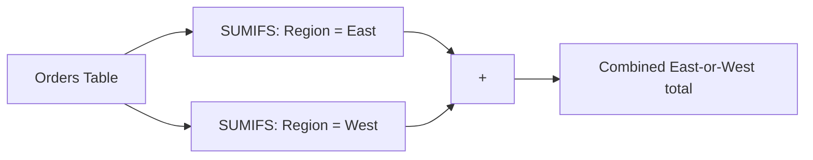

# Lecture 3 — Conditional Aggregation: the IFS Family

> **Duration:** ~2 hours. **Outcome:** You can write `SUMIFS`, `COUNTIFS`, and `AVERAGEIFS` formulas that filter a Table by one or several criteria at once, combine them with structured references so the criteria ranges grow with the Table, and use them to build a small live summary sheet — a Region × Category matrix — that updates itself as new orders are added.

Every question a stakeholder asks about a dataset has the same shape: "give me the total for *this slice*." Total sales in the East region. How many software orders. Average order size for a specific rep. In SQL you'd write a `WHERE` clause; in a spreadsheet, the `SUMIFS`/`COUNTIFS`/`AVERAGEIFS` family **is** your `WHERE` clause — conditional aggregation, built into three functions you'll use more than almost anything else in this course.

## 1. `SUMIFS` — the shape

```
=SUMIFS(sum_range, criteria_range1, criteria1, [criteria_range2, criteria2], ...)
```

Note the argument order: the range you want to **add up** comes first, then pairs of (range to test, value to test for) — as many pairs as you need. This is the opposite argument order from the older single-criterion `SUMIF(criteria_range, criteria, sum_range)`, which puts `sum_range` last — a genuinely common source of transposed-argument bugs when people mix the two. This course teaches `SUMIFS` exclusively, even for a single condition, so you only ever need to remember one argument order.

**One criterion — total sales in the East region:**

```
=SUMIFS(Orders[Total], Orders[Region], "East")
```

Read it as: "sum the `Total` column, where the `Region` column equals `East`." Verify against the seed data — East region orders total **2659.24**.

**Two criteria — East region *and* Software category:**

```
=SUMIFS(Orders[Total], Orders[Region], "East", Orders[Category], "Software")
```

Every additional (range, criteria) pair is an **implicit `AND`** — a row must satisfy all of them to be included. This returns **563.00** (order 1020's CRM License, $445, plus order 1024's Project Mgmt License, $118). There is no built-in `OR` across criteria pairs in `SUMIFS` itself — Section 5 covers the workaround for "either of these categories."

## 2. `COUNTIFS` — counting instead of summing

```
=COUNTIFS(criteria_range1, criteria1, [criteria_range2, criteria2], ...)
```

Identical criteria-pair pattern, but no `sum_range` at all — you're counting matching rows, not adding a column. How many Software orders total:

```
=COUNTIFS(Orders[Category], "Software")
```

Returns **7**. How many orders were placed by rep `T. Osei` for 3 or more units:

```
=COUNTIFS(Orders[Rep], "T. Osei", Orders[Qty], ">=3")
```

Notice the second criterion: `">=3"` — a comparison operator **as a text string**, quotes and all. This is the standard way every function in this family accepts inequality, wildcard, and comparison criteria — always a string, even though it's testing a number. Returns **1** (order 1015, Office Chair, qty 3).

## 3. `AVERAGEIFS` — the same pattern, averaged

```
=AVERAGEIFS(average_range, criteria_range1, criteria1, ...)
```

Same argument order as `SUMIFS` (the range to operate on comes first). Average order size for rep `R. Diaz`:

```
=AVERAGEIFS(Orders[Total], Orders[Rep], "R. Diaz")
```

R. Diaz's five orders total 2254.97, so this returns **450.994**. Remember from Week 1-adjacent aggregate behavior (and true here too): `AVERAGEIFS` divides by the **count of matching rows**, not by the Table's total row count — if a rep has zero matching orders, this returns `#DIV/0!`, not `0`. Wrap it in `IFERROR` (Week 3) if a summary sheet needs to show `0` or blank for a rep with no orders yet: `=IFERROR(AVERAGEIFS(...), 0)`.

## 4. Criteria syntax reference

Every criterion in this family follows the same small set of patterns:

| Criterion | Meaning |
|---|---|
| `"East"` | Exact text match (case-insensitive) |
| `">=3"` | Comparison — works on numbers and dates |
| `"<>East"` | Not equal to |
| `"*Desk*"` | Wildcard contains — `*` matches any sequence, same as `LIKE` in Week 3's context |
| `">="&DATE(2026,2,16)` | A cell/computed value concatenated into a comparison string — you can't just write `>=DATE(...)` as a literal string, it must be built with `&` |
| `D2` (a cell reference, no quotes) | Match whatever value is currently in that cell — lets a summary formula react to a dropdown or input cell |

That last row matters for building a reusable summary sheet: instead of hard-coding `"East"` into every formula, point the criterion at a cell containing `East`, and the same formula serves every region just by changing what's in that one input cell — or, better, by dragging the formula across a small matrix where the row/column headers *are* the criteria, covered next.

## 5. Handling "either of these" — `OR` logic inside `SUMIFS`

`SUMIFS`'s criteria pairs are always `AND`ed together. For "Region is East **or** West," wrap two `SUMIFS` calls in addition — each one independently exact, summed together:

```
=SUMIFS(Orders[Total], Orders[Region], "East") + SUMIFS(Orders[Total], Orders[Region], "West")
```

This returns **4274.21** (East 2659.24 + West 1614.97). The `+` between two complete `SUMIFS` calls is doing the `OR` — each call is a fully independent filter, and you're summing their two results, not trying to cram an `OR` into one call's criteria.



*Faking `OR` by summing two independent `SUMIFS` calls, since criteria pairs inside one call are always `AND`ed.*

## 6. Building a live summary sheet — a Region × Category matrix

This is the payoff for the whole lecture. On your `Summary` sheet (created in Lecture 2), build a small matrix: regions down the side, categories across the top, `SUMIFS` filling every cell.

```
        A          B             C           D                  E
1                  Electronics   Furniture   Office Supplies    Software
2       North
3       South
4       East
5       West
```

Type the region names in `A2:A5` and the category names already sit in `B1:E1`. In `B2`, write **one formula** you'll fill across and down to the whole 4×4 grid:

```
=SUMIFS(Orders[Total], Orders[Region], $A2, Orders[Category], B$1)
```

Look closely at the reference locking — this is Week 2's mixed-reference skill, now applied to criteria cells instead of a tax rate:

- **`$A2`** — column locked, row free. Filling this formula **right** across the row must keep pointing at column `A` (the region for *this* row) while filling **down** must let the row number change to track each new region.
- **`B$1`** — row locked, column free. Filling **right** must let the column change to track each category header; filling **down** must keep pointing at row `1` (the categories never move as you go down).

Fill `B2` right through `E2`, then select `B2:E2` and fill down through row 5. Every one of the 16 cells now shows the correct region/category total, and every one is a **single formula pattern**, not 16 different ones you wrote by hand. Spot-check against the values computed from the seed data: `North`/`Electronics` = **180.00**, `East`/`Furniture` = **2063.00**, `West`/`Software` = **326.00**.

Add a Total Row-style bottom sum and right-column sum using structured references and plain `SUM`:

```
B6 (col total, fill right through E6):  =SUM(B2:B5)
F2 (row total, fill down through F5):   =SUM(B2:E2)
```

`F6` (grand total, both ways) should read **5240.60** — matching the README checksum, and matching `SUM(Orders[Total])` computed directly. If your matrix's grand total doesn't match that number, one of your `SUMIFS` cells has a typo'd criterion — most often a mismatched exact-text category or region name.

## 7. Why this matrix stays correct forever

Every cell in `B2:E5` references `Orders[Total]`, `Orders[Region]`, and `Orders[Category]` — **structured references, not `A2:A25`-style addresses.** Add order 1025 to the `Orders` Table tomorrow, in any region, any category, and every one of these 16 `SUMIFS` cells recalculates automatically the instant the new row lands, because the Table grew and every structured reference in the workbook grew with it. No range to extend, no formula to re-drag, no "did I remember to update the summary" step. This is the exact behavior the mini-project asks you to prove, end to end, on a full report.

## 8. Check yourself

- Why does `SUMIFS` put its sum range first while the older `SUMIF` puts it last, and why does this course only teach `SUMIFS`?
- Write a `COUNTIFS` formula counting orders where `Qty` is at least 2 **and** `Category` is `"Furniture"`.
- What does `AVERAGEIFS` return for a rep with zero matching orders, and how do you make it show `0` instead?
- In the criteria string `">="&DATE(2026,2,16)`, why is the `&` necessary — what happens if you omit it?
- In the summary matrix formula `=SUMIFS(Orders[Total], Orders[Region], $A2, Orders[Category], B$1)`, explain exactly why `$A2` and `B$1` use different lock patterns.
- You add a new order row to the `Orders` Table. Which cells in the Region × Category matrix need to be manually updated?

If those came quickly, move to the exercises — you'll build this exact matrix yourself from a blank sheet, then extend it in the challenges and mini-project.

## Further reading

- **Microsoft — SUMIFS function:** <https://support.microsoft.com/en-us/office/sumifs-function-c9e748f5-7ea7-455d-9406-611cebce642b>
- **Microsoft — COUNTIFS function:** <https://support.microsoft.com/en-us/office/countifs-function-dda3dc6e-f74e-4aee-88bc-aa8c2a866842>
- **Microsoft — AVERAGEIFS function:** <https://support.microsoft.com/en-us/office/averageifs-function-48910c45-1fc0-4389-a028-f7c5c3001690>
- **Google — SUMIFS:** <https://support.google.com/docs/answer/9088700>
