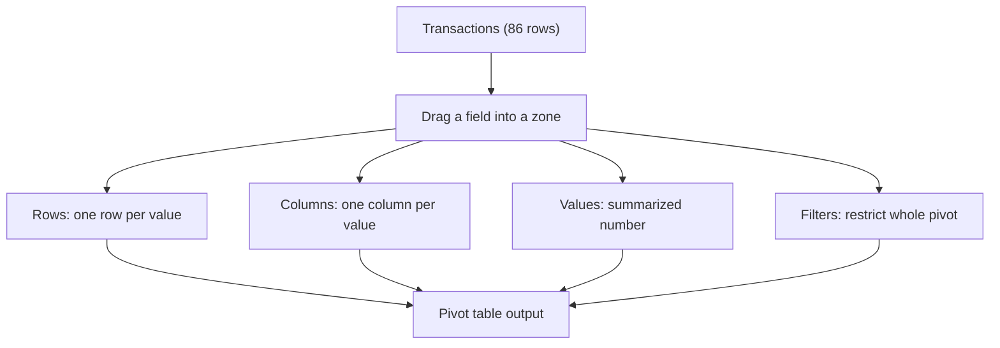

# Lecture 1 — Pivot Table Mechanics

> **Duration:** ~2 hours. **Outcome:** You can insert a pivot table from the `Transactions` table, place fields into the correct zone, choose the right aggregation, understand why the source being a Table matters, and refresh the pivot after the source data changes — in both Excel and Google Sheets.

## 1. What a pivot table actually does

Look at the `Transactions` sheet. It's a **flat table** — one row per order, 86 rows, 11 columns. Flat tables are great for storing data and terrible for reading it. Nobody can glance at 86 rows and tell you which region sold the most, or how May compared to January. The information is *in there*, but it isn't *visible*.

A pivot table's whole job is to answer one shape of question over and over:

> **"By [dimension], what is [measure]?"**

*By region, what is total revenue? By category, what is average order size? By month, how many orders came in?* Every one of those is the same underlying operation: group the rows by some column (or several), then collapse each group down to a single summary number. That grouping-and-collapsing operation is called a **pivot**, and it's the same operation `GROUP BY` performs in a database and `groupby()` performs in a dataframe — spreadsheets just give it a drag-and-drop interface instead of syntax.

Crucially: a pivot table never touches your source data. It reads from `Transactions`, builds a **separate summary object** on its own sheet, and leaves the 86 original rows completely untouched. You can build ten different pivot tables from the same source and none of them will ever corrupt the raw data — which is exactly why "keep raw data on one sheet, build everything else on top of it" (Week 1's convention) matters more than ever this week.

## 2. Inserting your first pivot table

**Excel:**

1. Click any cell inside the `Transactions` Table.
2. **Insert → PivotTable** (or **Insert → Recommended PivotTables** to see Excel's auto-suggestions first — a genuinely useful starting point when you're not sure what to build).
3. Excel auto-detects the Table's full range (because it's a Table, not a bare range — see §5) and defaults to "New Worksheet." Click **OK**.
4. A blank pivot canvas appears on the left, and the **PivotTable Fields** pane appears on the right, listing all 11 columns with four empty boxes below: **Filters, Columns, Rows, Values**.

**Google Sheets:**

1. Click any cell inside the `Transactions` table/range.
2. **Insert → Pivot table**.
3. Choose "New sheet" (recommended — keep pivots off the raw data sheet) and confirm the data range is correct.
4. The **Pivot table editor** panel opens on the right with the same four sections: **Rows, Columns, Values, Filters** (Sheets lists Rows/Columns above Values; the zones are identical in meaning to Excel's).

Both tools also offer an auto-suggestion feature (Excel's Recommended PivotTables, Sheets' "Suggested" pivot tables) that scans your columns and proposes a few starting pivots. Worth a glance when you're stuck on where to start — but this lecture builds pivots by hand so you understand every zone, not just the suggestions.

## 3. The four zones

Every pivot table is built from exactly four zones. Understanding what each one *does* — not just where it sits in the UI — is 90% of pivot table fluency.

| Zone | What it does | Example from `Transactions` |
|------|---------------|------------------------------|
| **Rows** | One output row per unique value (or combination of values) | Drag `Region` here → 4 rows: East, North, South, West |
| **Columns** | One output column per unique value — turns the pivot into a crosstab | Drag `Channel` here → 3 columns: Online, Retail, Wholesale |
| **Values** | The number(s) being summarized, and how | Drag `TotalRevenue` here, set to **Sum** |
| **Filters** | A dropdown that restricts the *entire* pivot to one or a few values, without adding a row or column for it | Drag `Category` here → pick "Camping" to see only camping orders everywhere else in the pivot |

*How dragging a field into each of the four zones shapes the pivot table output.*

Build this now: drag `Region` to **Rows** and `TotalRevenue` to **Values**. You should see:

| Region | Sum of TotalRevenue |
|--------|---------------------|
| East | 4,936.58 |
| North | 8,666.93 |
| South | 5,671.46 |
| West | 8,220.02 |
| **Grand Total** | **27,494.99** |

That's the whole mechanic. One drag into Rows, one drag into Values, and 86 rows became 4. Now add `Channel` to **Columns** and watch the same pivot split into a 4×3 crosstab — every region's revenue broken down by how it was sold, still built from the exact same two drags-plus-one you just did.

### Multiple fields in one zone

Rows and Columns each accept more than one field, and **order matters** — the first field is the outer grouping, the second nests inside it. Drag `Category` into Rows *underneath* `Region` and you get region groups, each expandable to show its categories nested inside. Drag `Region` first and `Category` second and you get the opposite nesting. There's no "correct" order — it depends which grouping the reader wants to scan first.

## 4. Aggregation choices

The **Values** zone doesn't just sum — every value field has a **summary function** you choose explicitly.

| Aggregation | What it computes | When to use it |
|-------------|-------------------|------------------|
| **Sum** | Total of all values in the group | Revenue, units, cost — anything additive |
| **Count** | Number of *rows* in the group (any field, even text) | "How many orders?" |
| **Count Numbers** (Excel) / Count works differently in Sheets | Number of *numeric* cells only | Rarely needed once you know the difference exists |
| **Average** | Mean of the values in the group | "What's the typical order size?" |
| **Max / Min** | Largest / smallest value in the group | "What was our biggest order this month?" |
| **Product** | Multiplies values together | Rare — compound growth factors, etc. |
| **StdDev / Var** | Spread of the values | Rare in business reporting, common in analysis |

**Change the aggregation on your Region pivot right now.** With `TotalRevenue` still in Values, switch it from Sum to **Average**. The numbers change completely — North's *average* order (~$376.83) tells a different story than North's *total* ($8,666.93). Neither is "more correct"; they answer different questions, and picking the wrong one is the single most common pivot table mistake beginners make.

**Excel:** click the field in the Values box → **Value Field Settings** → pick the summary function (and, on that same dialog, rename the field — e.g., "Sum of TotalRevenue" → "Total Revenue" — cosmetic but worth doing for anything you'll show someone else).

**Google Sheets:** click the field under Values → the "Summarize by" dropdown appears directly in the editor panel.

### Count vs. Sum: they don't agree

Drag `Category` into Rows and put `OrderID` into Values set to **Count**, then add a second `TotalRevenue` field set to **Sum**, side by side:

| Category | Count of OrderID | Sum of TotalRevenue |
|----------|------------------:|---------------------:|
| Accessories | 10 | 1,803.70 |
| Apparel | 21 | 4,586.01 |
| Camping | 20 | 8,535.29 |
| Electronics | 19 | 6,784.95 |
| Footwear | 16 | 5,785.04 |

**Apparel has the most orders (21) but Camping has the most revenue (8,535.29).** That's not a mistake — Camping gear costs more per unit, so fewer, bigger orders outweigh more, smaller ones. This is exactly why the aggregation you pick changes the answer to "which category matters most," and exactly why a careful analyst states which aggregation they used when reporting a ranking.

## 5. Why the source has to be a Table (or a clean range)

Pivot tables read a **rectangular range**: one header row, then unbroken data rows, no blank rows or columns inside it. Two consequences:

1. **A Table (Week 6) auto-expands its range** as you add rows, and a pivot built on a Table auto-includes new rows the next time it refreshes — no re-pointing the pivot's source range required. A pivot built on a bare, un-Tabled range does **not** grow automatically; if you add row 87 below a plain range, the pivot's source still stops at row 86 until you manually edit **PivotTable Analyze → Change Data Source**.
2. **A blank row or column anywhere inside the range breaks detection** in both tools — the pivot will either truncate at the gap or misread where headers are. Keep source data gap-free; that's the whole reason Week 1 taught you to never leave a blank row "for spacing" inside a data block.

This is the concrete payoff of last week's Table lesson: build pivots on Tables and this whole category of bug disappears.

## 6. Refreshing — pivot tables are a snapshot, not a live view

Here's the single most-missed fact about pivot tables in **Excel**: after you build one, editing the source data does **not** automatically update the pivot. The pivot cached a snapshot of the data at build time. If you go change a `TotalRevenue` value in `Transactions`, the pivot table still shows the old number until you tell it to look again.

**Excel:** right-click anywhere inside the pivot → **Refresh** (or **PivotTable Analyze → Refresh**, or **Data → Refresh All** to refresh every pivot in the workbook at once). There's also a "Refresh data when opening the file" checkbox in **PivotTable Options → Data** worth turning on for pivots you revisit often.

**Google Sheets:** pivot tables generally recalculate automatically as the source range changes, much like a formula would — you'll usually see the change reflected within a second or two without any manual action. If a Sheets pivot ever looks stale (rare, but happens with very large ranges or right after a bulk paste), click anywhere in it and press the small refresh icon Sheets shows in the corner, or reopen the pivot editor.

**Practice it now:** change one row's `TotalRevenue` in `Transactions` by any amount, look at your Region pivot in Sheets (should update on its own), then do the same test in Excel and confirm you must **Refresh** to see it. This difference trips up almost everyone the first time they build a report in Excel, forget to refresh, and hand someone a number that's already wrong.

## 7. Check yourself

- What question shape does every pivot table answer? Phrase it as "by ___, what is ___?"
- Which zone would you use to restrict an entire pivot to only 2025 Q2 data without adding a row or column for it?
- You put `Category` in Rows and `TotalRevenue` (Sum) in Values. Which category wins — and does that answer change if you switch to Count?
- Why does a pivot built on a Table auto-include newly added rows, while one built on a bare range does not?
- True or false: editing source data in Excel instantly updates every open pivot table. What's the actual behavior, and how do you fix it?

If those are automatic, Lecture 2 goes deeper: grouping dates and numbers, calculated fields, and reframing raw sums as percentages, running totals, and ranks.

## Further reading

- **Microsoft — Create a PivotTable to analyze worksheet data:** <https://support.microsoft.com/en-us/office/create-a-pivottable-to-analyze-worksheet-data-a9a84538-bfe9-40a9-a8e9-f99134456576>
- **Microsoft — Change the data source for a PivotTable:** <https://support.microsoft.com/en-us/office/change-the-data-source-for-a-pivottable-1cac445b-6fa8-4fac-98bc-3e934b6b6cb2>
- **Google — Create and use pivot tables:** <https://support.google.com/docs/answer/1272900>
