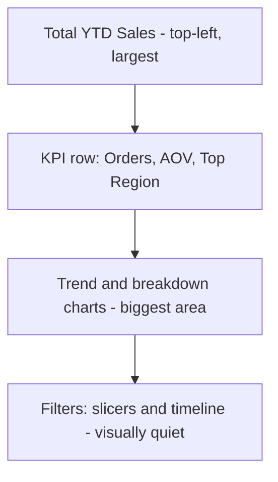

# Lecture 1 — Dashboard Design Principles

> **Duration:** ~2 hours. **Outcome:** You can look at a business question, a blank sheet, and a data source, and sketch — before writing a single formula — a dashboard layout with a clear visual hierarchy that fits on one screen and tells the viewer the right thing first.

## 1. The problem this lecture solves

You already know how to build a pivot table and a pivot chart (Week 7). Open your `PivotByRegion`, `PivotByCategory`, `PivotByRep`, and `PivotByMonth` sheets from this week's setup step and look at them side by side. Each one is *correct*. Each one also answers exactly one question, and only if the viewer already knows to ask it. Hand a busy regional manager four separate pivot tables on four separate tabs and the honest response is "which one am I supposed to look at, and what am I looking for?"

A **report** is a collection of correct numbers. A **dashboard** is a designed object: one screen, a small number of things on it, arranged so the most important fact is also the most visually dominant one, built for someone who has five seconds and no patience for tab-hopping. That's not a formula skill — you already have every formula skill this week needs from Weeks 2, 3, 6, and 7. It's a **design** skill, and like any design skill it has rules you can learn and apply deliberately instead of guessing.

## 2. Audience-first: who is looking, and what do they need to decide?

Before you place a single cell, answer three questions on paper:

1. **Who is the primary viewer?** A VP skimming on a phone between meetings needs something different from an analyst who will sit with the sheet for twenty minutes. Design for the *primary* viewer — you can always add a drill-down for the analyst, but the primary layout should serve whoever glances at it most often.
2. **What decision or question does this dashboard exist to answer?** For the Crunch Retail sales dashboard this week, the governing question is something like *"Is this quarter on track, and where is the weak spot?"* Every element on the screen should serve that question directly. If a chart is interesting but doesn't help answer it, it doesn't belong on this dashboard — it belongs in a separate, deeper report.
3. **What action follows from what they see?** A dashboard that shows numbers but suggests no next action is decoration. "Region South is 40% below target" should be legible at a glance specifically *because* it's the kind of fact that triggers a follow-up conversation.

Write the governing question down and tape it (literally, or as a sticky note in the sheet) where you can see it while you build. Every layout decision this week gets checked against it: *does this help answer that question, or is it here because it was easy to add?*

## 3. Visual hierarchy — size, position, and color signal importance

Human eyes don't scan a screen uniformly — they follow a predictable path, and design either works with that path or fights it.

- **Top-left gets seen first, and most.** Eye-tracking studies on dashboards and web pages consistently show a rough **Z-pattern** for sparse screens (top-left → top-right → diagonal down → bottom-right) or an **F-pattern** for denser, text-heavier ones. Put your single most important number top-left. Put supporting detail and secondary charts lower and to the right.
- **Bigger reads as more important, automatically.** A number rendered at 40pt is read as "the headline" before the viewer has even parsed what it says. A number at 11pt next to it reads as supporting detail. Use size *deliberately* to establish rank — don't make everything the same size and expect the viewer to figure out priority from context.
- **Color should mean something, not just look nice.** Reserve a strong, saturated color (red, amber, green) exclusively for status or alert meaning — "this KPI is below target." Everything else should live in a small, muted, neutral palette. If every tile is a different bright color "for visual interest," the one tile that's actually trying to signal "warning" gets lost in the noise. (Lecture 3 covers building an actual palette; for now, just reserve alert colors mentally.)
- **Whitespace is a hierarchy tool too.** A cramped sheet with no breathing room between elements reads as one undifferentiated block — the eye can't tell where one "thing" ends and the next begins. Deliberate empty rows/columns between zones let the viewer's eye parse the page into sections without you drawing a single border.

**Worked example.** Sketch, in words, the intended hierarchy for the Crunch Retail dashboard before building anything:

1. **First glance (top-left, largest):** Total YTD Sales — the one number that answers "how's the business doing" fastest.
2. **Second glance (top row, smaller, beside it):** three more KPI tiles — Total Orders, Average Order Value, Top Region — supporting context for the headline number.
3. **Third glance (below the KPI row, largest visual real estate):** the Sales by Month trend chart — *is it going up or down* — and the Sales by Region / Sales by Category charts beside or below it.
4. **Filters (top or side, visually quiet):** slicers and the timeline — present and usable, but not competing with the KPI row for attention. A slicer button shouldn't be bigger or brighter than the number it's about to change.

That ordering — headline number, supporting KPIs, trend and breakdown charts, quiet controls — is the visual hierarchy this week's dashboard is built around. Every lecture and exercise after this one assumes roughly that structure.

*The order a viewer's eye should hit each dashboard zone, first glance to last.*

## 4. The single-screen rule

**A dashboard that requires scrolling has already failed at its one job.** The entire point of a dashboard, as distinct from a report, is that it can be taken in at a glance — the moment a viewer has to scroll to see the rest, they're doing report-reading, not dashboard-glancing, and you've lost the format's only advantage.

Concretely, this week's target: the finished dashboard must be fully visible with **no vertical or horizontal scrolling** at a normal laptop window size (roughly 1366×768 or 1440×900, at 100% zoom, with the ribbon/toolbar visible — not a maximized 4K monitor you're assuming the viewer has). Challenge 1 later this week makes this a hard, tested constraint.

The single-screen rule is a forcing function, and it's the single biggest reason dashboard design differs from report design: **you cannot show everything.** You have to choose. That's uncomfortable the first time — every pivot feels important, every chart feels worth including — but it's the actual skill this lecture is teaching. A dashboard with twelve charts crammed onto one tiny screen where nothing is readable is not "single-screen" in any useful sense; it's a report that happens not to scroll. The rule is about *readability at a glance*, not about literal pixel count.

**Practical technique for meeting the rule in Excel/Sheets:**

- **Turn off gridlines** on the dashboard sheet (`View → Gridlines`, uncheck) — this alone makes a sheet look intentionally designed instead of like a spreadsheet.
- **Merge cells sparingly** for the title and KPI labels, but don't merge your data cells — merged cells break `SUMIFS`/pivot references later.
- **Set a fixed zoom and column-width grid** for the dashboard sheet specifically (a common technique: make every column a uniform, narrow width — e.g. ~20-24 px — turning the grid itself into a fine-grained design canvas you can size shapes and charts against precisely, rather than fighting default column widths).
- **Freeze nothing** — a true one-screen dashboard doesn't need frozen panes, because there is nothing to scroll to.

## 5. Choosing the few numbers that actually matter

Every dashboard has a temptation to include everything you know how to calculate. Resist it. The discipline: **pick 3–5 KPIs, no more**, chosen by asking "if the viewer only had five seconds, which of these would change what they do next?"

- **A vanity metric** looks impressive but doesn't change a decision — "Total historical orders ever placed" sounds nice but rarely drives action.
- **An actionable metric** does change a decision — "Sales this month vs. last month" or "Which region is furthest below its share of total sales" points directly at a follow-up question or action.

For the Crunch Retail dashboard, this week's four KPI tiles are deliberately chosen for that reason:

| KPI | Why it's on the dashboard, not cut |
|---|---|
| **Total Sales (filtered)** | The single headline number — answers "how much" instantly, and re-computes live under whatever slicer selection is active. |
| **Total Orders (filtered)** | Volume context for the sales number — distinguishes "fewer, bigger orders" from "more, smaller orders," which suggests different follow-up questions. |
| **Average Order Value** | A ratio, not just a sum — catches a trend that raw totals can hide (e.g., total sales flat, but AOV dropping because order count is quietly rising). |
| **Top Region (by sales, filtered)** | Directly names where attention should go next — the most actionable single fact on the whole dashboard. |

Notice what's *not* on the list: a full order-count-by-rep breakdown, a product-level table, a running list of every order. Those are legitimate things to know — they just don't belong on the five-second glance screen. (They're exactly the kind of thing a drill-down click, or a separate detail tab, is for — outside this week's scope, but worth knowing the distinction exists.)

## 6. Sketch before you build

The fastest way to end up with a cluttered, scrolling, unreadable dashboard is to open a blank sheet and start dropping in whatever pivot chart you built most recently. Instead, **sketch first** — on paper, in a text file, or as rough boxes drawn directly on the sheet with the shape tool — before placing a single real element.

A minimal sketch answers, in order:

1. Where does the **title** go, and how big?
2. Where does the **KPI row** go — how many tiles, what size, what order (left-to-right = importance, per Section 3)?
3. Where do the **charts** go — which is largest (most important), which are secondary?
4. Where do the **filter controls** (slicers, timeline) go — present but visually quiet?
5. Does the whole thing fit in the single-screen boundary from Section 4?

Sketching costs five minutes and saves an hour of rebuilding a dashboard whose layout fought itself the entire time you were assembling it. Exercise 1, immediately after this lecture, has you do exactly this sketch for the Crunch Retail dashboard before any pivot or slicer gets placed on the dashboard sheet.

## 7. Check yourself

- What's the practical difference between a "report" and a "dashboard," in terms of what the viewer is expected to do with it?
- Name two design tools (besides literal font size) that signal "this is the most important thing on the screen" without any text saying so.
- Why does the single-screen rule force you to cut content, and why is that a *feature* of dashboard design rather than a limitation you work around?
- Give an example of a vanity metric and an actionable metric that both describe the same underlying data, but only one of which belongs on a five-second-glance dashboard.
- Why sketch a layout before building it, given that you already know how to build every individual piece (KPI tile, chart, slicer)?

If those came quickly, move to Lecture 2 — turning the sketch into a working dashboard by wiring slicers and a timeline to every pivot table at once.

## Further reading

- **Microsoft — Excel help & learning (training hub — search "dashboard" for current walkthroughs):** <https://support.microsoft.com/en-us/excel>
- **Microsoft — Overview of PivotTables and PivotCharts (the raw material any dashboard sits on top of):** <https://support.microsoft.com/en-us/office/overview-of-pivottables-and-pivotcharts-527c8fa3-02c0-445a-a2db-7794676bce96>
- **Google — Create and use pivot tables (Sheets Help — the Sheets-side equivalent raw material):** <https://support.google.com/docs/answer/1272900>
