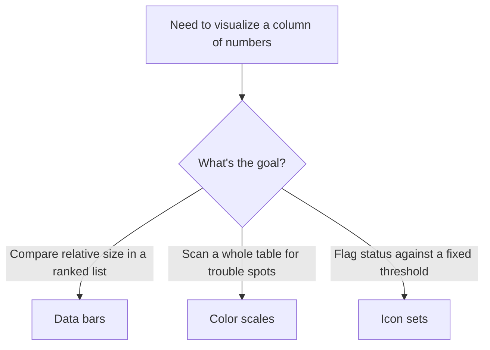

# Lecture 3 — In-Cell Visuals & Polish

> **Duration:** ~2 hours. **Outcome:** You can add sparklines, data bars, color scales, and icon sets that show a trend or a comparison inside a single cell — no chart required — and apply the consistent theming pass that separates a dashboard someone trusts from one that merely has correct numbers on it.

## 1. The problem this lecture solves

Your dashboard from Lecture 2 is functionally complete: four connected pivots, working slicers and a timeline, four live KPI tiles, a dynamic title. Look at it now with fresh eyes and it probably still looks like a spreadsheet — default fonts, default gridlines, a chart with Excel's default blue, KPI numbers the same size as everything around them. **Function and polish are different jobs**, and this lecture is entirely about the second one. A dashboard with perfect formulas and inconsistent, cluttered formatting reads as untrustworthy before anyone even checks a number — polish isn't decoration, it's part of how a viewer decides whether to believe what they're looking at.

## 2. Sparklines — a chart's worth of trend in one cell

A **sparkline** is a miniature chart that lives entirely inside a single cell — no axis labels, no legend, no chart frame, just the shape of a trend. It answers "is this going up or down" without spending any of your precious single-screen real estate on a full chart.

**In Excel:** select an empty cell next to (or below) a row of monthly values — for example, twelve monthly sales totals pulled from `PivotByMonth` into a horizontal helper range. `Insert → Sparklines → Line` (or `Column`, or `Win/Loss`). In the dialog, set **Data Range** to the twelve monthly values and **Location Range** to the single cell you selected. Click OK — that one cell now shows a tiny line chart of the twelve-month trend.

```
Data range:     PivotByMonth!$B$2:$B$13   (12 monthly totals)
Location range: DashboardSheet!$D$2       (a single cell)
```

Sparkline types and when to use each:

- **Line** — best for a continuous trend over time (this week's default: monthly sales trend).
- **Column** — best when individual period values matter as much as the overall direction (e.g., comparing twelve discrete months rather than emphasizing the smooth trend line).
- **Win/Loss** — best for a binary up/down signal per period (e.g., "was this month above or below target"), rendered as uniform up/down blocks regardless of magnitude.

Once placed, the `Sparkline Design` (or `Sparkline`) tab lets you: mark the **high point** and **low point** in a different color (`Show` group, checkboxes), set the **line/marker color**, and choose whether the sparkline's vertical axis is scaled per-cell or matched across a whole column of sparklines (`Axis → Same for All Sparklines` — turn this on whenever you're showing multiple sparklines that should be visually comparable to each other, e.g., one per region).

**In Google Sheets:** there's no menu item — sparklines are a **function**, typed directly into the cell:

```
=SPARKLINE(B2:M2)
```

`SPARKLINE` takes a range and an optional second argument, an options object, controlling type and styling:

```
=SPARKLINE(B2:M2, {"charttype","column";"color","#4472C4";"highcolor","#2E7D32";"lowcolor","#C62828"})
```

This single formula produces a column sparkline, base color blue, with the highest bar in green and the lowest in red — the direct Sheets equivalent of Excel's high-point/low-point marking, just expressed as formula arguments instead of ribbon checkboxes.

## 3. Data bars, color scales, and icon sets — conditional formatting as visualization

These three **conditional formatting** types turn a plain column of numbers into something scannable at a glance, without any chart at all:

- **Data bars** — a horizontal bar drawn *inside* the cell, proportional to its value relative to the range. Best for a ranked list (e.g., sales by rep) where relative size is the point.
- **Color scales** — a gradient (commonly red → yellow → green, or a two-color scale) applied as cell background, shading low values one color and high values another. Best for scanning a whole table at once for "where are the trouble spots."
- **Icon sets** — a small icon (arrows, traffic-light circles, flags) placed at the start of the cell based on which tier the value falls into. Best for a status signal against a fixed threshold (e.g., "is this rep above, at, or below their quota").


*Which conditional-formatting visual fits the question you're answering.*

**In Excel:** select the range, `Home → Conditional Formatting → Data Bars` (or `Color Scales`, or `Icon Sets`), pick a built-in style, or choose `More Rules...` to set custom colors and thresholds. For the KPI-adjacent context this week, apply data bars to a `PivotByRep` sales column so the viewer can see at a glance which reps are ahead without reading every number.

**In Google Sheets:** select the range, `Format → Conditional formatting`, choose **Color scale** (Sheets' built-in gradient tool, directly comparable to Excel's Color Scales) in the side panel. Sheets does not have a native "Data Bars" or "Icon Sets" conditional format type as of this course's writing — the closest workaround for a bar-in-cell effect is the `SPARKLINE` function itself with `charttype: "bar"`, which draws exactly that inside a cell via formula instead of a formatting rule.

**A calibration rule for all three:** set your thresholds to something meaningful, not just "min and max of whatever's currently in the range." A color scale that always shows *something* as red, even when every rep is comfortably above quota, teaches the viewer to ignore red — which defeats the entire purpose of a status color. Anchor thresholds to a real target (e.g., a quota figure) wherever one exists, using `More Rules` (Excel) or custom min/max values (Sheets) instead of the automatic min/max default.

## 4. Consistent theming — a locked palette, not "whatever looked nice"

Pick **one small palette** before formatting anything, and use it everywhere on the dashboard — nowhere else:

- **One accent color** for anything interactive or emphasized (a KPI tile's number, a chart's primary series) — for this week's dashboard, a single blue works well against neutral backgrounds.
- **One or two status colors**, reserved *exclusively* for status meaning (green = on target, red = below target) — never used decoratively elsewhere on the sheet, per the warning in Lecture 1, Section 3.
- **A neutral gray/white base** for everything else — labels, borders, background.

Concretely:

- Set every chart's colors to the same palette manually (`Chart Design → Change Colors`, or edit each series' fill directly) rather than leaving Excel's or Sheets' auto-assigned default chart colors, which are rarely coordinated with each other across multiple charts on the same sheet.
- Use **one font family** throughout the dashboard sheet, at a small number of deliberate sizes (e.g., 24-28pt for KPI numbers, 14pt for section labels, 10-11pt for chart labels and fine print) — not whatever size each element happened to default to.
- Apply **consistent number formatting**: if one KPI tile shows `$10,786.94` and another shows `$10787`, the mismatch reads as sloppy even though both numbers are correct. Pick one currency format (e.g., `$#,##0` with no decimals for large round figures, since cents rarely matter at dashboard-glance scale) and apply it everywhere money appears.

## 5. Removing chrome — the details that signal "designed," not "default"

- **Gridlines off** on the dashboard sheet specifically (`View → Gridlines`, unchecked) — leave them on for your pivot/data sheets where you're working with raw numbers, but a dashboard's *canvas* should look intentional, not like an untouched spreadsheet.
- **Hide helper columns/rows.** Any cell holding intermediate sparkline data, dynamic-title helper text, or KPI-formula scaffolding that isn't meant to be read directly should be hidden (`right-click column/row header → Hide`) or moved to a separate `Helpers` sheet tab entirely, kept out of the viewer's eye line.
- **Borders as intentional dividers, not defaults.** Use a thin, consistent border style to separate the KPI row from the chart zone, and the chart zone from the filter zone — this reinforces the "zones" from Lecture 1's sketch without needing any text label saying "KPIs" or "Charts."
- **Chart junk removal.** Every chart on the dashboard should drop: 3D effects (never used for anything other than "looking busy" — actively harder to read accurately than a flat 2D equivalent), unnecessary legends when a single series' meaning is already obvious from context, default gridlines inside the chart plot area if they're not adding real reading value, and any axis title that just repeats what a nearby label already says.

## 6. Finishing touches

- **A visible "as of" or refresh note.** Add a small, quiet text cell — `"Data as of: "&TEXT(TODAY(),"mmm d, yyyy")` — so a viewer instantly knows whether they're looking at current or stale data. This single detail is one of the most-requested things in real dashboards and costs one formula.
- **A print/PDF check.** Even an on-screen dashboard often gets exported to PDF and emailed. Set `Page Layout → Print Area` to exactly the dashboard's single-screen bounds (matching Lecture 1's single-screen rule) so an export doesn't awkwardly spill a chart or KPI tile onto a second page.
- **A final full-slicer-reset check.** Click every slicer's clear-filter icon, reset the timeline to the full year, and confirm the dashboard still looks correct and complete at its default, unfiltered state — this is the state most viewers will see first, and it needs to be exactly as polished as any filtered view.

## 7. Worked example: polishing the Crunch Retail dashboard

Sequence, applied after Lecture 2's functional wiring is done:

1. Add a `Line` sparkline showing the twelve-month trend next to the Total Sales KPI tile.
2. Apply data bars to the `PivotByRep` sales column so rep performance is scannable at a glance.
3. Lock a three-color palette (one accent blue, green/red for status, neutral gray base) and reformat every chart's series colors to match.
4. Set one consistent currency format across all four KPI tiles and every chart's value axis.
5. Turn off gridlines on the dashboard sheet; hide any helper cells feeding the dynamic title or sparklines.
6. Add thin borders separating the title, KPI row, chart zone, and filter zone.
7. Add a small "Data as of" note near the title.
8. Reset all slicers/timeline to unfiltered and confirm the whole thing still reads cleanly.

## 8. Check yourself

- What's the practical difference between a sparkline and a full chart, and when is a sparkline the *better* choice, not just the smaller one?
- Why should a color scale's thresholds be anchored to a real target value instead of the automatic min/max of whatever's currently in the range?
- Name three specific "chrome" elements worth removing from a finished dashboard, and explain what each one costs the viewer if left in.
- Which conditional-formatting visual type (data bars, color scales, icon sets) does Google Sheets lack natively, and what's the formula-based workaround?
- Why check the dashboard's fully-reset, unfiltered state as carefully as any filtered view, given that filtered views are what slicers are "for"?

That's the end of this week's lectures — from here, the exercises put every piece (layout, slicers, KPI tiles, sparklines, polish) into your hands directly on the Crunch Retail dataset.

## Further reading

- **Microsoft — Use sparklines to show data trends:** <https://support.microsoft.com/en-us/excel/get-started/use-sparklines-to-show-data-trends>
- **Microsoft — Use data bars, color scales, and icon sets to highlight data:** <https://support.microsoft.com/en-us/excel/use-data-bars-color-scales-and-icon-sets-to-highlight-data>
- **Google — SPARKLINE function:** <https://support.google.com/docs/answer/3093289>
- **Google — Use conditional formatting rules in Google Sheets:** <https://support.google.com/docs/answer/78413>
