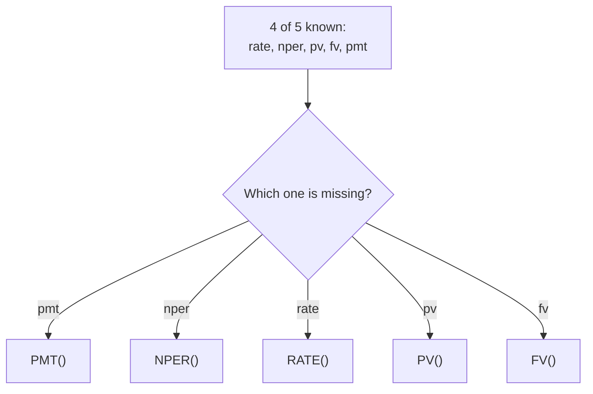
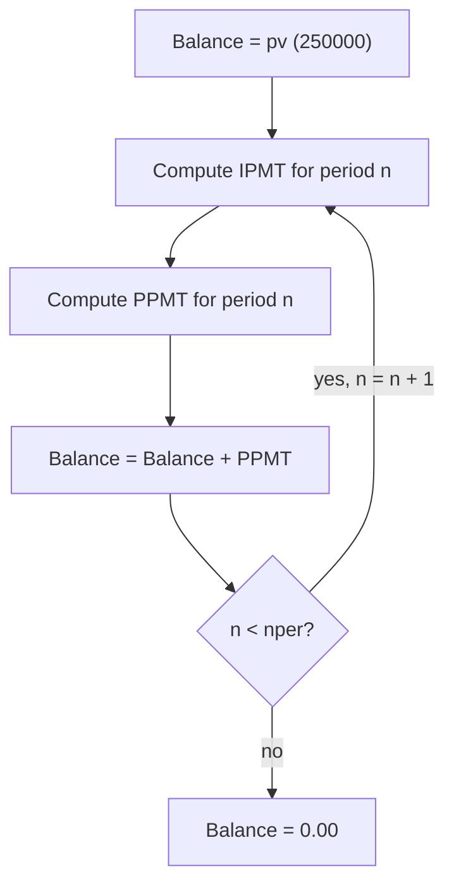

# Lecture 1 — Financial Functions: Time Value of Money, Amortization, and Investment Return

> **Duration:** ~2 hours. **Outcome:** You can compute a loan's fixed payment with `PMT`, split any single payment into interest and principal with `IPMT`/`PPMT`, build a full amortization schedule, and judge whether a set of investment cash flows is worth pursuing with `NPV`, `IRR`, `XNPV`, and `XIRR`.

## 1. Time value of money, in one sentence

A dollar today is worth more than a dollar a year from now — because you could invest today's dollar and have more than a dollar by then. Every function in this lecture is a different angle on that one idea. Once it clicks, the whole family of functions stops looking like a list to memorize and starts looking like one idea applied five ways.

Five quantities show up in almost every time-value-of-money formula, and every financial function in Excel/Sheets takes some subset of them as arguments:

| Symbol | Argument name | Meaning |
|---|---|---|
| `rate` | interest rate **per period** | Must match the payment frequency — monthly payments need the *monthly* rate, not the annual one. |
| `nper` | number of periods | Total number of payments over the life of the loan/investment. |
| `pv` | present value | A lump sum today — a loan amount received, or an investment's cost. |
| `fv` | future value | A lump sum at the end — usually `0` for a loan that fully pays off, but not always. |
| `pmt` | payment per period | A recurring cash flow — a loan payment, a savings contribution. |

Given any four of these, the fifth is computable — that's why Excel has a matching function for each: `PMT` solves for payment, `NPER` for the number of periods, `RATE` for the interest rate, `PV` for present value, `FV` for future value. This lecture focuses on `PMT` (and its siblings `IPMT`/`PPMT`) because loan amortization is the single most common real-world use, then moves to `NPV`/`IRR`, which drop the "fixed payment" assumption entirely and work on *any* sequence of cash flows.


*Any four time-value-of-money quantities determine the fifth — pick the matching function.*

## 2. `PMT` — the fixed loan payment, and why the sign is negative

```
=PMT(rate, nper, pv, [fv], [type])
```

Crunch Manufacturing borrows **$250,000** at **6% annual interest**, paid off over **5 years** in **monthly** installments. Because payments are monthly, the rate and the period count must both be in *months*:

```
=PMT(0.06/12, 5*12, 250000)
```

This returns **`-$4,832.57`**. Two things to understand about that result, not just accept:

**Why divide the rate by 12?** `0.06` is an *annual* rate. A monthly payment needs a *monthly* rate. Dividing by 12 is the simple (and standard) approximation banks use for consumer loans — it is not "true" compounding, but it is the convention every amortization schedule you'll ever open uses, so match it.

**Why is the result negative?** Excel's financial functions use a strict cash-flow-direction convention: money **you receive** is positive, money **you pay out** is negative. You *received* $250,000 (`pv = +250000`), so the thing you pay back every month is cash *leaving* you — hence negative. This isn't a quirk to work around with `ABS()` everywhere; it's the same sign logic that makes `NPV`/`IRR` work correctly later in this lecture, so learn to read it now. If a negative payment bothers your report, wrap the *display*, not the calculation: `=-PMT(0.06/12, 60, 250000)` for a clean positive number to show a reader, while keeping the underlying, signed value available for further math.

**The two optional arguments:**

- `fv` (future value) — the balance you want left over at the end. Omit it (or pass `0`) for a normal loan that's fully paid off. A balloon-payment loan would pass a nonzero `fv`.
- `type` — `0` (default) means payments happen at the **end** of each period (an "ordinary annuity" — how virtually all loans work); `1` means the **beginning** (an "annuity due" — how most leases and rent work). Getting this wrong shifts every number slightly; always confirm which convention your real-world loan uses before trusting the output.

## 3. `IPMT` and `PPMT` — splitting a payment into interest and principal

Every loan payment is part interest (what you owe the lender for the privilege of borrowing) and part principal (what actually reduces your balance). Early in a loan, interest dominates; late in a loan, principal dominates — this is the single most misunderstood fact about loans, and it's exactly what `IPMT`/`PPMT` let you see directly.

```
=IPMT(rate, per, nper, pv, [fv], [type])   -- interest portion of payment number `per`
=PPMT(rate, per, nper, pv, [fv], [type])   -- principal portion of payment number `per`
```

Same arguments as `PMT`, plus `per` — *which* payment number you want (1 through `nper`). For Crunch's loan, the interest and principal in the very first payment:

```
=IPMT(0.06/12, 1, 60, 250000)   -->  -$1,250.00
=PPMT(0.06/12, 1, 60, 250000)   -->  -$3,582.57
```

Check the identity that makes these two functions trustworthy: **`IPMT + PPMT` always equals `PMT`** for the same period. `-1250.00 + -3582.57 = -4832.57` — exactly the `PMT` result from Section 2. If that identity ever fails in your own sheet, one of the three formulas has mismatched arguments (usually `pv` typed differently in one of the three).

Now the first month's interest ($1,250.00) is easy to sanity-check by hand: it's simply the *monthly* rate times the *starting* balance — `0.06/12 * 250000 = 1250`. That's the whole mechanic of amortization: **interest each period is always the rate times whatever balance remains**, and principal is whatever's left of the fixed payment after interest is covered. As the balance shrinks, the interest slice shrinks with it, and — because the *total* payment is fixed by `PMT` — the principal slice grows to make up the difference.

## 4. Building the full amortization schedule

A schedule is just `IPMT`/`PPMT` computed for every period, with a running balance column. Structure it as a table with one row per month:

```
      A       B            C            D           E
1   Period   Payment      Interest     Principal   Balance
2     0                                              250000.00
3     1     =PMT(...)   =IPMT(...,1,...)  =PPMT(...,1,...)  =E2+D3
4     2     =PMT(...)   =IPMT(...,2,...)  =PPMT(...,2,...)  =E3+D4
```

The key formula is the **ending balance**: `=E2+D3` — previous balance plus this period's principal. Because `PPMT` is negative (a payment *reducing* the balance), adding it *subtracts* correctly — another place the sign convention from Section 2 pays off instead of fighting you. Fill rows 3–62 (60 months) and the balance column should reach exactly `0.00` at row 62 — if it lands on a stray fraction of a cent, that's normal floating-point rounding, not a bug; real bank statements handle it with a final adjusted payment.


*Each amortization row repeats the same split-and-reduce cycle until the loan is paid off.*

**Anchor `per` correctly when filling down.** Each row's `per` argument must equal *that row's* period number — reference the `Period` column (`=IPMT($B$1/12, A3, $B$2, $B$3)` referencing `A3`, filled down) rather than typing a literal `1`, `2`, `3…` into each `IPMT` call, or you'll silently compute the wrong period's split. This is exactly the relative-vs-absolute reference discipline from Week 2 — `A3` (the period number) must shift as you fill down; `rate`, `nper`, and `pv` must not.

## 5. `NPV` — present value of an uneven stream of cash flows

`PMT` assumes every period's cash flow is identical. Real investments rarely are — year 1 might lose money, year 3 might be the big payoff. `NPV` handles *any* sequence:

```
=NPV(rate, value1, [value2], ...)
```

Crunch is evaluating a project costing **$100,000** today, expected to return **$28,000, $32,000, $35,000, $30,000, $25,000** over the next five years, discounted at a **10%** required rate of return (the "hurdle rate" — the minimum return that makes the project worth doing instead of just investing the money elsewhere):

```
=NPV(0.10, 28000, 32000, 35000, 30000, 25000) - 100000
```

This returns approximately **$16,928** — meaning the project is worth about $16,928 *more* than doing nothing with that $100,000, in today's dollars, after accounting for the fact that money next year is worth less than money today.

**The single most common `NPV` mistake — and it will bite you if you don't internalize this now:** `NPV`'s first cash flow is assumed to happen at the **end of period 1**, not today (period 0). If your initial $100,000 investment happens *today*, it is **not** one of the arguments inside `NPV` — it gets subtracted separately, exactly as the formula above does. Put it inside the `NPV(...)` call instead —

```
=NPV(0.10, -100000, 28000, 32000, 35000, 30000, 25000)   -- WRONG
```

— and you've silently discounted the initial investment by one extra period, understating the true cost and overstating the project's attractiveness. Always ask: *is this cash flow happening right now, or a full period from now?* Anything happening right now goes outside `NPV` and is added/subtracted at face value.

## 6. `IRR` — the discount rate that makes NPV exactly zero

Where `NPV` answers "what's this worth at a rate I choose," `IRR` flips the question: "at what rate does this investment exactly break even?" That rate is the **internal rate of return** — the investment's own effective annual return, directly comparable to a hurdle rate or to any other investment's IRR.

```
=IRR(values, [guess])
```

Unlike `NPV`, `IRR` takes the *initial* investment **inside** the same array — because `IRR` needs the whole cash-flow timeline, including time 0, to solve for the rate:

```
=IRR({-100000, 28000, 32000, 35000, 30000, 25000})
```

This returns approximately **24.1%** — Crunch's project returns about 24.1% annually, comfortably above the 10% hurdle rate used in the `NPV` calculation, which is the same conclusion `NPV`'s positive $16,928 already told you from a different angle. **`NPV` and `IRR` should always agree on direction**: if `NPV` at your hurdle rate is positive, `IRR` will be above that hurdle rate; if `NPV` is negative, `IRR` will be below it. Checking both is a built-in sanity check on your own model.

`IRR` requires **at least one negative and one positive value** in the array — without both, there's no rate that makes the flows net to zero, and the function errors with `#NUM!`. The optional `[guess]` argument (default `10%`) seeds the iterative search `IRR` runs internally; supply your own guess only if the default fails to converge, which mostly happens with unusual cash-flow patterns (multiple sign changes, e.g. a big cash outflow partway through the project's life).

## 7. `XNPV` and `XIRR` — when cash flows land on real dates, not tidy periods

`NPV` and `IRR` assume every cash flow is exactly one period apart. Real projects rarely cooperate — a customer pays 47 days late, a milestone slips a quarter. `XNPV`/`XIRR` take **actual dates** instead of assuming even spacing:

```
=XNPV(rate, values, dates)
=XIRR(values, dates, [guess])
```

```
      A                B
1   Date             Cash Flow
2   2026-01-15        -100000
3   2026-07-02          28000
4   2027-03-18          32000
5   2027-11-30          35000
6   2028-08-10          30000
7   2029-02-22          25000
```

```
=XNPV(0.10, B2:B7, A2:A7)
=XIRR(B2:B7, A2:A7)
```

`XNPV`/`XIRR` discount each cash flow by the **exact number of days** between it and the first date in the range (using a 365-day year internally), rather than assuming clean annual gaps. For genuinely annual, evenly-spaced projections, `NPV`/`IRR` and `XNPV`/`XIRR` give nearly identical answers — but the moment cash flows are irregular, `XNPV`/`XIRR` are the *correct* tool and plain `NPV`/`IRR` will quietly misstate the answer. **Default to the `X` versions whenever you have real dates available** — they're strictly more accurate and cost you nothing extra to use.

## 8. Check yourself

- Why does `PMT` return a negative number for a loan you're receiving, and how would you display a positive number without corrupting the underlying calculation?
- What identity must always hold between `IPMT`, `PPMT`, and `PMT` for the same period — and what does it mean if it doesn't?
- In an amortization schedule, why does the interest portion shrink and the principal portion grow across the life of the loan, even though the total payment stays fixed?
- Where does the initial investment go in an `NPV` formula — inside the argument list, or added/subtracted separately? Why?
- If `NPV` at your hurdle rate is negative, what do you already know about the project's `IRR` without calculating it?
- When should you reach for `XNPV`/`XIRR` instead of `NPV`/`IRR`?

If those are automatic, Lecture 2 shows you how to lay these formulas out in a workbook so someone else can actually trust and audit them.

## Further reading

- **Microsoft — PMT function:** <https://support.microsoft.com/en-us/office/pmt-function-0214da64-9a63-4996-bc20-214433fa6441>
- **Microsoft — IPMT function:** <https://support.microsoft.com/en-us/office/ipmt-function-5cce0ad6-8402-4a41-8d29-61a0b054cb6f>
- **Microsoft — PPMT function:** <https://support.microsoft.com/en-us/office/ppmt-function-c370d9e3-7749-4ca4-beea-b06c6ac95e1b>
- **Microsoft — NPV function:** <https://support.microsoft.com/en-us/office/npv-function-8672cb67-2576-4d07-b67b-ac28acf2a568>
- **Microsoft — IRR function:** <https://support.microsoft.com/en-us/office/irr-function-64925eaa-9988-495b-b290-3ad0c163c1bc>
- **Microsoft — XNPV function:** <https://support.microsoft.com/en-us/office/xnpv-function-1b42bbf6-370f-4532-a0eb-d67c16b664b7>
- **Microsoft — XIRR function:** <https://support.microsoft.com/en-us/office/xirr-function-de1242ec-6477-445b-b11b-a303ad9adc9d>
- **Google — Financial functions in Sheets:** <https://support.google.com/docs/table/25273#financial>
