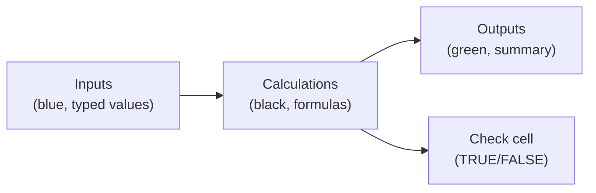

# Lecture 2 — Structuring a Model: Inputs, Calculations, Outputs

> **Duration:** ~2 hours. **Outcome:** You can look at any financial model and immediately identify which cells are assumptions, which are formulas, and which are the answer — and you can build your own models the same way, so a stranger (or you, in six months) can audit them without reading a single formula from scratch.

## 1. Why structure matters more in a financial model than anywhere else in this course

Every workbook you've built so far has been mostly forgiving — a wrong `XLOOKUP` shows an obvious `#N/A`, a bad pivot field just looks wrong on the page. A financial model fails differently: it keeps computing a number, the number looks plausible, and it's **wrong** — because a rate got typed into the wrong cell, or a formula referenced last year's assumption instead of this year's. Nobody notices until the wrong number has already driven a real decision. The single best defense against that is **structure**: a model laid out so its assumptions are impossible to miss and impossible to bury.

The professional convention — used across investment banking, corporate finance, and FP&A teams — separates every model into three zones:

| Zone | What lives there | Color convention |
|---|---|---|
| **Inputs** | Every assumption you could plausibly change: rates, terms, dates, growth rates, prices. Typed numbers, never formulas. | Blue text |
| **Calculations** | Every formula that derives something from the inputs (and possibly other calculations). Never a typed number. | Black text |
| **Outputs** | The final answers a decision-maker actually reads: monthly payment, NPV, IRR, break-even point. Usually formulas referencing calculations, sometimes formatted and highlighted for visibility. | Green text (or bold/boxed) |

You don't need to adopt the exact blue/black/green convention (though it's worth knowing — you'll see it in real finance workbooks and it signals you know what you're doing), but you must adopt the **separation**. The rule that makes everything else in this lecture work:

> **Every number a human might reasonably want to change lives in exactly one clearly labeled cell, and every formula in the model references that cell — never retypes its value.**


*Assumptions flow one direction only — into calculations, then into outputs and a self-check.*

## 2. What goes wrong without this discipline

Compare two versions of the same loan payment formula.

**Ungoverned** — the rate and term are typed directly into the formula, buried in the middle of a sheet with a dozen other numbers:

```
=PMT(0.06/12, 60, 250000)
```

This works, right up until Crunch's bank offers a better rate, and now you're hunting through every sheet for every place `0.06` and `60` appear — a loan calc, a scenario comparison, a chart title — updating each by hand, and hoping you found all of them. Miss one, and half your workbook reflects the new rate while the other half quietly still reflects the old one. This is the single most common way real spreadsheets produce wrong answers that nobody catches for weeks.

**Governed** — three clearly labeled input cells, referenced everywhere:

```
      A                  B
1   Loan Amount        250000
2   Annual Rate          6.00%
3   Term (Years)             5

...elsewhere in the model...
=PMT($B$1/12, $B$3*12, $B$1)      -- WRONG: reused B1 for two different meanings
=PMT($B$2/12, $B$3*12, $B$1)      -- correct
```

Now updating the rate means changing **one cell** — `B2` — and every formula in the workbook that depends on it recalculates automatically. This is exactly the payoff of the absolute references and named ranges from Week 2, applied at the scale of a whole model instead of a single sheet.

## 3. Naming your input cells

Named ranges (Week 2, Lecture 3) stop being a nice-to-have in a financial model and become close to mandatory — a formula like `=PMT(InterestRate/12, TermYears*12, LoanAmount)` is self-documenting in a way `=PMT($B$2/12, $B$3*12, $B$1)` never is. Anyone reading it — including you, months later — knows exactly what each argument means without clicking into each cell to check.

Build the Loan tab's input block this way:

```
      A                  B
1   Loan Amount        250000    <- name this cell "LoanAmount"
2   Annual Rate          6.00%   <- name this cell "AnnualRate"
3   Term (Years)             5   <- name this cell "TermYears"
```

**Excel:** select `B1`, type `LoanAmount` into the Name Box (top-left, replacing the cell address), press **Enter**. Repeat for `B2`/`B3`.
**Google Sheets:** select `B1` → **Data → Named ranges** → type `LoanAmount` → **Done**. Repeat.

Now the payment formula anywhere in the workbook reads:

```
=PMT(AnnualRate/12, TermYears*12, LoanAmount)
```

That formula is correct *and* it explains itself — a reviewer doesn't need the sheet's layout memorized to understand what it computes.

## 4. Grouping inputs into a visible assumptions block

Scatter your inputs across a sheet and the "one clearly labeled cell" rule collapses in practice, even if it's technically true — nobody can find the rate to change it. Instead, group **every** input cell for the whole model into one **Assumptions** block, usually at the top-left of a dedicated tab or the top of the model's main sheet:

```
      A                         B
1   ASSUMPTIONS
2   Loan Amount              250000
3   Annual Interest Rate       6.00%
4   Term (Years)                   5
5   Discount Rate (hurdle)    10.00%
6   Project Life (Years)           5
7
8   CALCULATIONS
9   Monthly Payment           =PMT(...)
...
```

Bold the `ASSUMPTIONS` and `CALCULATIONS` headers, give the assumptions block a light fill color, and freeze the top rows (Week 1 skill) if the model runs long. A reviewer's first move on any model you hand them should be "find the blue/highlighted block at the top" — and it should work every time, on every tab.

## 5. Calculations should never skip a step to look clever

A compressed, "clever" formula that nests six functions together is harder to audit than the same logic spread across five labeled helper cells — and auditability, not brevity, is the actual goal in a model someone else will rely on. Compare:

**Compressed** (technically correct, hard to check):

```
=PMT(AnnualRate/12,TermYears*12,LoanAmount)*12*TermYears-LoanAmount
```

*(total interest paid over the life of the loan, in one line)*

**Decomposed** (same answer, auditable):

```
      A                          B
10  Monthly Payment          =PMT(AnnualRate/12, TermYears*12, LoanAmount)
11  Total Paid               =-B10*TermYears*12
12  Total Interest Paid      =B11-LoanAmount
```

Row 12's result is identical either way, but the decomposed version lets a reviewer check row 10 against the known payment, row 11 against "does total-paid look roughly right," and row 12 in isolation — three small checks instead of one opaque one. **In a model you intend to hand off or revisit, prefer one formula per idea over one formula per answer.** This isn't a rule for every spreadsheet you'll ever build — a quick personal calculation can stay compressed — but it's the right default the moment a model's output will inform a real decision.

## 6. Outputs — the part a decision-maker actually reads

Everything in Sections 2–5 exists to produce a small number of trustworthy **outputs**. Put them somewhere obviously separate from the calculation clutter — a dedicated `Summary` or `Outputs` block, or even a separate `Summary` tab that pulls from the working tabs with simple reference formulas:

```
      A                         B
1   SUMMARY
2   Monthly Payment          =Loan!B10
3   Total Interest Paid      =Loan!B12
4   Project NPV              =Investments!B20
5   Project IRR              =Investments!B21
```

This `Summary` block should be readable **by someone who has never opened the `Loan` or `Investments` tabs**. If a number in it needs explanation beyond its label, the label is wrong, or it belongs one layer deeper in `Calculations` instead of in `Summary`. Format outputs distinctly — bold, boxed, a fill color, a larger font — so a reader's eye lands there first.

## 7. A single-flag error check

Professional models often add one more small habit: a **check cell** that reduces to a single `TRUE`/`FALSE` or `0`, confirming the model's internal math is self-consistent. For the amortization schedule from Lecture 1, a natural check is that the final balance is (to the penny, allowing for rounding) zero:

```
=ROUND(Loan!E62, 2) = 0      -- TRUE means the schedule pays off cleanly
```

For the `NPV`/`IRR` comparison, a natural check is the identity from Lecture 1, Section 6 — `NPV` positive implies `IRR` above the hurdle rate:

```
=IF(NPV_result > 0, IRR_result > HurdleRate, IRR_result <= HurdleRate)
```

One `TRUE`/`FALSE` cell, clearly labeled `Model Check`, near the summary block. It costs one formula and catches an entire category of "I typed something wrong three tabs ago" errors before they reach a decision-maker.

## 8. Putting it together — the layout this week builds toward

By the mini-project, your workbook follows this shape on every tab that models something:

```
1.  A labeled ASSUMPTIONS block — every changeable number, named, nothing else typed anywhere else on the tab
2.  A labeled CALCULATIONS block — every formula, one idea per row, referencing named inputs only
3.  A labeled OUTPUTS/SUMMARY block — the handful of numbers a decision-maker reads
4.  (Optional but recommended) A CHECK cell confirming internal consistency
```

This is the same shape whether the tab is a simple amortization schedule or a three-scenario investment comparison — the *content* changes, the *shape* doesn't. Internalizing that shape now is what makes Lecture 3's data tables, Goal Seek, and Scenario Manager straightforward: all three tools work by changing one or more **input** cells and watching one or more **output** cells respond — which only works cleanly if inputs and outputs are already separated the way this lecture describes.

## 9. Check yourself

- What's the actual rule this lecture is teaching — not "use blue for inputs," but the underlying principle behind that convention?
- Why does typing a rate directly inside a `PMT(...)` call in three different places create risk, even if all three are correct today?
- What's the difference between naming a cell `B2` "AnnualRate" versus leaving it unnamed, in terms of how a formula reading `=PMT(AnnualRate/12, ...)` communicates?
- Give one example of a "compressed" formula versus its "decomposed" equivalent, and explain which is easier to audit and why.
- What does a check cell actually verify, and why is `TRUE`/`FALSE` a better format for it than a number a reader has to interpret?

If those are automatic, Lecture 3 puts this structure to work — data tables, Goal Seek, and Scenario Manager all assume you already know exactly which cells are your inputs.

## Further reading

- **Corporate Finance Institute — Financial Modeling Best Practices:** <https://corporatefinanceinstitute.com/resources/financial-modeling/financial-modeling-best-practices/>
- **Microsoft — Define and use names in formulas (named ranges):** <https://support.microsoft.com/en-us/office/define-and-use-names-in-formulas-4d0f13ac-53b7-422e-afd2-abd7ff379c64>
- **Google — Named ranges in Google Sheets:** <https://support.google.com/docs/answer/63175>
- **Microsoft — Freeze panes to lock rows and columns:** <https://support.microsoft.com/en-us/office/freeze-panes-to-lock-rows-and-columns-dab2ffc9-020d-4026-8121-67dae5f8f2ac>
