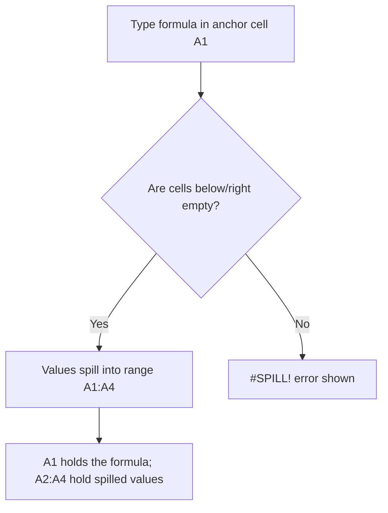
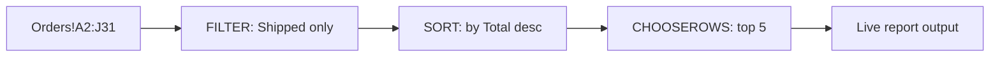

# Lecture 1 — The Spill Model & FILTER/SORT/UNIQUE

> **Duration:** ~2 hours. **Outcome:** You understand exactly what happens when a formula "spills," can read and predict a spill range, and can write live `FILTER`, `SORT`/`SORTBY`, and `UNIQUE` formulas against the `Orders` data — including multi-condition filters and multi-key sorts — from memory.

Every formula you've written through Week 9 followed one rule without exception: one formula, one cell, one answer. `=VLOOKUP(...)` returns one value. `=SUMIFS(...)` returns one value. Even an array formula from older Excel, entered with the dreaded `Ctrl+Shift+Enter`, mostly existed to produce a single aggregated number. This lecture breaks that rule on purpose. Run every example against the `Orders` data on the `Report` tab as you read.

## 1. What "spilling" actually means

Type this into `Report!A1`:

```excel
=UNIQUE(Orders!D2:D31)
```

Press Enter. One formula. Four cells fill in below it — `North`, `West`, `East`, `South` (in the order they first appear in the data) — with **no dragging, no copy-paste, no `Ctrl+Shift+Enter`**. That's a spill.

Here's the mental model: a dynamic-array formula returns not a single value but a **rectangular array** of values. The engine looks at the cell you typed the formula in — the **anchor cell** — and asks "is the space below/right of this cell empty?" If yes, it writes the array's values directly into those neighboring cells. The anchor cell (`A1` above) holds the actual formula; every other cell in the block holds a **spilled value** — you'll notice its formula bar shows the same formula in light gray, and you can't edit it directly. Try clicking `A2` (where `West` landed) and pressing Delete — Excel refuses, because you can only edit the array from its anchor.

Click the anchor cell and Excel/Sheets draws a thin blue border around the whole spill range — that border is your visual confirmation of exactly which cells belong to this one formula.


*How the engine decides whether a formula's array lands in the sheet or throws #SPILL!.*

### Why this is new

Before dynamic arrays (Excel 2019 and earlier), the *only* way to get a formula to return multiple values was a **legacy array formula**: select a multi-cell range first, type the formula, then confirm with `Ctrl+Shift+Enter` (Excel would wrap it in `{curly braces}` to show it was special). It was fragile — resize the output and you had to redo the whole selection — and most Excel users never learned it. Excel 365's dynamic-array engine (2018 onward) made spilling the *default* behavior of any formula that can return more than one value, with no special key combination required. **Google Sheets never needed this fix** — its calculation engine has treated array-returning functions as spilling by default since long before Excel caught up, which is one reason `FILTER`/`SORT`/`UNIQUE` feel completely native there.

## 2. The `#` spill-range operator

Once a formula has spilled, you often want to *reference the whole spilled block* from somewhere else — without knowing in advance how many rows it will spill into (that number can change every time the source data changes). Excel's answer is the **spill-range operator**, `#`:

```excel
=SUM(A2#)                 ' sums every cell the formula in A2 spilled into, however many there are
=COUNTA(A1#)               ' counts every spilled cell, including the anchor
```

If `A1` holds `=UNIQUE(Orders!D2:D31)` and it spills into `A1:A4`, then `A1#` always means "however many rows that turns out to be" — add a fifth region to the source data tomorrow and `A1#` automatically covers 5 cells without you touching the `SUM` formula. This is the dynamic-array version of what a Table's structured reference (Week 6) does for tabular ranges: a reference that adjusts itself instead of one you have to maintain by hand.

**Google Sheets has no `#` operator.** There's no direct equivalent — Sheets formulas that need "the whole result of that other formula" typically just reference the function call again (recompute it) or use a range large enough to safely cover the maximum expected spill. This is one of the real, permanent differences between the two apps' array models, not just a syntax difference — keep it in mind whenever you port a workbook between them.

## 3. `UNIQUE` — de-duplicating live

```excel
=UNIQUE(Orders!D2:D31)                       ' the 4 distinct regions, first-seen order
=UNIQUE(Orders!C2:C31)                       ' the 5 distinct reps
=SORT(UNIQUE(Orders!F2:F31))                 ' distinct categories, alphabetized (functions nest — more below)
```

`UNIQUE` takes three arguments: `UNIQUE(array, [by_col], [exactly_once])`.

- **`array`** — the range to de-duplicate.
- **`by_col`** — `FALSE` (default) compares whole **rows**; `TRUE` compares whole **columns** instead. You'll almost always leave this `FALSE`.
- **`exactly_once`** — `TRUE` returns only values that appear **exactly one time** (true one-offs), not "every distinct value." Default `FALSE` returns every distinct value regardless of how many times it repeats.

Multi-column `UNIQUE` de-duplicates whole **rows**, not each column independently:

```excel
=UNIQUE(Orders!D2:F31)     ' distinct (Region, Product, Category) COMBINATIONS — a row-level dedupe
```

Google Sheets: `UNIQUE(range)` — same idea, but Sheets' version only takes the one argument (no `by_col`/`exactly_once`); it always compares whole rows and always returns every distinct row.

## 4. `SORT` and `SORTBY` — ordering live

```excel
=SORT(Orders!A2:J31, 9, -1)             ' every order, sorted by column 9 (Total) descending
=SORT(Orders!A2:J31, 2, 1)              ' every order, sorted by column 2 (OrderDate) ascending
```

`SORT(array, [sort_index], [sort_order], [by_col])` — `sort_index` is the **column number within the array** (1-based, counting from the array's own left edge, not the sheet's column letters), `sort_order` is `1` for ascending (default) or `-1` for descending.

Multi-key sort — sort by `Region` first, then `Total` descending within each region — pass an array of indexes and an array of orders:

```excel
=SORT(Orders!A2:J31, {4,9}, {1,-1})     ' Region A→Z, then within each region, highest Total first
```

**`SORTBY`** sorts one array **by** a different array that isn't even part of the output — useful when the sort key isn't a column you want to display, or isn't a plain column at all:

```excel
=SORTBY(Orders!A2:C31, Orders!I2:I31, -1)     ' OrderID/Date/Rep only, ordered by Total (col I) — but Total itself isn't shown
```

That's the key difference from `SORT`: `SORT`'s index must point at a column *inside* the array you're returning; `SORTBY` lets the sort key live completely outside it.

Google Sheets: both `SORT` and `SORTBY` exist with matching syntax and behavior.

## 5. `FILTER` — the workhorse

```excel
=FILTER(Orders!A2:J31, Orders!D2:D31="North")
```

`FILTER(array, include, [if_empty])` — `array` is what gets returned, `include` is a same-height array (or column) of `TRUE`/`FALSE` deciding which rows survive, and the optional `if_empty` is what to show if *zero* rows match (without it, a no-match result throws `#CALC!` — Section 7 covers this).

### Multiple conditions

There's no comma-separated "and this too" argument — you build compound conditions with math, exactly like the `SUMIFS`/`COUNTIFS` multi-criteria pattern from Week 6, but using `*` for AND and `+` for OR **on the boolean arrays themselves**:

```excel
' AND — North region AND Shipped status
=FILTER(Orders!A2:J31, (Orders!D2:D31="North")*(Orders!J2:J31="Shipped"))

' OR — North region OR West region
=FILTER(Orders!A2:J31, (Orders!D2:D31="North")+(Orders!D2:D31="West"))

' Combine both — (North OR West) AND Shipped
=FILTER(Orders!A2:J31, ((Orders!D2:D31="North")+(Orders!D2:D31="West"))*(Orders!J2:J31="Shipped"))
```

Why `*` and `+`? `TRUE`/`FALSE` behave as `1`/`0` in arithmetic. Multiplying two boolean arrays element-by-element gives `1` only where **both** were `TRUE` — that's AND. Adding gives anything nonzero (`1` or `2`) where **either** was `TRUE` — that's OR, and `FILTER` treats any nonzero number as "include this row." Parenthesize generously; this is the one place a missing parenthesis silently changes which rows you get, with no error to warn you.

### Filtering to fewer columns

`array` doesn't have to be the whole table — hand `FILTER` just the columns you want back:

```excel
=FILTER(Orders!C2:E31, Orders!D2:D31="North")   ' just Rep, Region, Product for North orders
```

## 6. Nesting: building a live report in one formula

`FILTER`, `SORT`, and `UNIQUE` all take an array as input and return an array as output — which means you can **feed one straight into another**, no helper cells:

```excel
' Shipped orders, highest Total first
=SORT(FILTER(Orders!A2:J31, Orders!J2:J31="Shipped"), 9, -1)

' Distinct products among Shipped orders only, alphabetized
=SORT(UNIQUE(FILTER(Orders!E2:E31, Orders!J2:J31="Shipped")))

' Top 5 Shipped orders by Total — wrap the sorted result in a row-slice
=CHOOSEROWS(SORT(FILTER(Orders!A2:J31, Orders!J2:J31="Shipped"), 9, -1), {1;2;3;4;5})
```

`CHOOSEROWS(array, row_num1, [row_num2], ...)` plucks specific rows out of an array by position — pairing it with a sorted `FILTER` is the standard way to build a "top N" without `LARGE` or a helper rank column. (`TAKE(array, rows)` is the simpler cousin — `TAKE(sorted_filtered, 5)` grabs the first 5 rows without needing an explicit list.)


*Each function's output feeds straight into the next — no helper cells.*

## 7. Two new errors this week

**`#SPILL!`** — the formula *would* spill, but something is blocking its landing zone. The most common cause: a stray value sitting in a cell the array needs. Click the anchor cell; Excel outlines the blocked spill range with a dashed border so you can see exactly which cell is in the way. Fix: delete/move whatever's blocking it, or move the formula somewhere with more open space.

**`#CALC!`** — usually means `FILTER` matched **zero rows** and you didn't supply an `if_empty` argument:

```excel
=FILTER(Orders!A2:J31, Orders!D2:D31="Antarctica")            ' #CALC! — no rows match, no fallback given
=FILTER(Orders!A2:J31, Orders!D2:D31="Antarctica", "No matches")  ' shows the text "No matches" instead
```

Always supply `if_empty` in any `FILTER` a stakeholder will actually use — "no matches found" is a real, expected outcome of a live filter, not a bug, and it shouldn't look like one.

## 8. Google Sheets: same functions, one extra habit

Sheets has native, spilling `FILTER`, `SORT`, `SORTBY`, and `UNIQUE` with matching syntax to everything above (the multi-column `SORT`/`SORTBY` array-of-indexes trick, `{4,9}`/`{1,-1}`, works identically). The one thing worth knowing: Sheets grew up around `ARRAYFORMULA(...)`, a wrapper that forces an otherwise single-cell formula (like a plain `A2:A31 * B2:B31`) to operate on and return a whole array at once. You'll see it in older Sheets workbooks and tutorials constantly — it's now largely unnecessary for `FILTER`/`SORT`/`UNIQUE` themselves (they always spill natively) but you'll still reach for it when you want to force an otherwise-scalar operation, like a raw arithmetic expression, to spread across a whole column without wrapping it in `FILTER`/`ARRAYFORMULA` explicitly. If you ever open a Sheets file with `=ARRAYFORMULA(...)` everywhere, that's not a different feature — it's the same spill behavior this lecture just taught you, invoked with an explicit wrapper instead of Excel's implicit one.

## 9. Check yourself

- What's the difference between the anchor cell and a spilled cell? What happens if you try to edit a spilled cell directly?
- What does the `#` operator do, and why doesn't a plain `A1:A10` range reference do the same job as reliably?
- Write a `FILTER` that returns Rep, Product, and Total for orders that are **Pending** and in the **Audio** category.
- Why does `FILTER(..., cond1 + cond2)` mean OR, not AND?
- What causes `#CALC!`, and how do you prevent it from ever showing to an end user?
- `SORT`'s `sort_index` — is it a sheet column letter or a position inside the array? What's the difference in practice?

If those are automatic, Lecture 2 shows you how to keep formulas like these — which get long fast once you start nesting `FILTER` inside `SORT` inside `UNIQUE` — actually readable.

## Further reading

- **Microsoft — `FILTER` function:** <https://support.microsoft.com/en-us/office/filter-function-f4f7cb66-82eb-4767-8f7c-4877ad80c759>
- **Microsoft — `SORT`/`SORTBY` functions:** <https://support.microsoft.com/en-us/office/sort-function-22f63bd0-ccc8-492f-953d-c20e8e44b86c>
- **Microsoft — `UNIQUE` function:** <https://support.microsoft.com/en-us/office/unique-function-c5ab87fd-30a3-4ce9-9d1a-40204fb85e1e>
- **Microsoft — Dynamic arrays and spilled array behavior:** <https://support.microsoft.com/en-us/office/dynamic-arrays-and-spilled-array-behavior-205c6b06-03ba-4151-89a1-87a7eb36e531>
- **Google — `FILTER` function:** <https://support.google.com/docs/answer/3093197>
- **Google — `SORT` function:** <https://support.google.com/docs/answer/3093150>
- **Google — `UNIQUE` function:** <https://support.google.com/docs/answer/3093198>
