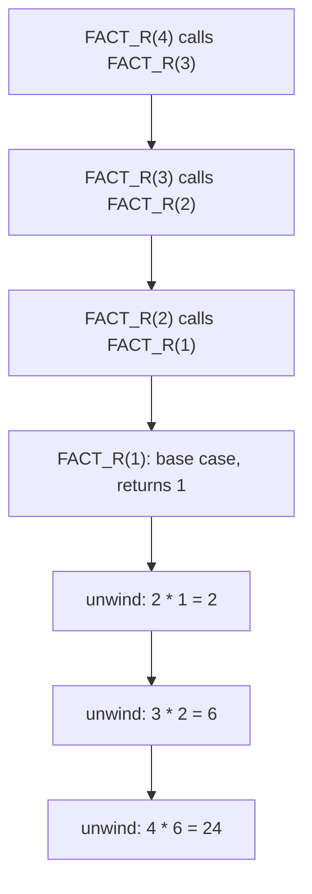

# Lecture 3 — LAMBDA: Your Own Functions

> **Duration:** ~2 hours. **Outcome:** You can write a `LAMBDA`, register it with a name so it behaves exactly like a built-in function, write a recursive `LAMBDA` that calls itself, and apply a `LAMBDA` across a range with `MAP`, `REDUCE`, `BYROW`, and `BYCOL`.

`LET` names *values* inside one formula. `LAMBDA` goes a step further: it names an entire **reusable formula** — a function you invent, with your own parameters, that you can call from any cell in the workbook exactly like you'd call `SUM` or `XLOOKUP`. This is the spreadsheet finally letting you write your own verbs instead of only combining the built-in ones.

## 1. The bare syntax

```excel
=LAMBDA(x, x * 1.1)(100)
```

`LAMBDA([parameter1, parameter2, ...], calculation)` — a list of parameter names, then the calculation that uses them. On its own, a `LAMBDA` does nothing; you have to **call** it immediately by adding a second set of parentheses with the actual arguments, as above — that returns `110`. This "define it, immediately call it" pattern is the same idea as an anonymous function in any programming language; it's rarely useful by itself, and Excel knows it — the real reason `LAMBDA` exists is Section 2.

## 2. Naming it: a real custom function

Register a `LAMBDA` with a name and it becomes a genuine custom function, autocomplete and all.

**Excel:** `Formulas → Define Name` (or `Ctrl+F3` → New). Name: `TAXRATE` (no spaces, can't start with a number, can't collide with a cell reference like `A1`). "Refers to": your `LAMBDA` formula, **without** the trailing call-parentheses:

```excel
=LAMBDA(income, IF(income > 100000, 0.32, IF(income > 40000, 0.22, 0.10)))
```

Click OK. Now, in any cell, anywhere in the workbook:

```excel
=TAXRATE(85000)          ' 0.22 — calls your custom function exactly like a built-in
=TAXRATE(D5)              ' works against a cell reference too
```

**Google Sheets:** `Data → Named functions → Add new function`. Give it a name, define its arguments by name, and paste the calculation (again, without a trailing call). Sheets' named-function editor is a dedicated UI rather than Excel's generic Name Manager, but the underlying idea — a name bound to a `LAMBDA`-shaped calculation, callable from anywhere — is identical.

A function built this way behaves like a first-class citizen of the app: it shows in autocomplete, it can be referenced in other formulas (including other `LAMBDA`s), and — critically — **it lives in the workbook**, not in a separate macro module (that's Week 12's territory). Anyone who opens this file can use `TAXRATE()` without installing anything.

### A function against this week's data

```excel
=LAMBDA(order_total, IF(order_total >= 150, "Large", IF(order_total >= 50, "Medium", "Small")))
```

Register this as `ORDERSIZE`, then:

```excel
=ORDERSIZE(Orders!I5)              ' "Small", "Medium", or "Large" for that one order
=MAP(Orders!I2:I31, ORDERSIZE)     ' the tier for EVERY order at once — see Section 4
```

## 3. Recursion — a LAMBDA that calls itself

A **recursive** function is one that calls itself with a smaller version of the same problem, until it hits a stopping condition (the **base case**). `LAMBDA` supports this directly: inside its own definition, it can refer to its **own registered name**.

Classic example — factorial, registered as `FACT_R` (Excel already has a built-in `FACT`; naming this one differently avoids a collision):

```excel
=LAMBDA(n, IF(n <= 1, 1, n * FACT_R(n - 1)))
```

Trace `FACT_R(4)` by hand: `4 * FACT_R(3)` → `4 * (3 * FACT_R(2))` → `4 * (3 * (2 * FACT_R(1)))` → base case hits, `FACT_R(1)` returns `1` → unwind back up: `2*1=2`, `3*2=6`, `4*6=24`. Every recursive `LAMBDA` needs exactly this shape: **a base case that stops the recursion, and a recursive case that makes the problem strictly smaller each call.** Skip the base case, or fail to shrink the problem, and you get infinite recursion — Excel/Sheets will eventually throw a stack-depth error rather than hang forever, but it's still a bug you have to fix, not a feature.


*Recursion calls down to the base case, then unwinds back up multiplying as it goes.*

A more spreadsheet-relevant recursive example — summing a column one row at a time instead of with `SUM`, to see the mechanics. Register this as `RUNSUM`:

```excel
=LAMBDA(rng, IF(ROWS(rng) = 1, INDEX(rng, 1), INDEX(rng, 1) + RUNSUM(DROP(rng, 1))))
```

`DROP(array, rows)` removes the first `rows` rows from an array (a `DROP(rng, 1)` peels the first element off, leaving one row less for the next recursive call — that's the "shrinking" step). Base case: once only one row is left (`ROWS(rng) = 1`), just return that element instead of recursing again. `=RUNSUM(Orders!I2:I31)` returns `3748`, the same answer as `SUM`.

This particular example is intentionally a toy — it exists to show recursion is *possible* on a range, not that it's the *right* tool here; `SUM` is correct and about a thousand times faster, and 30 recursive calls is already pushing what's comfortable (a few thousand rows would recurse too deep and fail). The real payoff for recursion, in Challenge 2, is a problem `SUM`/`FILTER`/`SORT` genuinely can't express in one non-recursive step: a loan balance that depends on *last period's* balance.

## 4. MAP — apply a LAMBDA to every element

```excel
=MAP(Orders!I2:I31, LAMBDA(total, total * 1.08))     ' every order's Total with 8% tax added, spilled
=MAP(Orders!I2:I31, ORDERSIZE)                        ' every order's size tier, using the named function from Section 2
```

`MAP(array1, [array2, ...], lambda)` — applies the `LAMBDA` to **every element** of the array(s), one at a time, and spills the results in the same shape as the input. If you pass more than one array, the `LAMBDA` needs a matching number of parameters — one value from each array, per position:

```excel
=MAP(Orders!G2:G31, Orders!H2:H31, LAMBDA(qty, price, qty * price))   ' recompute Total from Qty and UnitPrice, live
```

## 5. REDUCE — collapse an array to one value

```excel
=REDUCE(0, Orders!I2:I31, LAMBDA(acc, val, acc + val))     ' 3748 — a manual SUM, built from scratch
=REDUCE(0, Orders!I2:I31, LAMBDA(acc, val, IF(val > acc, val, acc)))   ' 796 — a manual MAX
```

`REDUCE(initial_value, array, lambda)` — the `LAMBDA` takes two parameters: an **accumulator** (`acc`, starting at `initial_value`) and the **current element** (`val`), and returns the new accumulator. `REDUCE` walks the whole array once, feeding each element in and carrying the running result forward — which is exactly the mechanical idea behind `SUM`, `MAX`, `COUNT`, and friends, except now you control the combining rule yourself. You'd never actually replace `SUM` with `REDUCE` in real work — it exists for the cases *without* a built-in aggregator, like combining values with a custom business rule.

## 6. SCAN — like REDUCE, but keeps every intermediate step

```excel
=SCAN(0, Orders!I2:I31, LAMBDA(acc, val, acc + val))
```

Same idea as `REDUCE`, but instead of returning only the *final* accumulated value, `SCAN` spills **every intermediate accumulator value** — a genuine running total column, one cell per row, in a single formula. This is the dynamic-array-native way to build a running-balance or cumulative-sum column that used to require a helper column with a formula like `=SUM($I$2:I2)` dragged down. *(As of this course's writing, Google Sheets does not have a direct `SCAN` equivalent — its closest tool is a `MAP`/`LAMBDA` combination over a helper index, or a `REDUCE` called once per row, which is noticeably more awkward. This is a real, current gap between the two apps, not a naming difference.)*

## 7. BYROW and BYCOL — apply a LAMBDA across each row or column

```excel
=BYROW(Orders!G2:I31, LAMBDA(row, SUM(row)))     ' one result per ROW — here, Qty+UnitPrice+Total added together (illustrative)
=BYCOL(Orders!G2:I31, LAMBDA(col, SUM(col)))     ' one result per COLUMN — sum of Qty, sum of UnitPrice, sum of Total
```

`BYROW(array, lambda)` calls the `LAMBDA` once per **row**, passing that whole row as a single-row array; `BYCOL` does the same per **column**. Both spill one result per row/column respectively. These are the tools you reach for when a computation genuinely needs "everything in this row together" (a weighted score across several row-columns, say) rather than one input value at a time, which is what plain `MAP` gives you.

## 8. Choosing the right tool

| You want... | Reach for |
|---|---|
| A named function you'll reuse across a workbook | `LAMBDA` + register with a name |
| A function that calls itself to solve a smaller version of the same problem | Recursive `LAMBDA` |
| The same transformation applied to every element, same shape out | `MAP` |
| One final combined value from a whole array, with a custom combining rule | `REDUCE` |
| Every *intermediate* combined value, not just the final one | `SCAN` |
| A calculation that needs a whole row (or column) at once | `BYROW` / `BYCOL` |

## 9. Check yourself

- What's the difference between `LAMBDA(x, x*2)` on its own and calling it with `LAMBDA(x, x*2)(5)`?
- What two things does every correct recursive `LAMBDA` need, without exception?
- `MAP` vs. `REDUCE` — which one changes the shape of your data, and which one collapses it to a single value?
- Why does `SCAN` sometimes replace a helper column that used to hold a running total?
- If you wanted the sum of `Qty * UnitPrice` per row without a helper column, would you reach for `MAP` or `BYROW`? Why does either work here?
- Why register a `LAMBDA` with a name instead of always writing it inline?

That closes the lecture trio. Exercises 1–3 drill each piece separately; the challenges and mini-project make you combine all three techniques — spill/`FILTER`/`SORT`/`UNIQUE`, `LET`, and `LAMBDA` — into single, production-quality formulas.

## Further reading

- **Microsoft — `LAMBDA` function:** <https://support.microsoft.com/en-us/office/lambda-function-bd212d27-1cd1-4321-a34a-ccbf254b8b67>
- **Microsoft — Create custom, reusable functions with LAMBDA:** <https://support.microsoft.com/en-us/office/create-custom-collaborative-functions-with-lambda-5d944738-77dc-4f26-a6bf-93a2ba0a7a7c>
- **Microsoft — `MAP` function:** <https://support.microsoft.com/en-us/office/map-function-48006093-f97c-47c1-bfcc-749263bb1f01>
- **Microsoft — `REDUCE` function:** <https://support.microsoft.com/en-us/office/reduce-function-42e39910-b345-45f3-84b8-0642b568b7cb>
- **Microsoft — `SCAN` function:** <https://support.microsoft.com/en-us/office/scan-function-d58dfd11-9969-4439-b2dc-e7062724de29>
- **Microsoft — `BYROW`/`BYCOL` functions:** <https://support.microsoft.com/en-us/office/byrow-function-2e04c677-78c8-4e6b-8c10-a4602f2602bb>
- **Google — Named functions in Google Sheets:** <https://support.google.com/docs/answer/12504534>
- **Google — `LAMBDA` function:** <https://support.google.com/docs/answer/12508178>
- **Google — `MAP` function:** <https://support.google.com/docs/answer/12571317>
