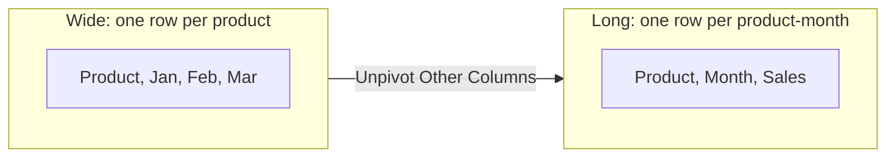

# Lecture 2 — Transforming & Shaping Data

> **Duration:** ~2 hours. **Outcome:** You can split a column by delimiter, force correct data types onto messy imports, remove junk rows and blank rows, unpivot a wide crosstab into a tidy long table, and group rows into an aggregate summary — each as a small, named, re-runnable step.

Lecture 1 imported one already-clean file and watched two auto-generated steps do all the work. Real exports are rarely that polite. This lecture works against messier shapes on purpose — a raw file with junk header rows and a text-formatted quantity, and a wide monthly report that needs reshaping before it's usable at all — and builds the transform vocabulary you'll use on every future import.

## 1. A messier source: header junk and mixed types

Create a new plain-text file named `Orders_Raw_Export.csv` in your `crunch-wholesale` folder with exactly this content (this is the file Exercise 1 also uses, so keep it once you've made it):

```
Crunch Wholesale — Weekly Orders Export
Generated: 2026-03-09 08:14 UTC
Warehouse: North

OrderID,OrderDate,SKU,ProductName,Qty,UnitCost
N-5001,2026-03-02,SKU-100,Trail Backpack,12,42.50
N-5002,2026-03-03,SKU-104, Camp Stove ,8 units,28.00
N-5003,2026-03-03,SKU-101,Hiking Boots,15,55.00

N-5004,2026-03-05,SKU-103,Water Bottle,40,4.25
N-5005,2026-03-06,SKU-102,Rain Shell,10,22.00
```

This is deliberately realistic: three metadata lines before the real header (a title, a generation timestamp, a warehouse label — extremely common in exports built for humans, not machines), a blank line splitting the data, and one `Qty` cell (`"8 units"`) that arrived as text with a unit suffix instead of a plain number, with stray spaces baked into that row's `ProductName` too.

Import it: **Data → Get Data → From File → From Text/CSV** → select `Orders_Raw_Export.csv` → **Transform Data**. The preview shows all of this junk raw — three metadata rows as "Column1," then a real header row buried at row 4, all still one wide `Column1` because Power Query hasn't yet been told the real header exists.

## 2. `Remove Top Rows` and `Use First Row as Headers`

**Home → Remove Rows → Remove Top Rows** → type `4` → OK. This strips the three metadata lines *and* the blank line, in one step — count carefully from the raw preview to be sure you're removing exactly through the row directly above the real `OrderID,OrderDate,...` header. Now **Home → Use First Row as Headers** — the row that was previously the top of what's left becomes real column headers, and a new `Changed Type` step is auto-appended, guessing at each column's type from the data now visible.

Look at the Applied Steps pane: you should see `Source`, `Removed Top Rows`, `Promoted Headers`, `Changed Type` — four named, ordered steps, each one fixing exactly one problem, in the order the problems needed fixing.

## 3. Fixing a value trapped as text: Replace Values

The auto-detected type for `Qty` is `Text`, not `Whole Number` — because one cell, `"8 units"`, isn't parseable as a plain number, so Power Query (correctly, conservatively) left the whole column as text rather than guess wrong. Fix the one bad cell directly: right-click that cell (or select the column and use **Transform → Replace Values**) → **Replace Values** → *Value To Find:* `8 units` → *Replace With:* `8` → OK. Now change the column's type properly: click the `Qty` column header's type icon → **Whole Number**.

This illustrates a general Power Query debugging pattern: when a type-conversion step silently produces a `Text`-typed column you expected to be numeric, the fix is almost always **find the one value breaking the pattern, normalize it explicitly, then convert the type** — not "give up and leave it as text." A single unclean cell should never force an entire column of otherwise-good data to stay untyped.

## 4. Trimming and cleaning text columns

The `ProductName` cell for SKU-104 has leading/trailing spaces baked in (`" Camp Stove "`) — the exact whitespace problem Week 5 fixed with `TRIM`. Power Query has the same fix as a one-click column transform: select the `ProductName` column → **Transform → Format → Trim**. (There's also **Format → Clean**, the Power Query equivalent of Week 5's `CLEAN`, for stripping non-printing control characters — apply it defensively any time text arrives from a system you don't fully trust, even if nothing looks visibly wrong.)

## 5. Removing blank and error rows

Even after `Remove Top Rows`, a genuinely blank data row can survive if it appears *within* the data region rather than only above it (this file doesn't have one after your cleanup, but real exports often do). The general-purpose fix: **Home → Remove Rows → Remove Blank Rows** removes any row that's entirely empty across every column. For rows where a *type conversion itself* fails and produces an `Error` value in a cell (rather than a blank), use **Home → Remove Rows → Remove Errors** — but apply it deliberately, after inspecting what's erroring, not reflexively; an error is Power Query telling you something is wrong, and silently deleting the row means you never find out what.

Verify the cleaned result: five data rows, `Qty` and `UnitCost` both numeric, `ProductName` trimmed. Sum `Qty × UnitCost` across the five rows — it must read **1949.00**, the same North-warehouse checksum from the README, confirming the messy version cleaned correctly matches the already-clean `North_Week1.csv` you set up earlier.


*The full cleaning pipeline for `Orders_Raw_Export.csv`, one named step per problem, in the order the problems needed fixing.*

## 6. Splitting a column

Power Query splits a column the same way Week 4's `LEFT`/`FIND`/`MID` formulas did, but as a repeatable step instead of a formula you have to re-derive. Select any text column and use **Home → Split Column**, with three common modes:

- **By Delimiter** — split `"Alvarez, Maria"` into two columns on the comma. Choose whether to split at the *first*, *last*, or *every* occurrence of the delimiter — critical when a value might contain the delimiter more than once (an address with multiple commas, for instance).
- **By Number of Characters** — split a fixed-width code like `SKU-100` into `SKU` and `100` by splitting after 4 characters.
- **By Positions** — split at one or more exact character offsets you specify, for old-style fixed-width text exports where every field occupies a known column range.

Try it on a scratch copy: select the `SKU` column → **Split Column → By Delimiter** → delimiter `-` → **Split at each occurrence of the delimiter**. This produces `SKU.1` (`"SKU"`) and `SKU.2` (`"100"`, `"104"`, etc.) — rename them sensibly or delete the step afterward once you've confirmed you understand the mechanic; the merge exercise later this week needs the *original*, unsplit `SKU` column intact to match against the Products lookup table.

## 7. Unpivoting a wide report

Create a second new file, `Monthly_Sales_Report.csv`, with this **wide** crosstab — one row per product, one column per month, a shape built for humans skimming a report, not for a computer aggregating it:

```
Product,Jan,Feb,Mar
Trail Backpack,1200,1450,1600
Hiking Boots,2200,1980,2350
Camp Stove,800,900,760
Rain Shell,650,700,820
Water Bottle,300,340,410
Tent 4-Person,1100,950,1300
```

Import it (**Get Data → From File → From Text/CSV → Transform Data**). This shape is exactly what Week 5, Lecture 2 called "wide data" — great to read, useless to pivot, filter, or join against, because "month" is smeared across the column headers instead of living inside the data as its own value.

Select the `Product` column, then **Transform → Unpivot Columns → Unpivot Other Columns** (the "Other Columns" variant is the one to reach for by default — it unpivots everything you *didn't* select, which means adding a new month column to the source next quarter unpivots automatically too, with zero change to this step). The result: three columns — `Product`, `Attribute` (rename this to `Month`), and `Value` (rename this to `Sales`) — eighteen rows instead of six, one row per product-month combination.


*Unpivot turns month column headers into row values — six wide rows become eighteen tidy long rows, same data, new shape.*

Verify: sum the `Sales` column across all eighteen rows — it must read **19810**, matching Trail Backpack (4250) + Hiking Boots (6530) + Camp Stove (2460) + Rain Shell (2170) + Water Bottle (1050) + Tent 4-Person (3350). This is the exact total the wide version also represents — unpivoting reshapes data, it never changes what the data *says*.

## 8. Pivot — the reverse operation

Power Query can also go the other direction: **Transform → Pivot Column** takes a long table and spreads one column's distinct values back out into separate columns, aggregating the values column by whatever function you choose (Sum, Average, Count, Min, Max). Select `Month` as the column to pivot, `Sales` as the values column, aggregation `Sum` — this reconstructs the original wide crosstab from the long table. You won't need this direction often (reports usually need to go wide-to-long for analysis, not the reverse), but recognizing it exists matters: it's the same tool Week 7's pivot tables use conceptually, just expressed as a query step instead of a drag-and-drop field well.

## 9. Grouping rows into an aggregate

**Home → Group By** collapses many rows into one row per distinct value of a chosen column, computing an aggregate for each group — the query-editor equivalent of Week 6's `SUMIFS`/`COUNTIFS` or Week 7's pivot table. On the unpivoted `Monthly_Sales_Report` result, try: **Group By** → group by `Product` → new column name `TotalSales`, operation `Sum`, column `Sales`. The result collapses eighteen rows to six — one per product, each showing that product's Jan+Feb+Mar total. Group By supports grouping by **multiple columns at once** (add rows in the dialog) and **multiple aggregate columns in one pass** (a `Sum` and a `Count` and an `Average`, all from one Group By step) — this is frequently faster than building the same summary with several separate `SUMIFS` formulas back on a worksheet, because it's one step instead of one formula per output cell.

## 10. Check yourself

- Why does `Remove Top Rows` need to run *before* `Use First Row as Headers` on `Orders_Raw_Export.csv`, and what would go wrong if you reversed the order?
- A column shows as `Text`-typed after an auto-`Changed Type` step, even though every value looks numeric to your eye. What's the most likely cause, and what's the fix?
- What's the difference between `Remove Blank Rows` and `Remove Errors`, and why should you inspect before applying the second one?
- Describe, in plain English, what `Unpivot Other Columns` does to `Monthly_Sales_Report.csv`, and why the "Other Columns" variant specifically (versus selecting the month columns directly) is the safer long-term choice.
- What does `Group By` compute, and which earlier-week Excel feature does it most resemble?

If those came quickly, Lecture 3 combines multiple sources — merging Orders against the Products lookup table, appending all three warehouse files from a folder, and understanding exactly what happens end-to-end when you click Refresh.

## Further reading

- **Microsoft — Split a column of text (Power Query):** <https://support.microsoft.com/en-us/office/split-a-column-of-text-power-query-1d938214-2b47-4d78-8fb1-7c1b17862fee>
- **Microsoft — Unpivot columns (Power Query):** <https://learn.microsoft.com/en-us/power-query/unpivot-column>
- **Microsoft — Group or summarize rows (Power Query):** <https://learn.microsoft.com/en-us/power-query/group-by>
- **Microsoft — Data types in Power Query:** <https://learn.microsoft.com/en-us/power-query/data-types>
