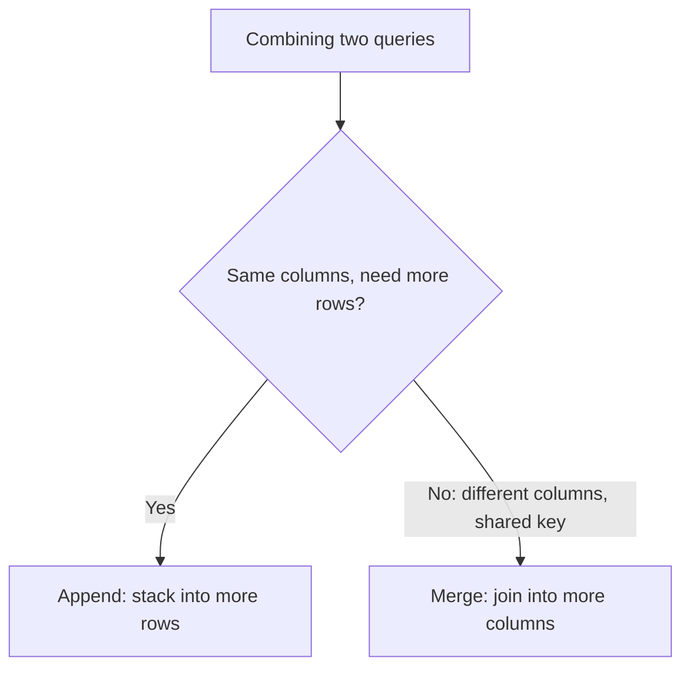
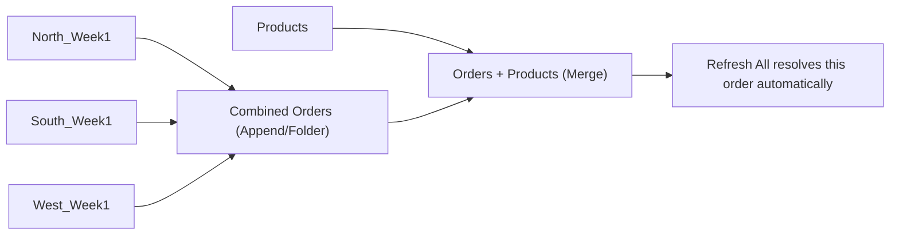

# Lecture 3 — Merging, Appending & Refresh

> **Duration:** ~1 hour. **Outcome:** You can merge two queries into one (a join), append multiple queries into one (a stack), combine an entire folder of same-shaped files automatically, explain the query dependency chain, and state precisely what Google Sheets' import functions can and cannot replicate.

The last two lectures worked with one source at a time. Real reporting jobs almost never do — Crunch Wholesale needs the North, South, and West warehouse files **combined**, and needs each order enriched with category and supplier data from the separate `Products.csv` lookup table. This lecture covers the two ways queries combine, plus the mechanism — the dependency chain — that makes a multi-query pipeline refresh correctly as one unit.

## 1. Merge vs. Append — the one distinction that matters most

These two operations get confused constantly because both combine two queries into one, but they solve opposite problems:

- **Merge** = a **join**. Two sources with *different* columns, related by a shared key, become one source with *more columns* — same number of rows (roughly; more on that below), wider. This is what you reach for to enrich `Orders` with `Category` and `Supplier` from `Products`, matched on `SKU`. It's the Power Query equivalent of Week 3's `XLOOKUP`/`INDEX MATCH`, except it pulls in *as many columns as you want at once*, not one `XLOOKUP` formula per column.
- **Append** = a **stack**. Two or more sources with the *same* columns become one source with *more rows*, same width. This is what combines North, South, and West's identically-shaped order exports into one unified orders table.

If you're ever unsure which one a task needs, ask: "does the result need more **columns** describing the same rows, or more **rows** of the same columns?" More columns → Merge. More rows → Append.

*The one question that decides Merge vs. Append: more rows of the same shape, or more columns describing the same rows.*

## 2. Merging Orders with Products

Import `North_Week1.csv` fresh (**Get Data → From File → From Text/CSV → Transform Data**) and, this time, at the bottom of the Close & Load dropdown choose **Only Create Connection** — you don't need this landing on a sheet by itself; it exists to feed the merge. Repeat for `Products.csv`, also as **Only Create Connection**. Both now appear in the Queries pane, unloaded to any sheet, available as building blocks.

Create the merge: **Home → Combine → Merge Queries** (or **Merge Queries as New**, which keeps the two originals untouched and creates a third query for the result — the safer default while you're learning). In the dialog:

1. Top table: `North_Week1`.
2. Bottom table: `Products`.
3. Click the `SKU` column header in **both** tables to select it as the matching key in each.
4. **Join Kind:** leave it at **Left Outer** (the default) — "keep every row from the top table, and bring in matching columns from the bottom table wherever a match exists; leave the new columns blank where there's no match." This mirrors `XLOOKUP`'s behavior when nothing matches: no error thrown, just an empty result for that row.

Click OK. The result table looks almost unchanged — same rows, same original columns — plus one new column, whose header is the *name of the second table* (`Products`), containing not visible data but a small **Table** value in every cell (a nested table, one per row, holding whatever matched). Click the **expand icon** (⤢) on that column's header, uncheck any columns you don't want (uncheck `SKU` from the expansion, since you already have it from the left table), and confirm. The nested tables disappear and `Category` and `Supplier` become two real, flat columns on every row.

Verify against SKU-104 (Camp Stove): its `Category` should read `Gear` and its `Supplier` should read `Summit Gear Partners`, matching the `Products.csv` lookup table exactly.

## 3. The other join kinds, briefly

**Left Outer** is correct for the overwhelming majority of "enrich my fact table with lookup data" tasks, but the Merge dialog offers five others worth recognizing by name:

| Join kind | Keeps |
|---|---|
| **Left Outer** (default) | Every row from the top table; matches from the bottom where they exist |
| **Right Outer** | Every row from the bottom table; matches from the top where they exist |
| **Full Outer** | Every row from both tables, matched where possible, blank where not |
| **Inner** | Only rows that matched in **both** tables — anything unmatched on either side is dropped |
| **Left Anti** | Only rows from the top table that had **no** match in the bottom — useful for finding orphaned records (an order referencing a `SKU` that doesn't exist in `Products`, for instance) |
| **Right Anti** | Only rows from the bottom table that had no match in the top — e.g., products that were never ordered |

**Left Anti** in particular is a genuinely useful data-quality check: merge `Orders` against `Products` with **Left Anti** selected, and if any rows survive, you've just found an order referencing a SKU your lookup table doesn't know about — a bug worth catching before it silently produces blank `Category`/`Supplier` values downstream.

## 4. Appending queries

With North, South, and West each loaded as **Only Create Connection** queries (repeat the import for `South_Week1.csv` and `West_Week1.csv` if you haven't already), combine them: **Home → Combine → Append Queries → Append Queries as New**. Choose **Three or more tables**, add `North_Week1`, `South_Week1`, and `West_Week1` to the "tables to append" list, in that order, and OK.

The result stacks all three: 5 + 4 + 5 = **14 rows**, in the original six-column shape (`OrderID`, `OrderDate`, `SKU`, `ProductName`, `Qty`, `UnitCost`) — even though `South_Week1.csv` had those same six columns in a *different physical order* in its raw file. Append matches columns **by name**, exactly like Merge does for its join key, which is why the column-order mismatch you deliberately built into `South_Week1.csv` (README setup) caused zero problems here. Had a column been *named* differently between files — `Qty` in two files but `Quantity` in the third — Append would produce a 15th column full of blanks for whichever rows came from the differently-named source, a visible signal that something needs fixing upstream rather than a silent misalignment.

Verify: sum `Qty × UnitCost` across all 14 appended rows — it must read **6934.50**, the full README checksum across all three warehouses.

## 5. Combining an entire folder at once

Appending three manually-imported queries works, but doesn't scale — a real distributor doesn't have three warehouses, and doesn't want to manually add a fourth `Get Data` step every time a new one opens. **From Folder** solves this directly: **Data → Get Data → From File → From Folder** → browse to your `warehouse-exports` subfolder → OK. Power Query lists every file in that folder as one row per file (name, size, modified date, and a `Content` column holding each file's raw binary). Click **Combine → Combine & Transform Data** (or the **Combine** button in the preview dialog).

Power Query does something worth understanding, not just clicking through: it picks the **first file** as a **sample**, builds a query against just that sample (the exact same steps Lecture 1–2 taught, applied automatically), then wraps that sample query in a reusable function and **applies that function to every file in the folder**, appending all the results together. The upshot: fix one file's shape, and every file in the folder — including ones added *after* you built the query — gets that identical treatment automatically the next time you refresh. This is Challenge 1 and the mini-project's core technique: drop a fourth warehouse's CSV into `warehouse-exports` next month, click Refresh, and it's in the combined output with zero query edits.

## 6. The dependency chain

Open **View → Query Dependencies** (or the **Advanced Editor**'s query list) to see it visually, or just read the Queries pane carefully: a query that was created by merging or appending *other* queries **depends on** those source queries. Your merged Orders+Products query depends on both `North_Week1` (or the folder-combine query) and `Products`. Click **Refresh All** (**Data** tab), and Power Query resolves this dependency chain correctly on its own — it re-runs the ultimate source queries (the raw file/folder reads) first, then re-runs everything that depends on them, in the correct order, automatically. You never have to manually sequence "refresh Products, then refresh the merge" — the chain handles it.

*The dependency chain: source queries refresh first, then everything downstream — you never sequence it by hand.*

This is also why **Only Create Connection** matters so much: a query that's just an intermediate link in this chain (like your standalone `Products` query) doesn't need — and shouldn't have — its own worksheet Table. Loading every intermediate query to a sheet clutters the workbook and slows Refresh All for no benefit; reserve **Load to Table** for the *final*, consumer-ready outputs, and leave everything upstream of that as a connection.

## 7. Google Sheets: the same jobs, a different toolkit

Google Sheets has no direct Power Query equivalent — no step-based editor, no Applied Steps pane, no drag-and-drop merge/append UI — but it covers the same *jobs* with formulas and a separate product:

- **`IMPORTRANGE(spreadsheet_url, range)`** — pulls a range from another Google Sheet (not a file on disk) into the current one. The first time, it prompts for a one-time access grant. This is Sheets' nearest analog to querying a second internal source, though it pulls raw values, not a transformable, step-based query.
- **`IMPORTDATA(url)`** — pulls a plain CSV or TSV file from a public URL directly into a range, refreshing automatically on a Google-controlled schedule (not instantly on demand the way Power Query's Refresh is).
- **`IMPORTHTML(url, "table", index)`** and **`IMPORTXML(url, xpath_query)`** — pull a table (or any XPath-selected content) from a public web page. This is Sheets' equivalent of Power Query's **From Web** connector, covered fully in Challenge 2.
- **Connected Sheets** — a genuinely different tier: connects a Sheet directly to a **BigQuery** dataset (Google's cloud data warehouse), letting you build pivot tables against data that can be billions of rows, far beyond what any spreadsheet could hold directly. This is closer in spirit to a database connection than to a Power Query file import.

**What Sheets' formula approach cannot do that Power Query can:** there's no reorderable, renameable, individually-debuggable step sequence — a working `IMPORTHTML` formula is one atomic unit, and if the source page's structure changes, the formula just breaks with no equivalent to "click back through Applied Steps to find where it went wrong." There's no dedicated Merge/Append UI — you'd build the equivalent with `VLOOKUP`/`XLOOKUP` (merge) or by literally stacking ranges with `{range1; range2}` array syntax (append), losing the named-step documentation trail entirely. And there's no folder-combine connector at all — Sheets has no concept of "a folder on your local disk" the way desktop Excel does, since Sheets lives natively in Drive; the closest equivalent for combining many files is Apps Script, which is real code, not a point-and-click feature.

## 8. Check yourself

- Give a one-sentence rule for choosing Merge vs. Append for a new combination task.
- Which join kind keeps every row from the top table, filling blanks where the bottom table has no match — and which Week 3 function does this behavior most resemble?
- What specifically does **Left Anti** join reveal, and why is that useful as a data-quality check?
- Why did `South_Week1.csv`'s different column order cause zero problems when appended to North and West?
- Explain, in your own words, what happens internally when Power Query's **From Folder** combine step encounters a fourth file added after the query was built.
- Name one thing Power Query's Applied Steps pane gives you that a single `IMPORTHTML` formula in Google Sheets cannot.

That's the whole ETL loop: import, transform, combine, refresh. The exercises apply each piece individually; the challenges and mini-project put all of it together into one pipeline, the same shape a real weekly reporting job takes.

## Further reading

- **Microsoft — Merge queries overview:** <https://learn.microsoft.com/en-us/power-query/merge-queries-overview>
- **Microsoft — Append queries:** <https://learn.microsoft.com/en-us/power-query/append-queries>
- **Microsoft — Combine files overview (From Folder):** <https://learn.microsoft.com/en-us/power-query/combine-files-overview>
- **Microsoft — Understanding the Power Query dependency/data flow:** <https://learn.microsoft.com/en-us/power-query/query-dependencies-view>
- **Google — IMPORTRANGE function:** <https://support.google.com/docs/answer/3093340>
- **Google — IMPORTHTML function:** <https://support.google.com/docs/answer/3093339>
- **Google — About Connected Sheets:** <https://support.google.com/docs/answer/9702507>
