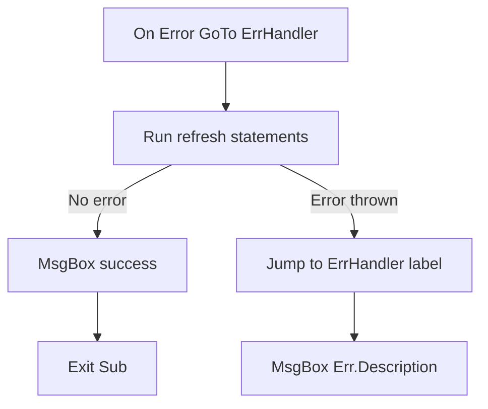

# Macros & VBA in Excel

A macro is a recorded (or written) sequence of actions Excel can replay on command. VBA — **Visual Basic for Applications** — is the programming language those actions are written in under the hood. You don't need to know VBA to record a macro, but you do need to read and edit VBA to make a recorded macro actually useful, because the recorder is a decent stenographer and a terrible programmer: it writes down exactly what you clicked, in the most literal way possible, with none of the judgment a human would apply.

This lecture takes you from "record a macro" to "read the mess it wrote" to "clean that mess into something you'd be comfortable running unattended, every month, on this dataset" — using our running scenario, **Crunch Outfitters**, and the sales dashboard workbook you've been building since Week 11.

## 1. Recording your first macro

`Developer → Record Macro` opens a dialog: name it (no spaces — use underscores, e.g. `FormatSalesHeader`), optionally give it a shortcut key (`Ctrl+Shift+F` — careful, this can silently override a built-in shortcut), and choose where to store it:

- **This Workbook** — the macro lives inside this file, travels with it, only works when this file is open. Use this for macros specific to one workbook, like our dashboard refresh.
- **Personal Macro Workbook** — a hidden file (`PERSONAL.XLSB`) that opens automatically every time Excel starts. Macros stored there are available in *every* workbook you ever open. Use this for personal utility macros (e.g., "strip all borders," "convert selection to Table") you want everywhere.
- **New Workbook** — rarely used; stores the macro in a brand-new blank file.

Click OK, and Excel is now recording. Every click, keystroke, and menu action is captured. Do this now: select the header row on your `Dashboard` sheet, bold it, set a fill color, widen the columns to fit, then click `Developer → Stop Recording`.

## 2. Reading what the recorder wrote

`Developer → Macros → [your macro name] → Edit` opens the **VBA Editor** (also `Alt+F11`). You'll see something like:

```vb
Sub FormatSalesHeader()
'
' FormatSalesHeader Macro
'

'
    Range("A1:F1").Select
    Selection.Font.Bold = True
    With Selection.Interior
        .Pattern = xlSolid
        .PatternColorIndex = xlAutomatic
        .Color = 15773696
        .TintAndShade = 0
        .PatternTintAndShade = 0
    End With
    Columns("A:F").EntireColumn.AutoFit
End Sub
```

Break this down:

- **`Sub FormatSalesHeader()` … `End Sub`** — a **subroutine**: a named block of code with no return value, the basic unit of a macro. Everything between these two lines runs when the macro is called.
- **`Range("A1:F1").Select`** then **`Selection.Font.Bold = True`** — the recorder's signature pattern: it selects something, *then* acts on the selection. This is how a human works with a mouse, but it's clumsy code — two steps to do one thing, and it clobbers whatever the user had selected before.
- **`With Selection.Interior … End With`** — a `With` block avoids repeating `Selection.Interior.X` five times; everything inside refers back to `Selection.Interior`.
- **`Color = 15773696`** — a raw numeric color code (a packed RGB value) instead of a name. Recorded macros are full of these; they work, but they're unreadable. `RGB(192, 220, 255)` produces the same value and reads like English.
- **`Columns("A:F").EntireColumn.AutoFit`** — this one *doesn't* select first; some operations don't need selection at all, which is your first clue that `.Select` is usually unnecessary.

## 3. Editing the recording into real code

The single most valuable VBA skill is dropping `.Select`/`Selection` and acting on objects directly:

```vb
Sub FormatSalesHeader()
    With Range("A1:F1")
        .Font.Bold = True
        .Interior.Color = RGB(192, 220, 255)
    End With
    Range("A:F").EntireColumn.AutoFit
End Sub
```

Same result, no selection churn, and it no longer disturbs whatever the user had highlighted. This pattern — **reference the object directly instead of selecting it** — is the difference between recorder output and code a professional would write, and it's true in every VBA macro you'll ever clean up.

## 4. Core VBA you need this week

You don't need a full programming course — you need five building blocks, used constantly in the exercises and the capstone.

### `Range` and `Cells` — referring to cells

```vb
Range("B2").Value = 100                 ' one cell, by address
Range("B2:D10").ClearContents            ' a block
Cells(2, 2).Value = 100                  ' row 2, column 2 — same cell as B2, but with variables for row/col
Range("SalesTable[Units]").Value          ' a structured reference into a Table (Week 6)
Worksheets("Dashboard").Range("A1")       ' fully qualified — always safer than a bare Range()
```

Always qualify with a worksheet when a macro might run while a different sheet is active — a bare `Range("A1")` refers to whatever sheet is *currently active*, which is exactly the kind of bug that only shows up the one time a user clicks your button from the wrong tab.

### `Sub` — grouping actions, with parameters

```vb
Sub StampRefreshTime()
    Worksheets("Dashboard").Range("B1").Value = "Last refreshed: " & Now
End Sub

Sub HighlightIfOver(threshold As Double)
    Dim c As Range
    For Each c In Worksheets("Dashboard").Range("Sales").Cells
        If c.Value > threshold Then c.Interior.Color = RGB(255, 235, 156)
    Next c
End Sub
```

`HighlightIfOver` takes a **parameter** (`threshold`) — call it with `HighlightIfOver 100000` and it highlights every cell in the named range `Sales` over 100,000. One `Sub`, reusable for any threshold, instead of hardcoding the number.

### Loops — doing something to every row

```vb
Sub FlagLowStock()
    Dim ws As Worksheet, lastRow As Long, i As Long
    Set ws = Worksheets("Sales_Data")
    lastRow = ws.Cells(ws.Rows.Count, "A").End(xlUp).Row   ' find the last used row in column A

    For i = 2 To lastRow                                    ' skip the header row
        If ws.Cells(i, "F").Value < 10 Then                 ' column F = Units
            ws.Cells(i, "G").Value = "REORDER"
        Else
            ws.Cells(i, "G").Value = ""
        End If
    Next i
End Sub
```

`Cells(ws.Rows.Count, "A").End(xlUp).Row` is the VBA idiom for "the last row with data in column A" — it starts at the bottom of the sheet (row 1,048,576) and simulates pressing `Ctrl+Up`. You'll use this exact line constantly; memorize it.

### Conditionals — `If`/`ElseIf`/`Else`

```vb
If region = "North" Then
    tier = "Zone 1"
ElseIf region = "South" Or region = "East" Then
    tier = "Zone 2"
Else
    tier = "Zone 3"
End If
```

Same logic as an Excel `IF`/`IFS` formula (Week 3) — VBA is just the version that runs as code instead of living in a cell.

### `On Error` — handling things going wrong

A macro that runs unattended (this week's whole point) **must** handle errors, or one missing file / locked sheet / renamed tab silently breaks the whole chain with a cryptic runtime error dialog a non-technical user can't act on.

```vb
Sub RefreshSalesData()
    On Error GoTo ErrHandler

    Worksheets("Sales_Data").ListObjects("SalesTable").QueryTable.Refresh BackgroundQuery:=False
    MsgBox "Sales data refreshed successfully.", vbInformation

    Exit Sub

ErrHandler:
    MsgBox "Refresh failed: " & Err.Description, vbCritical
End Sub
```

`On Error GoTo ErrHandler` means: if any line below throws a runtime error, jump straight to the `ErrHandler:` label instead of crashing. `Err.Description` holds the human-readable reason (e.g., "the query returned an error" or "the source file could not be found"). `Exit Sub` before the label is essential — without it, the success path would fall straight through into the error-handling code even when nothing went wrong.


*Without `Exit Sub`, the success path would fall straight through into the error handler below it.*

## 5. Attaching a macro to something clickable

Nobody wants to open the VBA editor to run a refresh. Give it a one-click surface:

**A button (Form Control):** `Developer → Insert → Button (Form Control)`, draw it on the `Dashboard` sheet, and Excel immediately prompts you to assign a macro — pick `RefreshSalesData`. Rename the button's caption to `Refresh Dashboard` by right-clicking → Edit Text.

**Any shape:** draw a rounded rectangle, style it, right-click → **Assign Macro** → pick the macro. This is how most polished dashboards do it — a shape styled to match the workbook's colors, not the plain gray Form Control button.

**A keyboard shortcut:** `Developer → Macros → Options` on a selected macro lets you set a `Ctrl+Shift+letter` shortcut.

**The Quick Access Toolbar:** `File → Options → Quick Access Toolbar → choose commands from: Macros` — pins the macro as a button in the title bar, available across every open workbook.

For a dashboard meant for other people, the shape-styled button is standard: it's visually part of the design, and "click the button that says Refresh" needs zero explanation.

## 6. Where macros live and how they're shared

- Saving a workbook with macros **requires** the `.xlsm` format. If you save as `.xlsx`, Excel silently strips all VBA — always confirm the file extension after `Save As`.
- The **Personal Macro Workbook** (`PERSONAL.XLSB`) is per-computer, not per-file — it does not travel with a workbook you email or share. Never put workbook-specific automation there.
- macOS Excel's VBA editor lacks a few Windows-only libraries (notably `Scripting.FileSystemObject` and full Outlook automation) — most of what this week covers works on both, but `challenge-02` (emailing via Outlook) is Windows-only; the Mac/cross-platform alternative is noted there.
- A macro-enabled file opened by someone else shows Excel's **security warning bar** ("Macros have been disabled") by default. That's Excel protecting the user from an unknown file's code doing something harmful — expected behavior, not a bug in your workbook. Document in your `README` that macros must be enabled for the refresh button to work.

## 7. A worked example: Crunch Outfitters header formatter

Putting it together — a small, real macro for the capstone workbook that formats the KPI row on the Dashboard sheet after every refresh (bold, currency format, conditional highlight if revenue dropped versus last month), written clean from the start rather than recorded and cleaned up after:

```vb
Sub FormatKPIRow()
    Dim ws As Worksheet
    Set ws = Worksheets("Dashboard")

    With ws.Range("B2:E2")            ' Revenue, Units, Avg Order Value, Top Region
        .Font.Bold = True
        .Font.Size = 14
    End With

    ws.Range("B2").NumberFormat = "$#,##0"      ' Revenue
    ws.Range("D2").NumberFormat = "$#,##0.00"   ' Avg Order Value

    ' Highlight Revenue red if it dropped vs. last month's snapshot in B3
    If ws.Range("B2").Value < ws.Range("B3").Value Then
        ws.Range("B2").Font.Color = RGB(200, 30, 30)
    Else
        ws.Range("B2").Font.Color = RGB(20, 120, 20)
    End If
End Sub
```

Nothing here came from the recorder — it's five lines of direct object references, one `With` block, and one comparison. This is the level of VBA the rest of this week expects: enough to read what the recorder produces, and enough to write small, purposeful routines by hand.

## Check yourself

- What's the practical difference between storing a macro in **This Workbook** versus the **Personal Macro Workbook**?
- Why does recorded code so often say `Range("A1").Select` followed by `Selection.Font.Bold = True`, instead of just `Range("A1").Font.Bold = True` — and why is the second form better?
- What does `Cells(ws.Rows.Count, "A").End(xlUp).Row` compute, and why is it more reliable than hardcoding a row number like `500`?
- What happens if you `Exit Sub` is missing before an `ErrHandler:` label in a `Sub` that uses `On Error GoTo ErrHandler`?
- Why must a workbook containing macros be saved as `.xlsm`, and what happens if you save it as `.xlsx` by mistake?

Next: [Apps Script for Google Sheets](./02-apps-script-automation.md) — the same automation ideas, a completely different language and execution model.
