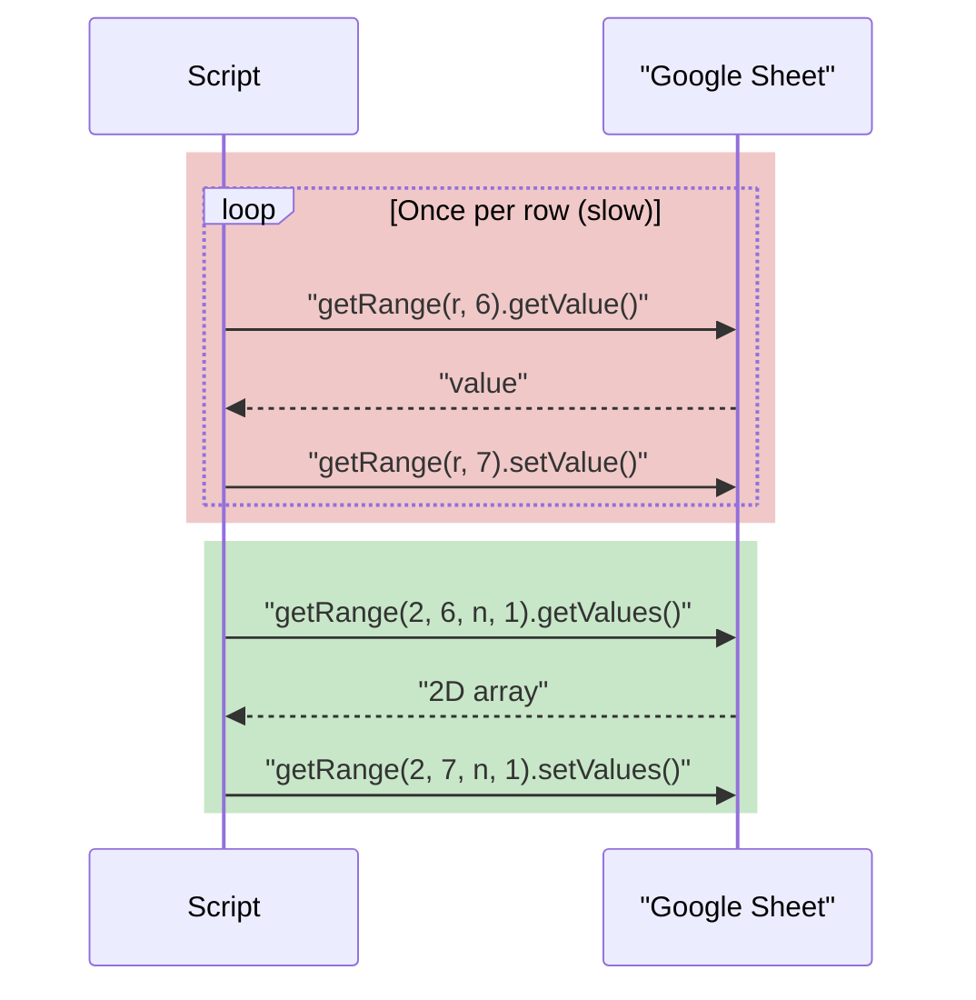

# Apps Script for Google Sheets

Google Sheets has no macro recorder that writes VBA — it has **Apps Script**, a cloud-hosted JavaScript environment bolted onto every Google Workspace app. Same job as VBA (automate repetitive spreadsheet work), completely different execution model: your code doesn't run inside Excel.exe on your machine, it runs on Google's servers, triggered by events, with its own permission and quota system. This lecture builds the same three things VBA gave you — read/write the sheet, add a one-click entry point, run automatically — using Apps Script's actual idioms rather than treating it as "VBA with different syntax."

We keep working the same **Crunch Outfitters** dashboard, this time in its Google Sheets copy.

## 1. Opening the script editor and your first function

`Extensions → Apps Script` opens a script project bound to this specific spreadsheet (a **container-bound script** — it travels with the file, similar to storing a VBA macro in "This Workbook"). The default file is `Code.gs`. Delete the placeholder and write:

```javascript
function sayHello() {
  SpreadsheetApp.getActiveSpreadsheet().toast('Hello from Apps Script!');
}
```

Save (`Ctrl+S` / `Cmd+S`), then in the toolbar pick `sayHello` from the function dropdown and click **Run**. The first run prompts an **authorization** screen — click through it, approving the script to access this spreadsheet. A small toast notification appears in the bottom-right of the Sheet. That's the whole loop: write a function, run it, it touches the spreadsheet through the `SpreadsheetApp` object.

## 2. `SpreadsheetApp` — the object model

Where VBA has `Worksheets("Dashboard").Range("A1")`, Apps Script has a chain of method calls:

```javascript
function readAndWrite() {
  const ss = SpreadsheetApp.getActiveSpreadsheet();     // the whole file
  const sheet = ss.getSheetByName('Dashboard');           // one tab
  const cell = sheet.getRange('B2');                      // one cell

  const currentRevenue = cell.getValue();
  sheet.getRange('C1').setValue('Last checked: ' + new Date());

  Logger.log('Revenue is currently ' + currentRevenue);   // View → Logs (or Ctrl+Enter) to see this
}
```

- **`getActiveSpreadsheet()`** — the file. In a container-bound script you can also use `SpreadsheetApp.getActive()` (shorter, same thing).
- **`getSheetByName('Dashboard')`** — always name-based, never index-based, because tab order changes and names shouldn't.
- **`getRange('B2')`**, **`getRange(row, col)`**, **`getRange('B2:E2')`** — same three addressing styles as VBA's `Range`/`Cells`.
- **`getValue()` / `setValue()`** for a single cell; **`getValues()` / `setValues()`** (plural) for a 2D array covering a whole range — always prefer the plural, batched versions when touching more than a handful of cells (see §5).

## 3. `onOpen()` — the simple trigger for a custom menu

Apps Script recognizes a small set of **simple triggers** — functions with reserved names that Google calls automatically, no wiring required. `onOpen()` runs every time a human opens the spreadsheet:

```javascript
function onOpen() {
  SpreadsheetApp.getUi()
    .createMenu('Crunch Dashboard')
    .addItem('Refresh Now', 'refreshDashboard')
    .addItem('Format KPI Row', 'formatKpiRow')
    .addSeparator()
    .addItem('About', 'showAbout')
    .addToUi();
}

function showAbout() {
  SpreadsheetApp.getUi().alert(
    'Crunch Outfitters Dashboard\nAutomated with Apps Script — Week 12, C41 Crunch Excel.'
  );
}
```

Reload the spreadsheet and a new **Crunch Dashboard** menu appears next to Help, with your two commands and a separator. This is the direct equivalent of VBA's shape-styled refresh button — a discoverable, one-click entry point for anyone who opens the file, technical or not.

`onOpen()` is a **simple trigger**: no setup screen, but it also runs with **limited authorization** (it can build a menu, but if a menu item tries to do something requiring full permission and the user hasn't authorized yet, it'll prompt them then). Simple triggers also cannot be `onOpen(e)` functions that send email or make external network calls directly on the open event — for anything beyond UI, use the menu item's target function, which runs with the full authorization the user already granted.

## 4. Installable triggers — the ones VBA doesn't really have

VBA has workbook-level events (`Workbook_Open`, `Worksheet_Change`) baked into the object model. Apps Script's simple triggers (`onOpen`, `onEdit`, `onSelectionChange`) cover a *thinner* slice of that, so anything more powerful — running unattended on a schedule, or an edit trigger that needs full authorization to send email or call an external API — has to be registered explicitly as an **installable trigger**.

`Apps Script editor → Triggers (clock icon in the left sidebar) → + Add Trigger`:

| Field | For a daily refresh |
|---|---|
| Function to run | `dailyRefresh` |
| Deployment | Head |
| Event source | Time-driven |
| Type of time based trigger | Day timer |
| Time of day | 6am – 7am |

Or register it in code, which is more reliable and reviewable than clicking through the UI (and is what the capstone will do):

```javascript
function createDailyTrigger() {
  // Run once, manually, to install the trigger — not every time the script runs.
  ScriptApp.newTrigger('dailyRefresh')
    .timeBased()
    .everyDays(1)
    .atHour(6)
    .create();
}

function dailyRefresh() {
  refreshDashboard();
  formatKpiRow();
}
```

Run `createDailyTrigger` **once** from the editor. That registers `dailyRefresh` with Google's trigger service; from then on it fires every morning around 6am whether or not anyone has the spreadsheet open, whether or not your laptop is even on — this is the biggest practical difference from VBA, where a macro only runs while Excel is open on a machine (or via an external scheduler poking the file, covered in this week's first challenge).

Other installable trigger types worth knowing: **On edit** (fires on any cell edit, receives an event object describing what changed — useful for validating input the instant someone types it), **On form submit**, and **On change** (structural changes: rows added/deleted, not just values).

## 5. Batch reads/writes — the one performance rule that matters

Every `getRange().getValue()` call is a round-trip to Google's servers. A loop that reads or writes cell-by-cell across a few hundred rows is slow and can hit execution-time limits. Always **read once into an array, work in memory, write once**:

```javascript
// Slow — one round-trip per row, per column touched
function flagLowStockSlow(sheet, lastRow) {
  for (let r = 2; r <= lastRow; r++) {
    const units = sheet.getRange(r, 6).getValue();          // round-trip
    sheet.getRange(r, 7).setValue(units < 10 ? 'REORDER' : ''); // round-trip
  }
}

// Fast — two round-trips total, regardless of row count
function flagLowStockFast(sheet, lastRow) {
  const data = sheet.getRange(2, 6, lastRow - 1, 1).getValues();   // one read
  const flags = data.map(row => [row[0] < 10 ? 'REORDER' : '']);
  sheet.getRange(2, 7, lastRow - 1, 1).setValues(flags);            // one write
}
```

`getRange(row, col, numRows, numCols)` addresses a rectangular block by position — the Apps Script equivalent of VBA's `Cells(...).Resize(...)`. This pattern (read a block into a 2D array, `.map()`/loop over it in memory, write the block back) is the standard shape of almost every real Apps Script function you'll write, and it's the pattern the capstone integration lecture builds on.


*Cell-by-cell round-trips versus one batched read and one batched write.*

## 6. Error handling — `try` / `catch`

```javascript
function refreshDashboard() {
  try {
    SpreadsheetApp.flush();                                     // force pending changes to apply
    const sheet = SpreadsheetApp.getActive().getSheetByName('Dashboard');
    sheet.getRange('F1').setValue('Last refreshed: ' + new Date());
    SpreadsheetApp.getActiveSpreadsheet().toast('Dashboard refreshed.');
  } catch (err) {
    SpreadsheetApp.getUi().alert('Refresh failed: ' + err.message);
    // For an unattended trigger (no UI available), email yourself instead — see Challenge 1.
  }
}
```

`SpreadsheetApp.flush()` is Apps Script's rough equivalent of VBA's `Application.CalculateUntilAsyncQueriesDone` — it forces any pending spreadsheet operations to complete before the next line runs, which matters when a script writes a value that other formulas depend on and then immediately reads a downstream result. One catch: `getUi()` only works when a human is present (a menu click, an editor Run). A trigger firing at 6am with nobody watching has **no UI** — call `getUi()` there and the script throws its own error. Challenge 1 covers the fix (log to a sheet or email instead of alerting).

## 7. VBA vs. Apps Script — the real differences

| | VBA (Excel) | Apps Script (Sheets) |
|---|---|---|
| Language | Visual Basic for Applications | JavaScript (V8 runtime) |
| Where it runs | Locally, inside Excel, on your machine | On Google's servers, in the cloud |
| Needs the file open? | Yes — only runs while Excel has the workbook open | No — installable triggers run whether or not anyone has the sheet open |
| Recorder | Yes — Record Macro writes real VBA | No recorder; you write every function |
| Entry points | `Sub`s attached to buttons/shapes/shortcuts; workbook events (`Workbook_Open`) | Menu items via `onOpen()`; simple + installable triggers |
| Execution limit | None (bounded only by your machine) | 6 minutes per execution (30 min for Workspace accounts) — a hard quota |
| External access | `Scripting.FileSystemObject`, COM automation (Outlook, etc.), mostly Windows-only | Built-in services: `MailApp`, `UrlFetchApp`, `DriveApp`, `CalendarApp` — cross-platform by design |
| File format requirement | Must save as `.xlsm` | None — Apps Script lives with the Sheet automatically |
| Sharing automation | Macro travels with the file, but each recipient must enable macros | Script travels with the Sheet; runs under whichever account is currently authorized, or the owner's for triggers |

The practical upshot for this week: **VBA is the right tool when the workbook must run offline, on someone's desktop, on their schedule** (open the file, click the button). **Apps Script is the right tool when the automation must run unattended, on a schedule, with nobody present** — which is exactly what Challenge 1 (scheduled auto-refresh) needs, and part of why the capstone treats "one-click refresh" (works in both) and "scheduled refresh" (Apps Script's real strength) as related but separate goals.

## Check yourself

- What is a *container-bound* script, and how is it similar to storing a VBA macro in "This Workbook" rather than the Personal Macro Workbook?
- Why does `onOpen()` count as a *simple* trigger, and what's the practical limitation that comes with that?
- Rewrite a loop that calls `sheet.getRange(r, 1).getValue()` inside a `for` loop of 500 iterations to use a single `getValues()` call instead. Why is the rewrite faster?
- Why can't `dailyRefresh()`'s error handler call `SpreadsheetApp.getUi().alert(...)` when it's fired by a time-driven trigger at 6am?
- Name one thing VBA can do that Apps Script structurally cannot (or vice versa), and explain *why* — not just that it's true.

Next: [Capstone: Wiring It All Together](./03-capstone-integration.md) — combining Power Query, pivots, dynamic arrays, and the dashboard into one automated, one-click deliverable.
