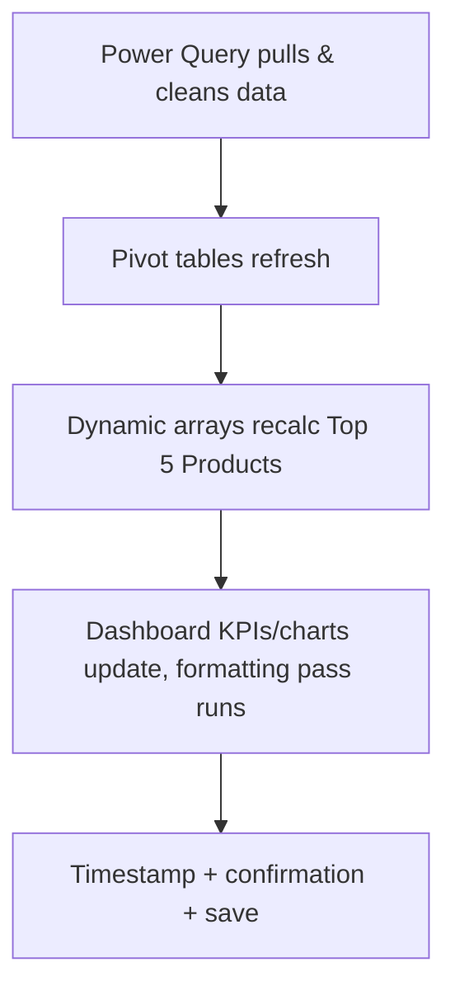

# Capstone: Wiring It All Together

Everything up to this point in the course produced *pieces*: a Power Query connection that pulls and cleans raw sales exports (Week 11), a pivot table that summarizes them (Week 7), dynamic-array formulas that surface the top products (Week 10), and a dashboard sheet with KPIs and charts (Week 8). Each piece works. None of them talk to each other automatically. This lecture is about the wiring — the thin layer of macro or Apps Script code whose entire job is to call the pieces in the right order, wait for each to finish before starting the next, format the result, and tell the user whether it worked. That wiring is what turns a folder of good spreadsheet skills into one product.

## 1. The refresh chain — what actually has to happen, in order

For the Crunch Outfitters workbook, "refresh the dashboard" is not one operation — it's a sequence with real dependencies:

```
1. Power Query pulls the latest sales export(s) and appends/replaces the cleaned table
      ↓ (must finish before step 2 — pivots read from the query's output table)
2. Pivot tables refresh against the updated Table
      ↓ (must finish before step 3 — dynamic arrays reference the pivot's ranges, or the raw table directly)
3. Dynamic-array formulas (FILTER/SORT/UNIQUE) recalculate the "Top 5 Products" and similar views
      ↓
4. Dashboard KPI cells and chart data ranges are already formula-driven, so they update automatically
      once steps 1–3 land — but formatting (conditional colors, number formats on new rows) needs a pass
      ↓
5. A visible confirmation: a timestamp cell, a message box / toast, and (for the capstone) a saved copy
```

Skip a step or run them out of order and you get the classic automation bug: a dashboard that *looks* refreshed (the button ran, no error appeared) but is actually showing yesterday's pivot against today's raw data, because the pivot never got told to recalculate. The single most common cause of "my automated dashboard is silently wrong" is exactly this — a refresh chain with a missing or misordered link.


*Each stage depends on the one before it finishing first — skip or reorder a link and the dashboard looks refreshed but isn't.*

## 2. Excel: `RefreshAll` and waiting for it to actually finish

`Application.CalculateUntilAsyncQueriesDone` (Excel 2016+ with Power Query) is the key line most VBA tutorials skip. Without it, `RefreshAll` *starts* the refresh and your macro's next line runs immediately — before the query has actually returned data — because Power Query refreshes asynchronously by default.

```vb
Sub RefreshDashboard()
    On Error GoTo ErrHandler
    Dim wb As Workbook
    Set wb = ThisWorkbook

    ' Step 1: refresh every Power Query connection and every pivot table's source
    wb.RefreshAll
    Application.CalculateUntilAsyncQueriesDone     ' block until all async queries finish

    ' Step 2: pivot tables built on Power Query output need an explicit refresh too,
    ' since some are configured "refresh on open" only, not "refresh on data change"
    Dim pt As PivotTable
    For Each pt In wb.Worksheets("Pivot_Summary").PivotTables
        pt.RefreshTable
    Next pt

    ' Step 3: dynamic arrays recalc automatically on any change, but force it to be safe
    Application.CalculateFull

    ' Step 4: formatting pass + timestamp
    FormatKPIRow
    wb.Worksheets("Dashboard").Range("F1").Value = "Last refreshed: " & Format(Now, "mmm d, yyyy h:mm AM/PM")

    ' Step 5: save and confirm
    wb.Save
    MsgBox "Dashboard refreshed and saved.", vbInformation, "Crunch Outfitters"
    Exit Sub

ErrHandler:
    MsgBox "Refresh failed at: " & Err.Description & vbCrLf & _
           "Check that the source file/folder for Power Query hasn't moved.", vbCritical, "Refresh Error"
End Sub
```

Notice the error message doesn't just say "an error occurred" — it names the most likely real-world cause (Power Query's source file moved or was renamed), because that's the failure this exact workbook will actually hit in practice. A generic error message is nearly useless to whoever clicks the button next month when you're not there to debug it; a specific one tells them what to go check first.

`For Each pt In wb.Worksheets("Pivot_Summary").PivotTables` loops over every pivot table on that sheet — if your dashboard has pivots on more than one sheet, loop over `wb.Worksheets` first and check each sheet's `.PivotTables.Count`.

## 3. Google Sheets: chaining the same steps in Apps Script

Sheets doesn't have Power Query, but the "connected sheet" pattern (`IMPORTRANGE`, a linked BigQuery/Sheets data source, or a Sheet fed by a scheduled Apps Script fetch) plays the same role, and pivot tables + `QUERY`/`FILTER`/`SORT` formulas play the roles of Excel's pivots and dynamic arrays. The wiring principle is identical — call each stage in order, force recalculation between stages that depend on each other, format, confirm:

```javascript
function refreshDashboard() {
  try {
    const ss = SpreadsheetApp.getActive();

    // Step 1: force any IMPORTRANGE / QUERY-fed source data to recalculate
    SpreadsheetApp.flush();

    // Step 2: pivot tables in Sheets recalc automatically when source data changes,
    // but flush() again after touching the source guarantees it's actually settled
    SpreadsheetApp.flush();

    // Step 3: dynamic FILTER/SORT/UNIQUE formulas on the "Top Products" sheet
    // recalc automatically too — nothing to call explicitly, just flush once more
    // after any programmatic writes below so the dashboard reads current values
    formatKpiRow_(ss);

    // Step 4: timestamp + confirmation
    const dash = ss.getSheetByName('Dashboard');
    dash.getRange('F1').setValue('Last refreshed: ' + Utilities.formatDate(
      new Date(), ss.getSpreadsheetTimeZone(), 'MMM d, yyyy h:mm a'
    ));
    SpreadsheetApp.flush();
    ss.toast('Dashboard refreshed.', 'Crunch Outfitters', 5);

  } catch (err) {
    notifyFailure_('refreshDashboard', err);
  }
}

function formatKpiRow_(ss) {
  const dash = ss.getSheetByName('Dashboard');
  const revenueCell = dash.getRange('B2');
  const priorRevenueCell = dash.getRange('B3');
  revenueCell.setFontWeight('bold').setNumberFormat('$#,##0');
  revenueCell.setFontColor(
    revenueCell.getValue() < priorRevenueCell.getValue() ? '#C81E1E' : '#148014'
  );
}

function notifyFailure_(functionName, err) {
  // No UI exists when a trigger runs unattended, so log AND email instead of alert().
  console.error(functionName + ' failed: ' + err.message);
  MailApp.sendEmail({
    to: Session.getEffectiveUser().getEmail(),
    subject: 'Crunch Outfitters dashboard refresh FAILED',
    body: functionName + ' threw: ' + err.message + '\n\n' + err.stack
  });
}
```

Two conventions worth adopting: functions ending in an underscore (`formatKpiRow_`, `notifyFailure_`) are Apps Script's informal way of marking a **private helper** — not meant to be run directly from the editor's function dropdown or exposed as a menu item, only called by other functions. And `notifyFailure_` is written once and reused by *every* function that might fail unattended, so a trigger failure at 6am doesn't just vanish into a log nobody reads.

## 4. Designing the single entry point

Both platforms converge on the same shape: **one function name is "the button."** Everything else — the individual refresh steps, the formatting helper, the error notifier — is a private implementation detail the user never calls directly.

- **Excel:** the shape/button on the Dashboard sheet is assigned to exactly one macro, `RefreshDashboard`. Every other `Sub` (`FormatKPIRow`, helper routines) exists to be called *by* `RefreshDashboard`, not clicked independently.
- **Sheets:** the `Crunch Dashboard → Refresh Now` menu item calls exactly one function, `refreshDashboard`. The scheduled trigger (Challenge 1) calls the *same* function — the manual button and the automatic schedule are two triggers for one identical code path, not two different implementations that can drift out of sync.

This single-entry-point discipline is the actual capstone skill. It's tempting, once you can write VBA or Apps Script, to bolt on five different buttons for five different partial operations ("refresh data," "refresh pivots," "format only," …). Resist it. A dashboard meant for someone else to use should have **one** obvious action that does the whole job correctly, every time, in the right order — with the individual steps as private helpers underneath it, not as separate things the user has to remember to run in sequence themselves.

## 5. Error handling that's actually useful to future-you

A generic `On Error GoTo ErrHandler: MsgBox "Error"` (VBA) or a bare `catch (err) { }` swallowing everything (Apps Script) technically "handles" the error in the sense that the program doesn't crash — but it throws away the one piece of information (what actually broke, and where) that would let anyone fix it. Three habits that separate real error handling from error *suppression*:

1. **Always surface `Err.Description` (VBA) or `err.message` (Apps Script)** in whatever you show the user — never a bare "Something went wrong."
2. **Say what to check, not just what failed.** "Refresh failed — check that the source file/folder for Power Query hasn't moved" is actionable; "Refresh failed" is not.
3. **When there's no UI to show the error to (a scheduled trigger), don't let it vanish.** Log it (`Logger.log`/`console.error` in Apps Script, write to an "Errors" sheet/cell in VBA) and, for anything that runs unattended and matters, email it — Challenge 1 builds exactly this.

## 6. Documenting the automation

The last piece of "shipping" the capstone isn't code at all — it's a short `README` inside the workbook (or a `notes.md` alongside it) that answers, in plain language, the four questions anyone inheriting this file will have:

- **What does the Refresh button/menu item actually do**, in order? (The five-step chain from §1, in one sentence each.)
- **What has to be true for it to work** — does the Power Query source file/folder need to exist at a specific path? Does an Apps Script trigger need re-authorizing if ownership of the Sheet changes?
- **What happens if it fails**, and where does the error show up (a message box, an email, a log)?
- **How do you change the schedule or the data source** if the export format or the refresh time needs to move?

A workbook that automates itself perfectly but explains nothing is only self-sufficient until the one day something upstream changes — and on that day, documentation is the difference between a five-minute fix and someone quietly abandoning the whole workbook.

## Check yourself

- Why does `wb.RefreshAll` alone not guarantee the data has actually arrived before the next line of VBA runs, and what line fixes that?
- In the Apps Script version, why is `formatKpiRow_` named with a trailing underscore, and what does that convention signal to someone reading the code?
- What's the single-entry-point principle, and what problem does it prevent — walk through what could go wrong with five separate buttons instead of one.
- Why is `MsgBox "Error"` / `catch (err) {}` (with nothing inside) worse than not handling the error at all, in terms of what future-you can do with it?
- Name the four questions the workbook's automation `README` should answer, and explain why "what happens if it fails" belongs on that list even though the whole point is that it usually won't.

Next: put this into practice — start with [Exercise 1: Record & Edit Your First Macro](../exercises/exercise-01-record-first-macro.md).
